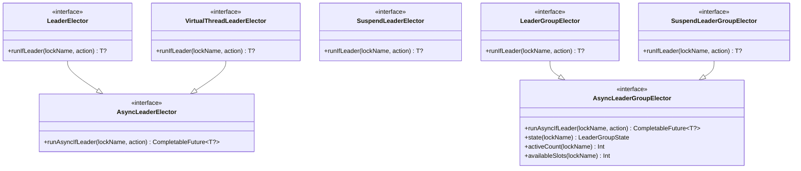
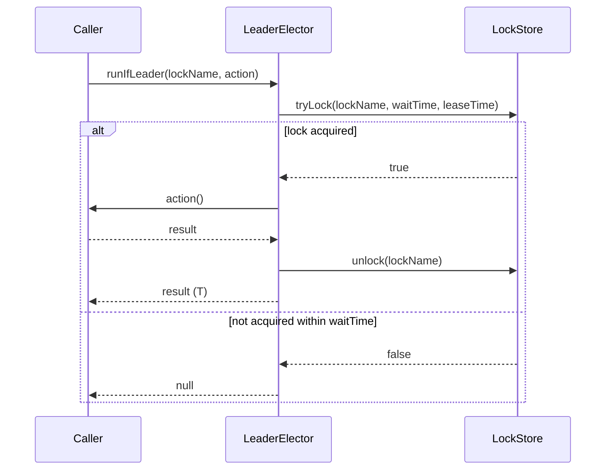
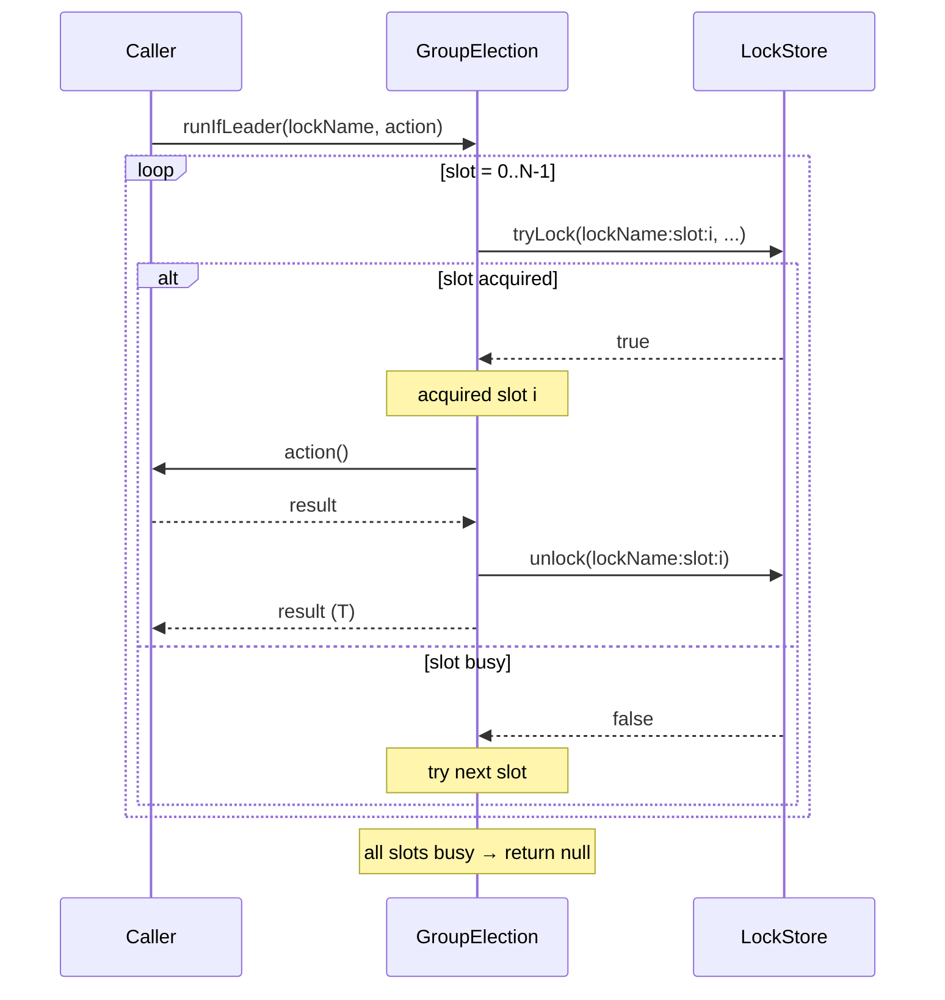

# leader-core

[한국어](README.ko.md)

Core interfaces and local in-process implementations for `bluetape4k-leader`.

---

## Overview

`leader-core` defines the contracts for all leader election backends and provides local (in-process) implementations that need no external infrastructure. Use local implementations in single-instance deployments or tests.

## Architecture



## API Contract

### `runIfLeader(lockName, action): T?`

- Acquires the named lock (or semaphore slot for group elections)
- If acquired: executes `action` and returns its result
- If not acquired within `waitTime`: returns **`null`** (never throws on contention)
- Exceptions from `action` are propagated to the caller
- Lock is released after `action` completes (or on exception)

### Election lifecycle listeners

`LeaderElectionListenerRegistry` implementations support `addListener` and `removeListener` for lifecycle callbacks:

- `onElected(lockName)` before the guarded action starts
- `onRevoked(lockName)` after the held lock or slot is released by the current call
- `onSkipped(lockName)` when the action is not run because leadership was not acquired

For suspend electors, `LeaderElectionEventPublisher.events` exposes the same lifecycle as a hot `Flow<LeaderElectionEvent>`.

```kotlin
val election = LocalLeaderElector()
val handle = election.addListener(object : LeaderElectionListener {
    override fun onElected(lockName: String) {
        println("elected: $lockName")
    }
})

try {
    election.runIfLeader("daily-job") { processData() }
} finally {
    handle.close()
}
```

```kotlin
val election = LocalSuspendLeaderElector()

launch {
    election.events.collect { event ->
        println(event)
    }
}

election.runIfLeader("nightly-sync") { syncToRemote() }
```

### Options

```kotlin
LeaderElectionOptions(
    waitTime: Duration = 5.seconds,   // max wait for lock acquisition
    leaseTime: Duration = 60.seconds, // max lock hold time
    minLeaseTime: Duration = Duration.ZERO // minimum local hold time
)

LeaderGroupElectionOptions(
    maxLeaders: Int = 2,                          // max concurrent leaders
    waitTime: Duration = 5.seconds,
    leaseTime: Duration = 60.seconds,
    minLeaseTime: Duration = Duration.ZERO
)
```

`minLeaseTime` is the local lockAtLeastFor equivalent. Local electors keep the lock or slot until the minimum hold time has elapsed. Distributed backend TTL delegation is handled separately in #77.

## Sequence Diagrams

### Single-leader: lock acquire/release



### Multi-leader group: slot-based semaphore (maxLeaders = N)



## Local Implementations

All local implementations use JVM primitives (`ReentrantLock`, `Semaphore`) — no external dependencies.

| Class | Interface | Description |
|-------|-----------|-------------|
| `LocalLeaderElector` | `LeaderElector` | Blocking, `ReentrantLock`-based |
| `LocalAsyncLeaderElector` | `AsyncLeaderElector` | `CompletableFuture` on thread pool |
| `LocalVirtualThreadLeaderElector` | `VirtualThreadLeaderElector` | Virtual thread per election |
| `LocalSuspendLeaderElector` | `SuspendLeaderElector` | Coroutine with `Mutex` |
| `LocalLeaderGroupElector` | `LeaderGroupElector` | `Semaphore`-based multi-leader |
| `LocalSuspendLeaderGroupElector` | `SuspendLeaderGroupElector` | Coroutine `Semaphore` |
| `LocalStrategicLeaderElector` | `StrategicLeaderElector` | Strategy-based blocking election |
| `LocalStrategicSuspendLeaderElector` | `StrategicSuspendLeaderElector` | Strategy-based coroutine election |

## Strategic Election

### Overview

Strategic election separates the **nomination phase** (candidate registration) from the **decision phase** (strategy application), enabling flexible leader selection policies.

```
registerCandidate() → elect(strategy) → 1 winner, rest skipped
```

### Built-in Strategies

| Strategy | Description |
|----------|-------------|
| `FifoElectionStrategy` | Earliest registered candidate wins |
| `RandomElectionStrategy(seed)` | Deterministic random selection (seed required for distributed use) |
| `ScoredElectionStrategy(scorer)` | Highest-scoring candidate wins |

### Built-in Scorers (0–100 normalized)

| Scorer | Description |
|--------|-------------|
| `IdleTimeScorer` | Node idle longest since last completion |
| `SuccessRateScorer` | Highest success-rate node |
| `RecentSuccessScorer` | Most recently succeeded node |
| `WeightedScorer` | Weighted sum of multiple scorers |

### Key Interfaces

```kotlin
interface StrategicLeaderElector {
    val nodeId: String
    fun registerCandidate(lockName: String, info: CandidateInfo, ttl: Duration = Duration.ZERO)
    fun unregisterCandidate(lockName: String, nodeId: String)
    fun listCandidates(lockName: String): List<CandidateInfo>
    fun <T> runIfLeader(lockName: String, strategy: ElectionStrategy, options: LeaderElectionOptions, action: () -> T): T?
}
```

## Usage Examples

### Strategic election — scored idle-time

```kotlin
val election = LocalStrategicLeaderElector("node-1")

election.registerCandidate("batch-job", CandidateInfo("node-1"))
election.registerCandidate("batch-job", CandidateInfo("node-2"))

val result = election.runIfLeader("batch-job", ScoredElectionStrategy(IdleTimeScorer)) {
    processBatch()
}
// Only the node idle longest runs processBatch(); others return null
```

### Strategic election — weighted scorer

```kotlin
val scorer = WeightedScorer(IdleTimeScorer to 0.4, SuccessRateScorer to 0.6)
val strategy = ScoredElectionStrategy(scorer)

val result = election.runIfLeader("weighted-job", strategy) { work() }
```

### Blocking single-leader

```kotlin
val election = LocalLeaderElector()

val result = election.runIfLeader("daily-job") {
    processData()
}
// result == processData() on success, null if lock not acquired
```

### Coroutine suspend single-leader

```kotlin
val election = LocalSuspendLeaderElector()

val result = election.runIfLeader("nightly-sync") {
    syncToRemote()
}
```

### Multi-leader group (semaphore)

```kotlin
val options = LeaderGroupElectionOptions(maxLeaders = 3)
val election = LocalLeaderGroupElector(options)

// Up to 3 concurrent calls can run this action at once
val result = election.runIfLeader("parallel-batch") {
    processChunk()
}

println(election.activeCount("parallel-batch"))   // 0–3
println(election.availableSlots("parallel-batch")) // 3 - activeCount
```

### State inspection

```kotlin
val state: LeaderGroupState = election.state("parallel-batch")
println(state.activeCount)    // current leader count
println(state.maxLeaders)     // maxLeaders from options
```

## Dependency

```kotlin
// build.gradle.kts
implementation("io.github.bluetape4k.leader:leader-core:0.1.0-SNAPSHOT")
```
