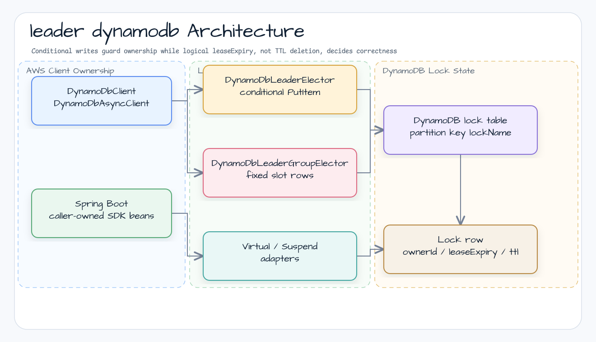

# bluetape4k-leader-dynamodb

[English](README.md) | 한국어

conditional write와 logical TTL 기반의 프리뷰 DynamoDB 리더 선출 백엔드입니다.

## Architecture



## 동작 계약

- 테이블 생성과 수명 관리는 애플리케이션 책임입니다.
- 테이블은 문자열 파티션 키 `lockName`을 사용해야 합니다.
- 락 행은 `ownerId`, `auditLeaderId`, `nodeId`, epoch milliseconds 단위 `leaseExpiry`, epoch seconds 단위 `ttl`을 저장합니다.
- 획득은 행이 없거나 logical lease가 만료된 경우에만 성공하는 조건부 `PutItem`을 사용합니다.
- `ttl`은 cleanup 메타데이터입니다. correctness는 DynamoDB TTL 삭제 시점이 아니라 `leaseExpiry`에 의존합니다.
- 일반적인 락 경쟁은 `null`을 반환하고, AWS SDK/client 장애는 전파합니다.
- `minLeaseTime`은 caller를 블로킹하지 않고 남은 최소 lease 동안 행을 유지합니다.
- 단일 리더 `autoExtend`는 action 실행 중 lease를 갱신합니다. Group elector는 명시적 `LockExtender` 호출이 필요합니다.

## 구현 클래스

| 클래스 | 인터페이스 | 설명 |
|---|---|---|
| `DynamoDbLeaderElector` | `LeaderElector` + async facade | 블로킹 및 `CompletableFuture` 단일 리더 선출 |
| `DynamoDbLeaderGroupElector` | `LeaderGroupElector` | 슬롯 기반 블로킹 복수 리더 선출 |
| `DynamoDbVirtualThreadLeaderElector` | `VirtualThreadLeaderElector` | 블로킹 elector 위의 가상 스레드 단일 리더 어댑터 |
| `DynamoDbVirtualThreadLeaderGroupElector` | `VirtualThreadLeaderGroupElector` | 블로킹 group elector 위의 가상 스레드 복수 리더 어댑터 |
| `DynamoDbSuspendLeaderElector` | `SuspendLeaderElector` | `DynamoDbAsyncClient` 기반 코루틴 단일 리더 선출 |
| `DynamoDbSuspendLeaderGroupElector` | `SuspendLeaderGroupElector` | 슬롯 기반 코루틴 복수 리더 선출 |

## 테이블

```text
partition key: lockName (S)
attributes:
  ownerId       S
  auditLeaderId S
  nodeId        S
  leaseExpiry   N  epoch milliseconds
  ttl           N  epoch seconds, DynamoDB TTL attribute
```

권장 테이블 설정:

```bash
aws dynamodb create-table \
  --table-name bluetape4k_leader_locks \
  --attribute-definitions AttributeName=lockName,AttributeType=S \
  --key-schema AttributeName=lockName,KeyType=HASH \
  --billing-mode PAY_PER_REQUEST

aws dynamodb update-time-to-live \
  --table-name bluetape4k_leader_locks \
  --time-to-live-specification Enabled=true,AttributeName=ttl
```

## 사용법

```kotlin
import io.bluetape4k.leader.dynamodb.DynamoDbLeaderElector
import software.amazon.awssdk.services.dynamodb.DynamoDbClient

val client = DynamoDbClient.create()
val elector = DynamoDbLeaderElector(client)

val result = elector.runIfLeader("daily-report") {
    generateReport()
}
// 리더이면 generateReport() 결과, 경쟁으로 획득 실패 시 null
```

Group election:

```kotlin
import io.bluetape4k.leader.LeaderGroupElectionOptions
import io.bluetape4k.leader.dynamodb.DynamoDbLeaderGroupElectionOptions
import io.bluetape4k.leader.dynamodb.DynamoDbLeaderGroupElector

val group = DynamoDbLeaderGroupElector(
    client,
    DynamoDbLeaderGroupElectionOptions(
        leaderGroupOptions = LeaderGroupElectionOptions(maxLeaders = 3),
    ),
)

group.runIfLeader("parallel-batch") {
    processChunk()
}
```

가상 스레드 API:

```kotlin
import io.bluetape4k.leader.dynamodb.DynamoDbVirtualThreadLeaderElector

val virtualElector = DynamoDbVirtualThreadLeaderElector(elector)
val result = virtualElector.runAsyncIfLeader("daily-report") {
    generateReport()
}.await()
```

Coroutine API:

```kotlin
import io.bluetape4k.leader.dynamodb.DynamoDbSuspendLeaderElector
import software.amazon.awssdk.services.dynamodb.DynamoDbAsyncClient

val asyncClient = DynamoDbAsyncClient.create()
val suspendElector = DynamoDbSuspendLeaderElector(asyncClient)

val result = suspendElector.runIfLeader("nightly-cleanup") {
    cleanupExpiredSessions()
}
```

## Spring Boot

애플리케이션 소유 AWS SDK client를 bean으로 등록하면 auto-configuration이 direct elector, 가상 스레드 어댑터, AOP factory를 생성합니다.

```kotlin
@Bean
fun dynamoDbClient(): DynamoDbClient = DynamoDbClient.create()

@Bean
fun dynamoDbAsyncClient(): DynamoDbAsyncClient = DynamoDbAsyncClient.create()
```

```yaml
bluetape4k:
  leader:
    dynamodb:
      table-name: bluetape4k_leader_locks
      key-prefix: leader
      retry-delay: 50ms
      ttl-padding: 60s
      clock-skew-tolerance: 5s
```

## 테스트

모듈 테스트는 Testcontainers 기반 DynamoDB Local을 사용합니다.

```bash
./gradlew :bluetape4k-leader-dynamodb:test
```
