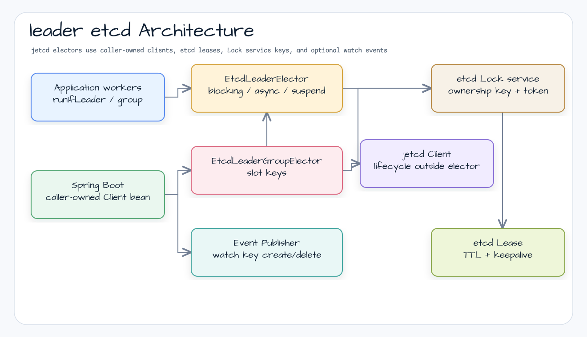

# bluetape4k-leader-etcd

한국어 | [English](./README.md)

`bluetape4k-leader` 의 etcd v3 백엔드입니다. jetcd Lock service 와 etcd
lease 를 사용하므로 이미 etcd cluster 를 운영하는 서비스는 Redis, MongoDB,
ZooKeeper, Kubernetes Lease 를 추가하지 않고 단일 active worker 또는 제한된
active worker group 을 선출할 수 있습니다.

## Architecture



## Core Features

- Blocking / async `LeaderElector` 구현
- Coroutine-native `SuspendLeaderElector` 구현
- Blocking elector 위의 virtual-thread adapter
- slot 별 jetcd Lock key 를 사용하는 blocking / coroutine `LeaderGroupElector` 구현
- ownership key 생성/삭제 이벤트를 전달하는 watch 기반 `LeaderElectionEventPublisher`
- jetcd Lock ownership key 를 backend token 으로 보관해 owner-conditional release 수행
- 기존 `LockExtender` 와 watchdog 계약을 통한 lease keepalive
- jetcd `Client` 는 caller-owned; endpoint, TLS, 인증, lifecycle 은 elector 밖에서 관리
- `bluetape4k-testcontainers` 의 EtcdServer 기반 통합 테스트
- `leader-spring-boot` 가 caller-owned jetcd `Client` bean 을 발견했을 때 Spring Boot auto-configuration 지원

## Usage

```kotlin
import io.bluetape4k.leader.LeaderElectionOptions
import io.bluetape4k.leader.etcd.EtcdLeaderElectionOptions
import io.bluetape4k.leader.etcd.EtcdLeaderElector
import io.etcd.jetcd.Client
import kotlin.time.Duration.Companion.seconds

val client = Client.builder()
    .endpoints("http://localhost:2379")
    .build()

val elector = EtcdLeaderElector(
    client = client,
    options = EtcdLeaderElectionOptions(
        keyPrefix = "/apps/orders/leader",
        leaderOptions = LeaderElectionOptions(
            nodeId = "worker-0",
            waitTime = 2.seconds,
            leaseTime = 30.seconds,
            autoExtend = true,
        ),
    ),
)

elector.runIfLeader("daily-report") {
    generateReport()
}
```

Coroutine 사용:

```kotlin
import io.bluetape4k.leader.etcd.EtcdSuspendLeaderElector

val suspendElector = EtcdSuspendLeaderElector(client)

suspendElector.runIfLeader("nightly-sync") {
    syncData()
}
```

Virtual thread 사용:

```kotlin
import io.bluetape4k.leader.etcd.EtcdLeaderElector
import io.bluetape4k.leader.etcd.EtcdVirtualThreadLeaderElector

val virtualElector = EtcdVirtualThreadLeaderElector(EtcdLeaderElector(client))

val future = virtualElector.runAsyncIfLeader("webhook-poller") {
    pollWebhooks()
}
```

Client extension:

```kotlin
import io.bluetape4k.leader.etcd.runIfLeader

client.runIfLeader("cache-warmer") {
    warmCache()
}
```

Group 사용:

```kotlin
import io.bluetape4k.leader.LeaderGroupElectionOptions
import io.bluetape4k.leader.etcd.EtcdLeaderGroupElectionOptions
import io.bluetape4k.leader.etcd.EtcdLeaderGroupElector

val groupElector = EtcdLeaderGroupElector(
    client = client,
    options = EtcdLeaderGroupElectionOptions(
        keyPrefix = "/apps/orders/leader",
        leaderGroupOptions = LeaderGroupElectionOptions(maxLeaders = 3),
    ),
)

groupElector.runIfLeader("partition-worker") {
    processPartition()
}
```

Watch 기반 event stream:

```kotlin
import io.bluetape4k.leader.etcd.EtcdLeaderElectionEventPublisher
import kotlinx.coroutines.flow.collect

val publisher = EtcdLeaderElectionEventPublisher(
    client = client,
    keyPrefix = "/apps/orders/leader",
)

publisher.events.collect { event ->
    recordLeaderEvent(event)
}
```

## Configuration

| 옵션 | 타입 | 기본값 | 설명 |
| --- | --- | --- | --- |
| `keyPrefix` | `String` | `/bluetape4k/leader` | lock key 를 저장할 absolute etcd key prefix |
| `retryDelay` | `Duration` | `50.milliseconds` | cleanup wait floor: unlock 과 lease revoke 는 `max(waitTime, retryDelay)` 만큼 대기. jetcd queued lock 외 retry API 용 예약 옵션이기도 함. |
| `leaderOptions.waitTime` | `Duration` | `5.seconds` | lease grant, lock 획득, cleanup (unlock/lease revoke 는 `max(waitTime, retryDelay)` 대기) 전체 최대 시간 예산 |
| `leaderOptions.leaseTime` | `Duration` | `60.seconds` | etcd lease TTL |
| `leaderOptions.nodeId` | `String` | process-level default | core 계약과 공유하는 audit node id |
| `leaderOptions.minLeaseTime` | `Duration` | `0.seconds` | 빠른 action 뒤 최소 leadership 유지 시간 |
| `leaderOptions.autoExtend` | `Boolean` | `false` | action 실행 중 active etcd lease 자동 keepalive |
| `leaderGroupOptions.maxLeaders` | `Int` | `2` | 동시 group leader 최대 수 |
| `leaderGroupOptions.waitTime` | `Duration` | `5.seconds` | group slot 획득 전체 최대 대기 시간 |
| `leaderGroupOptions.leaseTime` | `Duration` | `60.seconds` | group slot 용 etcd lease TTL |
| `leaderGroupOptions.minLeaseTime` | `Duration` | `0.seconds` | 빠른 action 뒤 최소 group-slot 유지 시간 |

`lockName` 은 etcd path segment 로 percent-encoding 됩니다. 원본 이름에는
Unicode, slash, colon 이 들어갈 수 있으며 encoded key 는 항상 `keyPrefix` 아래에
남습니다.

Group election 은 slot 마다 하나의 etcd Lock key 를 사용합니다:
`{keyPrefix}/group/{encodedLockName}/slot-{n}`. Slot 획득은 random slot 에서
시작해 남은 slot 을 순회하며, 한 contended slot 이 전체 group 획득 예산을 모두
소비하지 않도록 slot 별 대기 시간을 제한합니다.

`EtcdLeaderElectionEventPublisher` 는 설정된 `keyPrefix` 를 watch 하며 Lock
ownership key 의 `PUT` 은 `Elected`, `DELETE` 는 `Revoked` 로 발행합니다.
현재 owner 를 재검증하므로 queued jetcd Lock contender 를 active leader 로
잘못 보고하지 않습니다. `Skipped` 는 etcd 상태 변화가 아니라 local 획득
결과이므로 발행하지 않습니다. publisher 를 닫아도 watch 만 닫히며 caller-owned
jetcd `Client` 는 열린 상태로 남습니다.

## Dependency

Gradle (Kotlin DSL):

```kotlin
dependencies {
    implementation("io.github.bluetape4k.leader:bluetape4k-leader-etcd:$bluetape4kLeaderVersion")
}
```

생성자가 `io.etcd.jetcd.Client` 를 받으므로 jetcd Core 는 API dependency 로
노출됩니다.

## Spring Boot

`leader-etcd` 와 `leader-spring-boot` 를 함께 추가한 뒤 jetcd `Client` bean 을
등록하세요. Spring auto-configuration 은 해당 caller-owned client 로 blocking,
coroutine, group elector 를 생성하며 endpoint, TLS, 인증, lifecycle 관리는
라이브러리 밖에 둡니다.

```yaml
bluetape4k:
  leader:
    etcd:
      key-prefix: /apps/orders/leader
```

`EtcdLeaderElectionEventPublisher` 는 생성 즉시 live watch 를 시작하므로 자동
생성하지 않습니다. Backend ownership event 가 필요한 애플리케이션에서 명시적으로
생성하고 닫으세요.

## Testing

```bash
./gradlew :bluetape4k-leader-etcd:test
```

통합 테스트는 `EtcdServer.Launcher.etcd` 로 실제 etcd container 를 시작합니다.
Docker 가 필요합니다.

## License

MIT License
