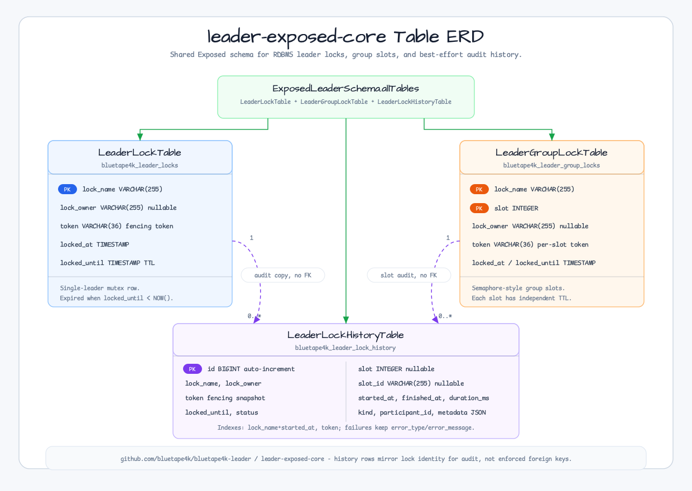

# leader-exposed-core

[English](README.md) | 한국어

RDBMS 기반 분산 리더 선출 백엔드를 위한 공통 DB 스키마 및 테이블 정의 모듈.

`leader-exposed-jdbc`와 `leader-exposed-r2dbc` 모듈의 공통 의존성입니다.
JDBC/R2DBC 드라이버는 포함되지 않으며, Exposed 테이블 정의와 상수만 제공합니다.

## 아키텍처



## 테이블

| 테이블 | 오브젝트 | 용도 |
|-------|--------|------|
| `bluetape4k_leader_locks` | `LeaderLockTable` | 단일 리더 선출 락 |
| `bluetape4k_leader_group_locks` | `LeaderGroupLockTable` | 다중 리더(세마포어) 선출 락 |
| `bluetape4k_leader_lock_history` | `LeaderLockHistoryTable` | 락 획득 이력 |

### LeaderLockTable

PK: `lock_name` (VARCHAR 255)

| 컬럼 | 타입 | 설명 |
|------|------|------|
| `lock_name` | VARCHAR(255) | PK, `validateLockName()`으로 검증 |
| `lock_owner` | VARCHAR(255) | nullable, 인스턴스 식별자 |
| `token` | VARCHAR(36) | UUID 펜싱 토큰 |
| `locked_at` | TIMESTAMP | 획득 시각 |
| `locked_until` | TIMESTAMP | TTL 만료 시각; `locked_until < NOW()`로 만료 감지 |

### LeaderGroupLockTable

복합 PK: `(lock_name, slot)`

| 컬럼 | 타입 | 설명 |
|------|------|------|
| `lock_name` | VARCHAR(255) | PK의 일부 |
| `slot` | INTEGER | PK의 일부, 범위 `[0, maxLeaders)` |
| `lock_owner` | VARCHAR(255) | nullable |
| `token` | VARCHAR(36) | UUID 펜싱 토큰 |
| `locked_at` | TIMESTAMP | 획득 시각 |
| `locked_until` | TIMESTAMP | TTL 만료 시각 |

### LeaderLockHistoryTable

PK: `id` (auto-increment BIGINT)

| 컬럼 | 타입 | 설명 |
|------|------|------|
| `id` | BIGINT | 자동 증가 |
| `lock_name` | VARCHAR(255) | 락 이름 |
| `lock_owner` | VARCHAR(255) | nullable |
| `token` | VARCHAR(36) | UUID |
| `slot` | INTEGER | nullable; 그룹 락에만 사용 |
| `locked_until` | TIMESTAMP | 획득 시점의 TTL |
| `status` | VARCHAR(20) | `ACQUIRED`, `COMPLETED`, `FAILED`, `EXPIRED` |
| `started_at` | TIMESTAMP | 락 획득 시각 (인덱스됨) |
| `finished_at` | TIMESTAMP | nullable; ACQUIRED 상태에서는 null |
| `duration_ms` | BIGINT | nullable; ACQUIRED 상태에서는 null |
| `error_type` | VARCHAR(255) | nullable; 예외 클래스명 |
| `error_message` | VARCHAR(512) | nullable; 정제된 오류 메시지 |
| `kind` | VARCHAR(32) | nullable; `SINGLE` 또는 `GROUP` |
| `participant_id` | VARCHAR(255) | nullable; 노드 또는 인스턴스 식별자 |
| `metadata` | TEXT | nullable; JSON 메타데이터 |
| `slot_id` | VARCHAR(255) | nullable; 정수가 아닌 백엔드를 위한 문자열 슬롯 식별자 |

인덱스: `idx_history_lock_started (lock_name, started_at)`, `idx_history_token (token)`

## 스키마 헬퍼

```kotlin
// 모든 테이블 생성
SchemaUtils.createMissingTablesAndColumns(*ExposedLeaderSchema.allTables)

// 모든 테이블 삭제
SchemaUtils.drop(*ExposedLeaderSchema.allTables)
```

`ExposedLeaderSchema.allTables`는 Exposed vararg API에 복사 없이 전달하기 위해 `Array<Table>` 타입입니다.

## 락 이름 검증

```kotlin
import io.bluetape4k.leader.validateLockName

validateLockName("my-job")           // 통과
validateLockName("batch:worker:0")   // 통과
validateLockName("invalid name")     // IllegalArgumentException
validateLockName("-bad-start")       // IllegalArgumentException
```

검증 규칙:
- 공백 불가; 최대 255자
- 패턴: `^[a-zA-Z0-9][a-zA-Z0-9_\-:]{0,254}$`
- 첫 문자는 영문자 또는 숫자여야 함

## 의존성

```kotlin
// 프로덕션
api(project(":leader-core"))
api(libs.exposed.core)
api(libs.exposed.java.time)
compileOnly(libs.exposed.dao)

// 테스트 전용
testImplementation(libs.exposed.jdbc.tests) // TestDB, withTables
testImplementation(libs.exposed.jdbc)
testImplementation(libs.hikaricp)
```
