# leader-exposed-jdbc

[English](README.md)

[Exposed](https://github.com/JetBrains/Exposed) JDBC 기반 분산 리더 선출 구현체입니다. 블로킹과 비동기(CompletableFuture) API를 제공합니다.

H2, PostgreSQL, MySQL 8 호환.

---

## 개요

`leader-exposed-jdbc`는 Exposed JDBC DSL을 사용하여 `leader-core` 인터페이스를 구현합니다. `LeaderLockTable`의 단일 행(PK = `lockName`)이 분산 뮤텍스 역할을 하며, UUID fencing token으로 락 소유권을 추적합니다.

락 전략: `UPDATE WHERE lockedUntil < NOW()` → `INSERT (PK 충돌 시 skip)` → `SELECT WHERE token = ?`. 세 단계 모두 하나의 트랜잭션 안에서 실행됩니다.

스키마는 최초 선출 호출 시 `SchemaUtils.createMissingTablesAndColumns`로 자동 생성됩니다.

## 아키텍처



## 구현체 목록

| 클래스 | 구현 인터페이스 | 설명 |
|-------|--------------|------|
| `ExposedJdbcLeaderElector` | `LeaderElector` + `AsyncLeaderElector` | 블로킹 / CompletableFuture 단일 리더 |
| `ExposedJdbcLeaderGroupElector` | `LeaderGroupElector` | 블로킹 복수 리더 (슬롯 세마포어) |
| `ExposedJdbcVirtualThreadLeaderElector` | `VirtualThreadLeaderElector` | 가상 스레드 단일 리더 |

## 사용 예시

### 초기화

```kotlin
val db = Database.connect(hikariDataSource)
```

스키마 테이블은 최초 선출 호출 시 자동으로 생성됩니다.

### 블로킹 단일 리더

```kotlin
val election = ExposedJdbcLeaderElector(db)

val result = election.runIfLeader("daily-report") {
    generateReport()
}
// result: 리더 노드에서는 generateReport() 결과, 나머지 노드는 null
```

### 비동기 단일 리더 (CompletableFuture)

```kotlin
val election = ExposedJdbcLeaderElector(db)

val future: CompletableFuture<Report?> = election.runAsyncIfLeader(
    lockName = "daily-report",
    executor = executor,
    action = { generateReportAsync() }   // CompletableFuture<Report> 반환
)
```

### 블로킹 복수 리더 그룹

```kotlin
val options = ExposedJdbcLeaderGroupElectionOptions(
    leaderGroupOptions = LeaderGroupElectionOptions(maxLeaders = 3)
)
val election = ExposedJdbcLeaderGroupElector(db, options)

val result = election.runIfLeader("parallel-batch") {
    processChunk()
}
// 최대 3개 노드가 동시 실행; 나머지는 null 반환
```

### 그룹 상태 조회

```kotlin
val state = election.state("parallel-batch")
println("active=${state.activeCount} max=${state.maxLeaders} full=${state.isFull}")
println("사용 가능 슬롯: ${election.availableSlots("parallel-batch")}")
```

### 가상 스레드 단일 리더

```kotlin
// 기존 ExposedJdbcLeaderElector을 래핑
val election = ExposedJdbcLeaderElector(db)
val vtElection = ExposedJdbcVirtualThreadLeaderElector(election)

val future: VirtualFuture<Result?> = vtElection.runAsyncIfLeader("nightly-sync") {
    syncData()
}
val result = future.get(5, TimeUnit.SECONDS)

// 또는 Database 확장함수로 간편하게
val result2 = db.runVirtualIfLeader("nightly-sync") { syncData() }
    .get(5, TimeUnit.SECONDS)
```

### 옵션 커스터마이징

```kotlin
val options = ExposedJdbcLeaderElectionOptions(
    leaderOptions = LeaderElectionOptions(
        waitTime = 5.seconds,
        leaseTime = 1.minutes
    ),
    retryStrategy = RetryStrategy.Jitter(baseDelayMs = 50),
    lockOwner = "node-1"
)
val election = ExposedJdbcLeaderElector(db, options)
```

## 락 내부 동작

`ExposedJdbcLock`은 단일 트랜잭션 내 **UPDATE+INSERT+SELECT** 패턴을 사용합니다:

1. **UPDATE** `SET token=?, lockedUntil=? WHERE lockName=? AND lockedUntil < NOW()` — 만료된 락 갱신
2. **INSERT** `(lockName, token, lockedUntil, ...)` — 행이 없으면 신규 삽입 (경합 시 PK 충돌 → 조용히 스킵)
3. **SELECT** `WHERE lockName=? AND token=?` — 소유권 확인

이 패턴은 DB 방언별 특수 문법 없이 모든 지원 DB에서 동작합니다.

## 재시도 전략

```kotlin
sealed class RetryStrategy {
    // Full jitter: [1ms, min(baseDelayMs, remaining)) 균등 분포
    data class Jitter(val baseDelayMs: Long = 50L) : RetryStrategy()

    // 지수 백오프, maxDelayMs 상한
    data class Exponential(val baseDelayMs: Long = 50L, val maxDelayMs: Long = 5_000L) : RetryStrategy()

    // 고정 간격
    data class Fixed(val fixedMs: Long = 50L) : RetryStrategy()
}
```

기본값은 `Jitter(50ms)` — 대부분의 OLTP 워크로드에 적합합니다.

각 전략은 생성 시점에 파라미터를 검증합니다:

| 변형 | 제약 |
|---|---|
| `Jitter` | `baseDelayMs >= 2` |
| `Exponential` | `baseDelayMs >= 1`, `maxDelayMs >= baseDelayMs` |
| `Fixed` | `fixedMs >= 1` |

## 이력 기록

`SafeLeaderHistoryRecorder`를 elector에 전달하면 각 선출 시도가 `LeaderLockHistoryTable`에 기록됩니다:

```kotlin
val sink = ExposedLeaderHistorySink(db)
val recorder = SafeLeaderHistoryRecorder(sink)
val election = ExposedJdbcLeaderElector(db, options, recorder)
```

| 상태 | 시점 |
|------|------|
| `ACQUIRED` | 락 획득 |
| `COMPLETED` | action 정상 반환 |
| `FAILED` | action 예외 발생 |

이력 기록은 best-effort입니다 — 기록 실패가 락 동작에 영향을 주지 않습니다.

## DB 호환성

| DB | 테스트 버전 |
|----|-----------|
| H2 | 2.x (in-memory, 테스트용) |
| PostgreSQL | 14+ |
| MySQL | 8.0+ |

## 의존성 추가

```kotlin
// build.gradle.kts
implementation("io.github.bluetape4k.leader:bluetape4k-leader-exposed-jdbc:0.1.0-SNAPSHOT")

// Exposed + JDBC 드라이버가 클래스패스에 있어야 합니다
implementation("org.jetbrains.exposed:exposed-jdbc:1.2.0")
implementation("com.zaxxer:HikariCP:6.x.x")
implementation("org.postgresql:postgresql:42.x.x")  // 또는 mysql-connector-j 등
```
