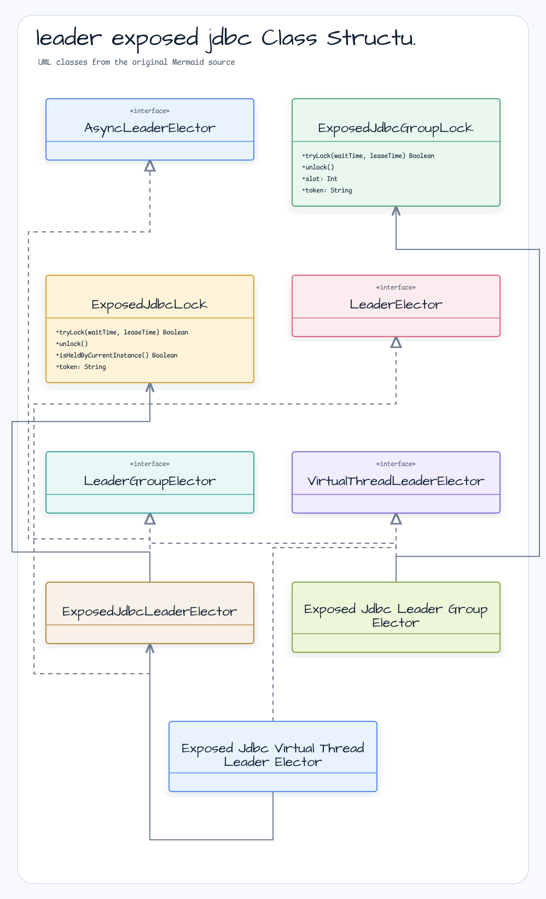

# leader-exposed-jdbc

[한국어](README.ko.md)

JDBC-backed leader election using [Exposed](https://github.com/JetBrains/Exposed) — blocking and async APIs.

Compatible with H2, PostgreSQL, and MySQL 8.

---

## Overview

`leader-exposed-jdbc` implements `leader-core` interfaces using Exposed's JDBC DSL. A single `LeaderLockTable` row (PK = `lockName`) acts as the distributed mutex; lock ownership is tracked by a UUID fencing token.

Lock strategy: `UPDATE WHERE lockedUntil < NOW()` → `INSERT (on PK conflict: skip)` → `SELECT WHERE token = ?`. All three steps run inside one transaction — no Lua, no `SELECT FOR UPDATE`.

Schema is created automatically on first use via `SchemaUtils.createMissingTablesAndColumns`.

## Architecture



## Implementations

| Class | Interface | Description |
|-------|-----------|-------------|
| `ExposedJdbcLeaderElector` | `LeaderElector` + `AsyncLeaderElector` | Blocking / CompletableFuture single-leader |
| `ExposedJdbcLeaderGroupElector` | `LeaderGroupElector` | Blocking multi-leader (slot semaphore) |
| `ExposedJdbcVirtualThreadLeaderElector` | `VirtualThreadLeaderElector` | Virtual-thread single-leader |

## Usage

### Setup

```kotlin
val db = Database.connect(hikariDataSource)
```

Schema tables are created automatically on first election call.

### Blocking single-leader

```kotlin
val election = ExposedJdbcLeaderElector(db)

val result = election.runIfLeader("daily-report") {
    generateReport()
}
// result == report on leader node, null on others
```

### Async single-leader (CompletableFuture)

```kotlin
val election = ExposedJdbcLeaderElector(db)

val future: CompletableFuture<Report?> = election.runAsyncIfLeader(
    lockName = "daily-report",
    executor = executor,
    action = { generateReportAsync() }   // returns CompletableFuture<Report>
)
```

### Blocking multi-leader group

```kotlin
val options = ExposedJdbcLeaderGroupElectionOptions(
    leaderGroupOptions = LeaderGroupElectionOptions(maxLeaders = 3)
)
val election = ExposedJdbcLeaderGroupElector(db, options)

val result = election.runIfLeader("parallel-batch") {
    processChunk()
}
// Up to 3 nodes run concurrently; others return null
```

### Inspecting group state

```kotlin
val state = election.state("parallel-batch")
println("active=${state.activeCount} max=${state.maxLeaders} full=${state.isFull}")
println("available slots: ${election.availableSlots("parallel-batch")}")
```

### Virtual-thread single-leader

```kotlin
// Wrap an existing ExposedJdbcLeaderElector
val election = ExposedJdbcLeaderElector(db)
val vtElection = ExposedJdbcVirtualThreadLeaderElector(election)

val future: VirtualFuture<Result?> = vtElection.runAsyncIfLeader("nightly-sync") {
    syncData()
}
val result = future.get(5, TimeUnit.SECONDS)

// Or use the Database extension shortcut
val result2 = db.runVirtualIfLeader("nightly-sync") { syncData() }
    .get(5, TimeUnit.SECONDS)
```

### Custom options

```kotlin
val options = ExposedJdbcLeaderElectionOptions(
    leaderOptions = LeaderElectionOptions(
        waitTime = 5.seconds,
        leaseTime = 1.minutes
    ),
    retryStrategy = RetryStrategy.Jitter(baseDelayMs = 50),
    lockOwner = "node-1"
)
val election = ExposedJdbcLeaderElector(db, options)
```

## Lock Internals

`ExposedJdbcLock` uses an **UPDATE+INSERT+SELECT** pattern inside a single transaction:

1. **UPDATE** `LeaderLockTable SET token=?, lockedUntil=? WHERE lockName=? AND lockedUntil < NOW()` — takes over an expired lock
2. **INSERT** `LeaderLockTable (lockName, token, lockedUntil, ...)` — creates a new lock if no row exists (PK conflict on contention → silently skipped)
3. **SELECT** `WHERE lockName=? AND token=?` — confirms ownership

This pattern works on all supported databases without database-specific syntax.

## Retry Strategy

```kotlin
sealed class RetryStrategy {
    // Full jitter: delay in [1ms, min(baseDelayMs, remaining))
    data class Jitter(val baseDelayMs: Long = 50L) : RetryStrategy()

    // Exponential backoff capped at maxDelayMs
    data class Exponential(val baseDelayMs: Long = 50L, val maxDelayMs: Long = 5_000L) : RetryStrategy()

    // Fixed interval
    data class Fixed(val fixedMs: Long = 50L) : RetryStrategy()
}
```

Default is `Jitter(50ms)` — suitable for most OLTP workloads.

Each variant validates its parameters at construction:

| Variant | Constraint |
|---|---|
| `Jitter` | `baseDelayMs >= 2` |
| `Exponential` | `baseDelayMs >= 1`, `maxDelayMs >= baseDelayMs` |
| `Fixed` | `fixedMs >= 1` |

## History Recording

Pass a `SafeLeaderHistoryRecorder` to the elector to enable audit history in `LeaderLockHistoryTable`:

```kotlin
val sink = ExposedLeaderHistorySink(db)
val recorder = SafeLeaderHistoryRecorder(sink)
val election = ExposedJdbcLeaderElector(db, options, recorder)
```

| Status | When |
|--------|------|
| `ACQUIRED` | Lock obtained |
| `COMPLETED` | Action returned normally |
| `FAILED` | Action threw an exception |

History is best-effort — recording failures do not affect lock semantics.

## Database Compatibility

| Database | Tested version |
|----------|---------------|
| H2 | 2.x (in-memory, for tests) |
| PostgreSQL | 14+ |
| MySQL | 8.0+ |

## Dependency

```kotlin
// build.gradle.kts
implementation("io.github.bluetape4k.leader:bluetape4k-leader-exposed-jdbc:0.2.0")

// Exposed + JDBC driver must be on the classpath
implementation("org.jetbrains.exposed:exposed-jdbc:1.2.0")
implementation("com.zaxxer:HikariCP:6.x.x")
implementation("org.postgresql:postgresql:42.x.x")  // or mysql-connector-j, etc.
```
