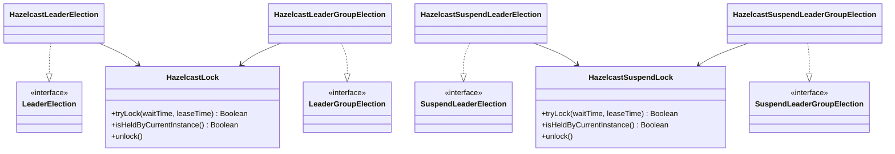

# leader-hazelcast

[English](README.md)

Hazelcast 기반 분산 리더 선출 — 블로킹, 비동기, Virtual Thread, 코루틴 API 제공.

---

## 개요

`leader-hazelcast`는 Hazelcast `IMap`을 분산 락 저장소로 사용하여 `leader-core` 인터페이스를 구현합니다. CP Subsystem 없이 동작하며, `putIfAbsent + TTL` + 토큰 기반 조건부 해제 방식으로 락을 구현합니다.

락 전략: `IMap.putIfAbsent(key, token, leaseTimeMs, MILLISECONDS)`로 원자적 획득, `IMap.remove(key, token)`으로 보유자만 해제. 스레드 ID에 의존하지 않는 토큰 모델 — Virtual Thread 및 코루틴 스레드 전환에서도 안전합니다.

> **주의:** `leaseTime`은 action의 최대 실행 시간보다 충분히 커야 합니다.
> TTL이 만료되면 락이 자동 해제되며, 갱신(watchdog)은 수행되지 않습니다.
>
> **주의:** 락 맵에는 near-cache를 절대 활성화하지 마십시오.
> 오래된 near-cache 값이 `isHeldByCurrentInstance()` 오판을 유발할 수 있습니다.

## 아키텍처



## 구현체

| 클래스 | 인터페이스 | 설명 |
|--------|-----------|------|
| `HazelcastLeaderElection` | `LeaderElection` | 블로킹 + 비동기 단일 리더 |
| `HazelcastLeaderGroupElection` | `LeaderGroupElection` | 블로킹 + 비동기 복수 리더 (슬롯 기반) |
| `HazelcastSuspendLeaderElection` | `SuspendLeaderElection` | 코루틴 단일 리더 |
| `HazelcastSuspendLeaderGroupElection` | `SuspendLeaderGroupElection` | 코루틴 복수 리더 (슬롯 기반) |

## 사용법

### 설정

```kotlin
val config = ClientConfig().apply {
    networkConfig.addAddress("localhost:5701")
}
val hazelcast = HazelcastClient.newHazelcastClient(config)
```

### 블로킹 단일 리더

```kotlin
val election = HazelcastLeaderElection(hazelcast)

val result = election.runIfLeader("daily-report") {
    generateReport()
}
// 리더 노드: generateReport() 반환값, 나머지: null
```

### 블로킹 복수 리더 그룹

```kotlin
val options = LeaderGroupElectionOptions(maxLeaders = 3)
val election = HazelcastLeaderGroupElection(hazelcast, options)

val result = election.runIfLeader("parallel-batch") {
    processChunk()
}
// 최대 3개 노드가 동시에 실행, 나머지는 null 반환
```

### 비동기 단일 리더

```kotlin
val election = HazelcastLeaderElection(hazelcast)

val future: CompletableFuture<Report?> = election.runAsyncIfLeader("daily-report") {
    CompletableFuture.supplyAsync { generateReport() }
}
```

### 코루틴 단일 리더

```kotlin
val election = HazelcastSuspendLeaderElection(hazelcast)

val result = election.runIfLeader("nightly-sync") {
    delay(100)
    syncData()
}
```

### 코루틴 복수 리더 그룹

```kotlin
val options = LeaderGroupElectionOptions(maxLeaders = 2)
val election = HazelcastSuspendLeaderGroupElection(hazelcast, options)

coroutineScope {
    val jobs = (1..5).map {
        async { election.runIfLeader("task-group") { processTask(it) } }
    }
    jobs.awaitAll()  // 2개 동시 실행, 3개는 null 반환
}
```

### 확장 함수

```kotlin
// 블로킹
hazelcast.runIfLeader("job") { doWork() }
hazelcast.runIfLeaderGroup("job", options) { doWork() }

// 코루틴
hazelcast.suspendRunIfLeader("job") { doWork() }
hazelcast.suspendRunIfLeaderGroup("job", options) { doWork() }
```

### 커스텀 옵션

```kotlin
val options = LeaderElectionOptions(
    waitTime = Duration.ofSeconds(3),
    leaseTime = Duration.ofSeconds(60)
)
val election = HazelcastLeaderElection(hazelcast, options)
```

## 락 내부 구현

`HazelcastLock`은 CP Subsystem 없이 `IMap` 연산으로 분산 락을 구현합니다:

```
획득: IMap.putIfAbsent(lockKey, token, leaseTimeMs, MILLISECONDS)
     → null 반환 = 획득 성공 (키 없음), 기존 토큰 반환 = 실패
해제: IMap.remove(lockKey, token)
     → 원자적 조건부 삭제 — 값이 토큰과 일치할 때만 삭제
확인: IMap.get(lockKey) == token
```

그룹 선출은 N개의 슬롯 키(`lockName:slot:0` … `lockName:slot:N-1`)로 세마포어를 시뮬레이션합니다. 각 호출자는 슬롯을 순서대로 시도하고, 처음 획득한 슬롯을 사용합니다.

락 맵 이름:
- 단일 리더: `bluetape4k:leader:locks`
- 그룹: `bluetape4k:leader:group:locks`

## 의존성

```kotlin
// build.gradle.kts
implementation("io.github.bluetape4k.leader:leader-hazelcast:0.1.0-SNAPSHOT")

// Hazelcast 클라이언트가 클래스패스에 있어야 합니다
implementation("com.hazelcast:hazelcast:5.x.x")
```
