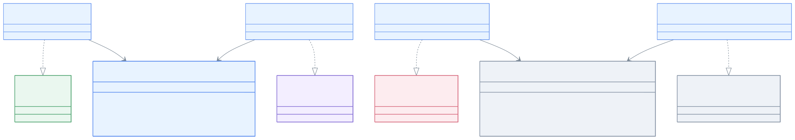
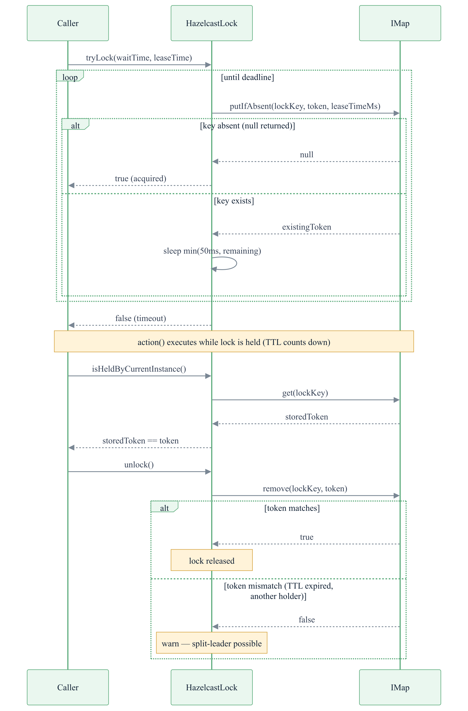
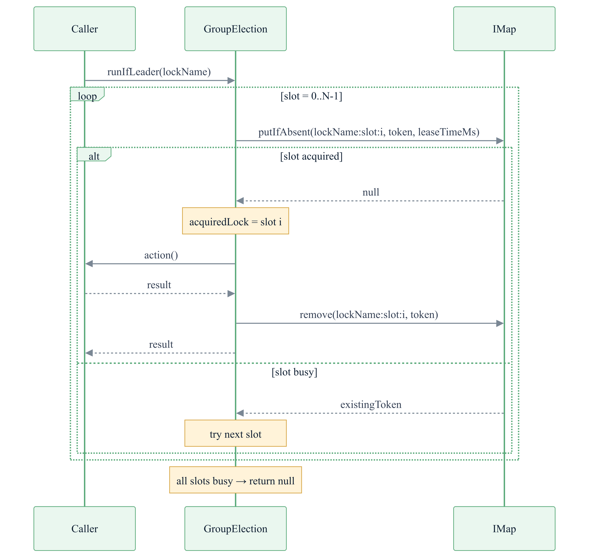

# leader-hazelcast

[한국어](README.ko.md)

Hazelcast-backed leader election — blocking, async, virtual-thread, and coroutine APIs.

---

## Overview

`leader-hazelcast` implements `leader-core` interfaces using Hazelcast `IMap` as a distributed lock store. No CP Subsystem required — lock primitives use `putIfAbsent + TTL` and token-based conditional release.

Lock strategy: `IMap.putIfAbsent(key, token, leaseTimeMs, MILLISECONDS)` for atomic acquire, `IMap.remove(key, token)` for owner-only release. Thread-unbound token model — safe for Virtual Threads and coroutine thread switches.

> **Note:** `leaseTime` must be longer than the expected action duration. TTL expiry automatically releases the lock; no watchdog renewal is performed.
>
> `minLeaseTime` retains the token with a shortened map-entry TTL when work finishes early, so other nodes cannot reacquire the same lock until the minimum lease has elapsed.
>
> **Note:** Never enable near-cache on the lock map. Stale near-cache reads can cause `isHeldByCurrentInstance()` to misidentify the lock holder.

## Architecture



## Implementations

| Class | Interface | Description |
|-------|-----------|-------------|
| `HazelcastLeaderElector` | `LeaderElector` | Blocking + async single-leader |
| `HazelcastLeaderGroupElector` | `LeaderGroupElector` | Blocking + async multi-leader (slot-based) |
| `HazelcastSuspendLeaderElector` | `SuspendLeaderElector` | Coroutine single-leader |
| `HazelcastSuspendLeaderGroupElector` | `SuspendLeaderGroupElector` | Coroutine multi-leader (slot-based) |
| `HazelcastLeaderElectorFactory` | `LeaderElectorFactory` | Factory: creates `HazelcastLeaderElector` per call |
| `HazelcastLeaderGroupElectorFactory` | `LeaderGroupElectorFactory` | Factory: creates `HazelcastLeaderGroupElector` per call |

## Usage

### Setup

```kotlin
val config = ClientConfig().apply {
    networkConfig.addAddress("localhost:5701")
}
val hazelcast = HazelcastClient.newHazelcastClient(config)
```

### Blocking single-leader

```kotlin
val election = HazelcastLeaderElector(hazelcast)

val result = election.runIfLeader("daily-report") {
    generateReport()
}
// result == generateReport() return value on leader, null on others
```

### Blocking multi-leader group

```kotlin
val options = LeaderGroupElectionOptions(maxLeaders = 3)
val election = HazelcastLeaderGroupElector(hazelcast, options)

val result = election.runIfLeader("parallel-batch") {
    processChunk()
}
// up to 3 nodes run concurrently, rest return null
```

### Async single-leader

```kotlin
val election = HazelcastLeaderElector(hazelcast)

val future: CompletableFuture<Report?> = election.runAsyncIfLeader("daily-report") {
    CompletableFuture.supplyAsync { generateReport() }
}
```

### Coroutine single-leader

```kotlin
val election = HazelcastSuspendLeaderElector(hazelcast)

val result = election.runIfLeader("nightly-sync") {
    delay(100)
    syncData()
}
```

### Coroutine multi-leader group

```kotlin
val options = LeaderGroupElectionOptions(maxLeaders = 2)
val election = HazelcastSuspendLeaderGroupElector(hazelcast, options)

coroutineScope {
    val jobs = (1..5).map {
        async { election.runIfLeader("task-group") { processTask(it) } }
    }
    jobs.awaitAll()  // 2 run concurrently, 3 return null
}
```

### Extension functions

```kotlin
// Blocking
hazelcast.runIfLeader("job") { doWork() }
hazelcast.runIfLeaderGroup("job", options) { doWork() }

// Coroutine
hazelcast.suspendRunIfLeader("job") { doWork() }
hazelcast.suspendRunIfLeaderGroup("job", options) { doWork() }
```

### Custom options

```kotlin
val options = LeaderElectionOptions(
    waitTime = 3.seconds,
    leaseTime = 60.seconds
)
val election = HazelcastLeaderElector(hazelcast, options)
```

### Using factories

```kotlin
val factory: LeaderElectorFactory = HazelcastLeaderElectorFactory(hazelcast)
val election = factory.create(LeaderElectionOptions.Default)

val groupFactory: LeaderGroupElectorFactory = HazelcastLeaderGroupElectorFactory(hazelcast)
val groupElection = groupFactory.create(LeaderGroupElectionOptions(maxLeaders = 3))
```

## Lock Internals

`HazelcastLock` uses `IMap` operations for CP-Subsystem-free distributed locking:

```
Acquire: IMap.putIfAbsent(lockKey, token, leaseTimeMs, MILLISECONDS)
         → returns null on success (key was absent), existing token on failure
Release: IMap.remove(lockKey, token)
         → atomic conditional delete — only removes if value matches token
Check:   IMap.get(lockKey) == token
```

### Lock acquire/release sequence



### Group election slot sequence (maxLeaders = N)



Group election simulates a semaphore with N slot keys (`lockName:slot:0` … `lockName:slot:N-1`). Each caller tries slots in sequence; first acquired slot wins.

Lock map names:
- Single-leader: `bluetape4k:leader:locks`
- Group: `bluetape4k:leader:group:locks`

## Dependency

```kotlin
// build.gradle.kts
implementation("io.github.bluetape4k.leader:bluetape4k-leader-hazelcast:0.1.0-SNAPSHOT")

// Hazelcast must be on the classpath
implementation("com.hazelcast:hazelcast:5.x.x")
```
