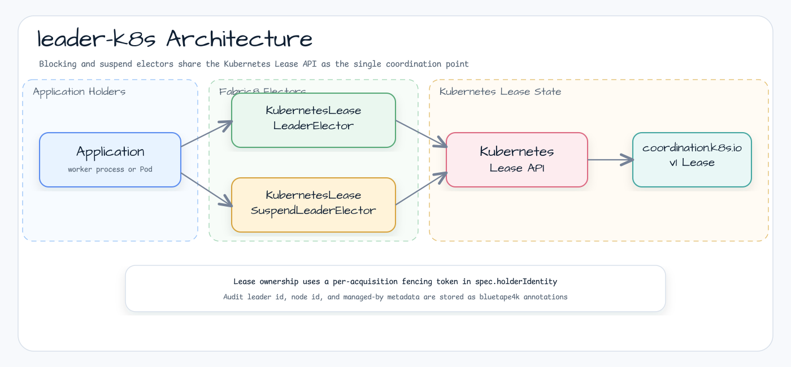
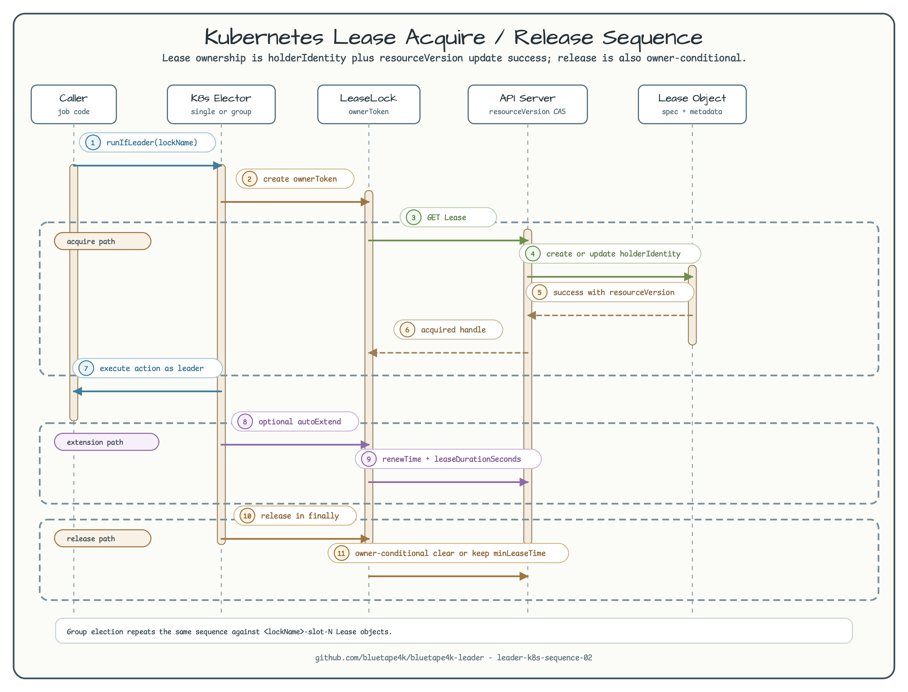

# bluetape4k-leader-k8s

English | [한국어](./README.ko.md)

Kubernetes Lease backend for `bluetape4k-leader`. It uses the native
`coordination.k8s.io/v1` Lease API, so applications running in Kubernetes can
elect exactly one active worker, or a bounded group of workers, without adding
Redis, MongoDB, ZooKeeper, or a custom CRD.

## Architecture





`holderIdentity` stores a per-acquisition fencing token. Human/audit identity is
kept in annotations:

| Annotation | Purpose |
| --- | --- |
| `leader.bluetape4k.io/audit-leader-id` | Slot leader id or generated token for state/audit display |
| `leader.bluetape4k.io/node-id` | `LeaderElectionOptions.nodeId` |
| `leader.bluetape4k.io/managed-by` | `bluetape4k-leader-k8s` marker |

This prevents two electors in the same JVM or Pod from treating the same
`nodeId` as ownership authority.

Group leader election uses one Lease per slot:

```text
<lockName>-slot-<slotIndex>
```

Each slot keeps the same fencing-token and owner-conditional update semantics as
single-Lease election. Group state is observability metadata only; correctness
stays on Kubernetes Lease ownership checks.

## Core Features

- Blocking and async `LeaderElector` implementation
- Coroutine-native `SuspendLeaderElector` implementation
- Blocking and async `LeaderGroupElector` implementation using Lease-per-slot
- Coroutine-native `SuspendLeaderGroupElector` implementation
- Owner-conditional release and extension using Kubernetes `resourceVersion`
- Expired Lease takeover based on `renewTime + leaseDurationSeconds`
- `LeaderState` and `LeaderGroupState` snapshots mapped from Lease metadata and annotations
- `minLeaseTime` support for short actions that must keep leadership briefly
- K3s-backed integration tests under `k8sTest`

## Usage

```kotlin
import io.bluetape4k.leader.LeaderElectionOptions
import io.bluetape4k.leader.k8s.KubernetesLeaseLeaderElector
import io.bluetape4k.leader.k8s.KubernetesLeaseOptions
import io.fabric8.kubernetes.client.KubernetesClientBuilder
import kotlin.time.Duration.Companion.seconds

val client = KubernetesClientBuilder().build()
val elector = KubernetesLeaseLeaderElector(
    client = client,
    options = KubernetesLeaseOptions(
        namespace = "operators",
        leaderOptions = LeaderElectionOptions(
            nodeId = "worker-0",
            waitTime = 2.seconds,
            leaseTime = 30.seconds,
            autoExtend = true,
        ),
    ),
)

elector.runIfLeader("daily-report") {
    generateReport()
}
```

Coroutine usage:

```kotlin
import io.bluetape4k.leader.k8s.KubernetesLeaseSuspendLeaderElector

val suspendElector = KubernetesLeaseSuspendLeaderElector(client)

suspendElector.runIfLeader("nightly-sync") {
    syncData()
}
```

Async usage:

```kotlin
val future = elector.runAsyncIfLeader("webhook-poller") {
    pollWebhooksAsync()
}
```

Group usage:

```kotlin
import io.bluetape4k.leader.LeaderGroupElectionOptions
import io.bluetape4k.leader.k8s.KubernetesLeaseGroupOptions
import io.bluetape4k.leader.k8s.KubernetesLeaseLeaderGroupElector

val groupElector = KubernetesLeaseLeaderGroupElector(
    client = client,
    options = KubernetesLeaseGroupOptions(
        namespace = "operators",
        leaderGroupOptions = LeaderGroupElectionOptions(
            maxLeaders = 4,
            nodeId = "worker-0",
            waitTime = 2.seconds,
            leaseTime = 30.seconds,
        ),
    ),
)

groupElector.runIfLeader("partition-worker") {
    processPartition()
}
```

## Configuration

| Option | Type | Default | Description |
| --- | --- | --- | --- |
| `namespace` | `String` | `default` | Namespace that stores Lease objects |
| `retryDelay` | `Duration` | `50.milliseconds` | Full-jitter retry upper bound after contention or `409 Conflict` |
| `leaderOptions.waitTime` | `Duration` | `5.seconds` | Maximum time to wait for leadership |
| `leaderOptions.leaseTime` | `Duration` | `60.seconds` | Lease duration written to Kubernetes |
| `leaderOptions.nodeId` | `String` | process-level default | Audit node id annotation |
| `leaderOptions.minLeaseTime` | `Duration` | `0.seconds` | Minimum leadership hold time after quick actions |
| `leaderOptions.autoExtend` | `Boolean` | `false` | Extends the active Lease while the action runs |
| `leaderGroupOptions.maxLeaders` | `Int` | `2` | Maximum active Lease slots for group election |
| `leaderGroupOptions.waitTime` | `Duration` | `5.seconds` | Maximum time to acquire any group slot |
| `leaderGroupOptions.leaseTime` | `Duration` | `60.seconds` | Lease duration for each group slot |
| `leaderGroupOptions.nodeId` | `String` | process-level default | Audit node id annotation for group slots |
| `leaderGroupOptions.minLeaseTime` | `Duration` | `0.seconds` | Minimum slot hold time after quick group actions |

`lockName` must be a Kubernetes DNS-1123 label and must fit the Lease name limit
(63 characters). For group election, the derived `<lockName>-slot-<slotIndex>`
names must also fit this limit.

## RBAC

The service account running the application needs Lease access in the selected
namespace. Production electors do not delete Leases during normal release, but
`delete` is useful for test and operator cleanup tooling:

```yaml
apiVersion: rbac.authorization.k8s.io/v1
kind: Role
metadata:
  name: bluetape4k-leader
  namespace: operators
rules:
  - apiGroups: ["coordination.k8s.io"]
    resources: ["leases"]
    verbs: ["get", "list", "watch", "create", "update", "patch", "delete"]
---
apiVersion: rbac.authorization.k8s.io/v1
kind: RoleBinding
metadata:
  name: bluetape4k-leader
  namespace: operators
subjects:
  - kind: ServiceAccount
    name: worker
    namespace: operators
roleRef:
  apiGroup: rbac.authorization.k8s.io
  kind: Role
  name: bluetape4k-leader
```

## Testing

Unit tests exclude K3s:

```bash
./gradlew :bluetape4k-leader-k8s:test
```

Run K3s-backed integration tests separately. This task includes single-Lease and
Lease-per-slot group election coverage for acquire, contention, release,
reacquire, expiry takeover, and cancellation/error cleanup paths:

```bash
./gradlew :bluetape4k-leader-k8s:k8sTest
```

K3s tests require a Docker daemon with privileged container support. Pull request
CI runs the non-K3s unit slice; the weekly/manual Nightly full workflow runs
`:bluetape4k-leader-k8s:test :bluetape4k-leader-k8s:k8sTest`.

## Dependency

Gradle (Kotlin DSL):

```kotlin
dependencies {
    implementation("io.github.bluetape4k.leader:bluetape4k-leader-k8s:$bluetape4kLeaderVersion")
}
```

The module exposes Fabric8 Kubernetes Client as an API dependency because
constructors accept `KubernetesClient`.

## License

MIT License
