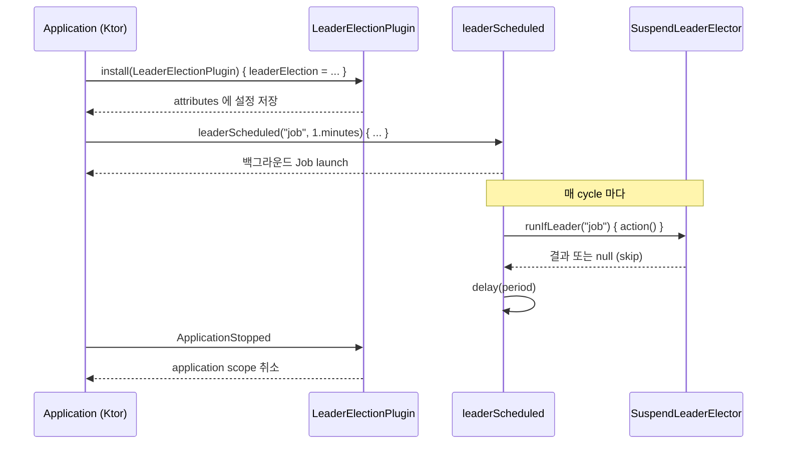

# bluetape4k-leader-ktor

한국어 | [English](./README.md)

`bluetape4k-leader` 의 Ktor 3.x 통합 모듈입니다. Ktor 애플리케이션 플러그인 DSL 과
Spring `@Scheduled` 스타일의 주기적 리더 전용 작업 헬퍼를 제공합니다.

## Architecture

`leader-ktor` 는 `leader-core` 위에 세 가지 통합 요소를 제공합니다:

1. **`LeaderElectionPlugin`** — `createApplicationPlugin` DSL 로 정의된 플러그인.
   `SuspendLeaderElector` (필요 시 `SuspendLeaderGroupElector`) 를 받아 `Application.attributes`
   에 저장하여 확장 함수에서 재사용할 수 있게 합니다.
2. **`leaderElectionPluginConfig()`** — `Application` 확장 함수. 저장된 설정을 조회합니다.
3. **`Application.leaderScheduled(...)`** — 주기적으로 리더 전용 suspend 작업을 실행합니다.
   `Application` 코루틴 스코프에서 `launch` 하여 `ApplicationStopped` 시 자동 취소됩니다.



## Core Features

- Ktor 3.x 호환, coroutine-native (`SuspendLeaderElector` 기반)
- `ApplicationStopped` 시 `Application` 코루틴 스코프가 자동 취소 처리
- cycle 별 예외 격리 — `action` 예외는 로그만 남기고 다음 cycle 진행 (poison-pill 방지)
- `CancellationException` 은 항상 재전파되어 구조적 동시성 보존
- 입력 검증: `lockName` 은 blank 금지, `period` 는 양수 필수
- 백엔드 자유 선택: `SuspendLeaderElector` 구현체
  (`leader-redis-redisson`, `leader-redis-lettuce`, `leader-mongodb` 등)

## Usage Examples

```kotlin
import io.bluetape4k.leader.ktor.LeaderElectionPlugin
import io.bluetape4k.leader.ktor.leaderScheduled
import io.bluetape4k.leader.redisson.RedissonSuspendLeaderElector
import io.ktor.server.application.Application
import io.ktor.server.application.install
import kotlin.time.Duration.Companion.minutes

fun Application.module() {
    val redisson = redissonClient()

    install(LeaderElectionPlugin) {
        leaderElection = RedissonSuspendLeaderElector(redisson)
    }

    leaderScheduled("daily-report", period = 1.minutes) {
        reportService.generate()
    }
}
```

수동 취소:

```kotlin
val job = leaderScheduled("inventory-sync", 5.minutes) { syncInventory() }
// ... 나중에
job.cancel()
```

플러그인을 우회하여 elector 직접 주입 (advanced):

```kotlin
leaderScheduled(
    lockName = "ad-hoc",
    period = 30.seconds,
    leaderElection = customElector,
) {
    doWork()
}
```

## Configuration Options

| 필드                  | 타입                          | 필수 | 설명                                       |
|-----------------------|-------------------------------|------|--------------------------------------------|
| `leaderElection`      | `SuspendLeaderElector?`       | 예   | 단일 리더 선출 백엔드                      |
| `leaderGroupElection` | `SuspendLeaderGroupElector?`  | 아니오 | 그룹/멀티 리더 백엔드 (선택)             |
| `managementRouteEnabled` | `Boolean`                  | 아니오 | `GET /management/leaderElection` 활성화 |
| `managementRoutePath` | `String`                      | 아니오 | Management route 경로                     |

`leaderScheduled` 파라미터:

| 파라미터          | 타입                      | 기본값                           | 비고                                       |
|-------------------|---------------------------|----------------------------------|--------------------------------------------|
| `lockName`        | `String`                  | —                                | blank 금지                                 |
| `period`          | `kotlin.time.Duration`    | —                                | 양수 필수                                  |
| `leaderElection`  | `SuspendLeaderElector`    | 설치된 플러그인 설정에서 조회    | 미지정 시 플러그인 설정 사용               |
| `action`          | `suspend () -> Unit`      | —                                | 리더로 선출되었을 때만 실행                |

## Management Route

Management route는 기본 비활성입니다. 첫 scheduled run 전에 보여야 하는 정적 lock 이름이 있으면 함께 등록하세요:

```kotlin
fun Application.module() {
    install(LeaderElectionPlugin) {
        leaderElection = redissonElector
        managementRouteEnabled = true
        managementLockNames("batch-job", "migration-gate")
    }
}
```

```http
GET /management/leaderElection
```

이 route는 Ktor 애플리케이션의 main port와 routing pipeline에 설치됩니다. 신뢰된 management boundary 밖으로 노출하기 전에 인증 plugin, network policy, 또는 별도 internal port로 보호하세요.

```json
{
  "locks": [
    {
      "name": "batch-job",
      "status": "Empty",
      "leaderId": null,
      "leaseExpiry": null
    }
  ]
}
```

`leaderScheduled()`는 플러그인이 설치되어 있을 때 자신의 lock 이름을 management registry에 기록합니다. 이 route는 JSON text를 직접 응답하므로, 이 endpoint만을 위해 Ktor content negotiation을 추가할 필요는 없습니다.

## `leaderScheduled` 안의 LockAssert / LockExtender (Issue #79)

`leaderScheduled { ... }` background action 안에서 `LockAssert.assertLockedSuspend()` 와
`LockExtender.extendActiveLockDetailedSuspend(d)` 가 정상 동작합니다. 내부 `SuspendLeaderElector` 의
capture 메커니즘이 `LockHandleElement` 를 action 의 `CoroutineContext` 로 전파합니다.

```kotlin
leaderScheduled("daily-report", period = 1.hours) {
    LockAssert.assertLockedSuspend()                              // 리더일 때 통과
    val outcome = LockExtender.extendActiveLockDetailedSuspend(10.minutes)
    if (outcome is ExtendOutcome.Extended) {
        runLongRunningReport()
    }
}
```

**미지원 시나리오**: `Application.routing` 핸들러, `PipelineContext`, 그 외 `leaderScheduled` 가 아닌
표면 (Ktor request pipeline 등). 플러그인은 `Application.attributes` 에만 설정을 저장하며 Ktor
routing pipeline 에 `LockHandleElement` 를 주입하지 않습니다. 보장된 전파를 위해 반드시
`leaderScheduled` 안에서 사용하세요.

## Dependency

Gradle (Kotlin DSL):

```kotlin
dependencies {
    implementation("io.github.bluetape4k.leader:bluetape4k-leader-ktor:$bluetape4kLeaderVersion")
    implementation("io.github.bluetape4k.leader:bluetape4k-leader-redis-redisson:$bluetape4kLeaderVersion") // 또는 다른 백엔드
    implementation("io.ktor:ktor-server-core:3.4.3")
}
```

`ktor-server-core` 는 본 모듈에서 `compileOnly` 로만 선언되므로, 사용 애플리케이션에서
직접 의존성을 추가해야 합니다.

## License

MIT License
