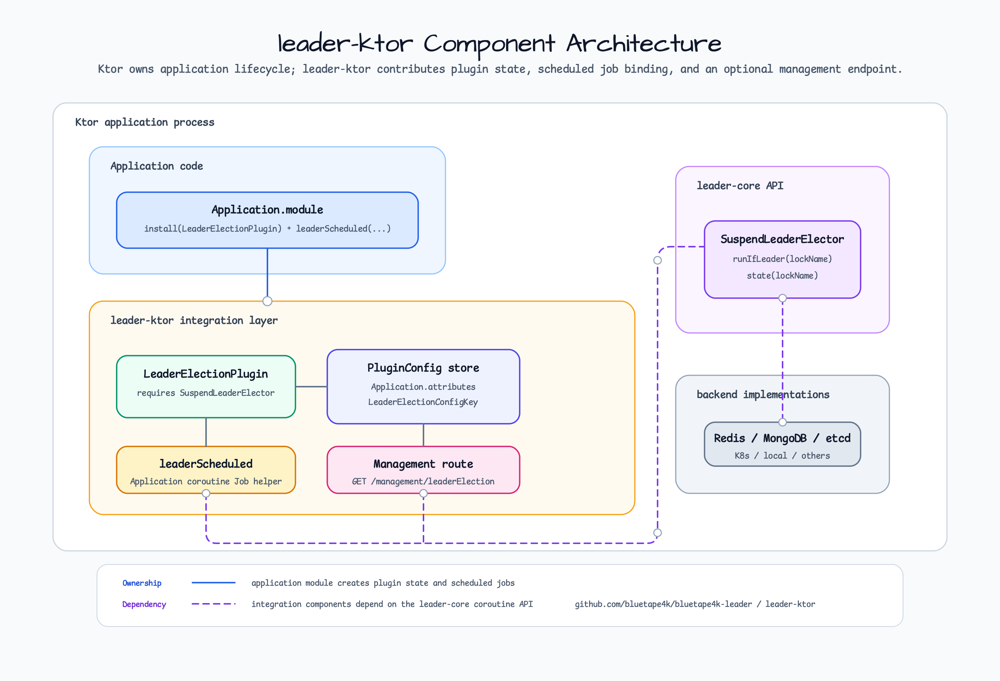
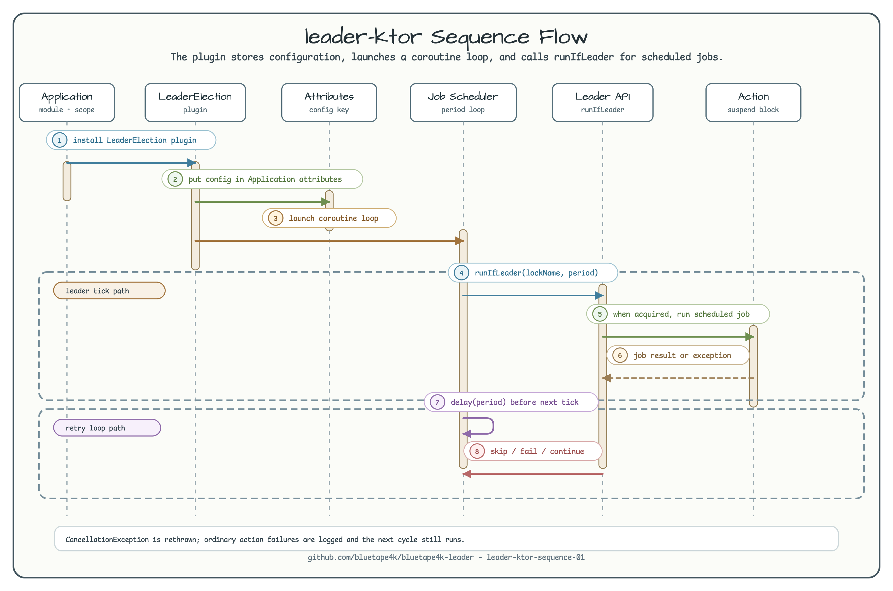

# bluetape4k-leader-ktor

[English](./README.md) | 한국어

`bluetape4k-leader` 의 Ktor 3.x 통합 모듈입니다. Ktor 애플리케이션 플러그인 DSL 과
Spring `@Scheduled` 스타일의 주기적 리더 전용 작업 헬퍼를 제공합니다.

## Architecture

`leader-ktor` 는 `leader-core` 위에 세 가지 통합 요소를 제공합니다:

1. **`LeaderElectionPlugin`** — `createApplicationPlugin` DSL 로 정의된 플러그인.
   `SuspendLeaderElector` (필요 시 `SuspendLeaderGroupElector`) 를 받아 `Application.attributes`
   에 저장하여 확장 함수에서 재사용할 수 있게 합니다.
2. **`leaderElectionPluginConfig()`** — `Application` 확장 함수. 저장된 설정을 조회합니다.
3. **`Application.leaderScheduled(...)`** — 주기적으로 리더 전용 suspend 작업을 실행합니다.
   `LeaderElectionPlugin`이 설치되면 반환된 Job을 애플리케이션 소유 resource registry에
   등록하고 `ApplicationStopped` 시 bounded join과 함께 취소합니다.



### Runtime sequence



## Core Features

- Ktor 3.x 호환, coroutine-native (`SuspendLeaderElector` 기반)
- Plugin resource registry가 `ApplicationStopped` 시 애플리케이션 소유 scheduler Job을
  취소하며 caller-owned elector와 backend client는 암묵적으로 닫지 않음
- cycle 별 예외 격리 — `action` 예외는 로그만 남기고 다음 cycle 진행 (poison-pill 방지)
- `CancellationException` 은 항상 재전파되어 구조적 동시성 보존
- 입력 검증: `lockName` 은 blank 금지, `period` 는 양수 필수
- 백엔드 자유 선택: `SuspendLeaderElector` 구현체
  (`leader-redis-redisson`, `leader-redis-lettuce`, `leader-mongodb` 등)

## Usage Examples

```kotlin
import io.bluetape4k.leader.ktor.LeaderElectionPlugin
import io.bluetape4k.leader.ktor.leaderScheduled
import io.bluetape4k.leader.redisson.RedissonSuspendLeaderElector
import io.ktor.server.application.Application
import io.ktor.server.application.install
import kotlin.time.Duration.Companion.minutes

fun Application.module() {
    val redisson = redissonClient()

    install(LeaderElectionPlugin) {
        leaderElection = RedissonSuspendLeaderElector(redisson)
    }

    leaderScheduled("daily-report", period = 1.minutes) {
        reportService.generate()
    }
}
```

수동 취소:

```kotlin
val job = leaderScheduled("inventory-sync", 5.minutes) { syncInventory() }
// ... 나중에
job.cancel()
```

### Lifecycle 소유권

`LeaderElectionPlugin`은 애플리케이션 소유 resource registry를 하나 만듭니다.
`leaderScheduled`가 반환한 Job은 여기에 등록되고 `ApplicationStopped`가 관찰되면
즉시 취소됩니다. 이후 registry-owned cleanup이 bounded join을 수행하며 Ktor stop
callback을 block하지 않습니다. Resource 정리는 idempotent이고 registry lock 밖에서
실행됩니다.

Plugin은 전달받은 `SuspendLeaderElector`, Redis/SQL/Mongo client 또는 애플리케이션이
소유한 다른 backend를 자동으로 닫지 않습니다. Plugin 없이 explicit elector를 전달한
`leaderScheduled`는 기존 `Application` scope를 사용하며 취소 책임은 caller에게 있습니다.
정상적인 lock contention은 계속 `null`을 반환하고 scheduler는 다음 cycle을 진행합니다.

플러그인을 우회하여 elector 직접 주입 (advanced):

```kotlin
leaderScheduled(
    lockName = "ad-hoc",
    period = 30.seconds,
    leaderElection = customElector,
) {
    doWork()
}
```

## Configuration Options

| 필드                  | 타입                          | 필수 | 설명                                       |
|-----------------------|-------------------------------|------|--------------------------------------------|
| `leaderElection`      | `SuspendLeaderElector?`       | 예   | 단일 리더 선출 백엔드                      |
| `leaderGroupElection` | `SuspendLeaderGroupElector?`  | 아니오 | 그룹/멀티 리더 백엔드 (선택)             |
| `managementRouteEnabled` | `Boolean`                  | 아니오 | `GET /management/leaderElection` 활성화 |
| `managementRoutePath` | `String`                      | 아니오 | Management route 경로                     |
| `backendDiagnosticsRouteEnabled` | `Boolean`           | 아니오 | `GET /management/leaderElection/diagnostics` 활성화 |
| `backendDiagnosticsRoutePath` | `String`                | 아니오 | Backend diagnostics route 경로             |
| `backendConnectivityCheckEnabled` | `Boolean`          | 아니오 | 요청마다 active connectivity probe 한 번 실행 |
| `backendConnectivityCheckTimeout` | `kotlin.time.Duration` | 아니오 | 양수이면서 유한한 probe 제한 시간, 기본값 `500ms` |
| `managementActionRouteEnabled` | `Boolean` | 아니오 | 애플리케이션 소유 action registry를 검증하며 route 설치는 별도 명시 |
| `managementActionRegistry` | `SuspendLeaderManagementActionRegistry?` | 아니오 | 애플리케이션 소유 single-leader action registry |
| `managementActionRoutePath` | `String?` | 아니오 | action path 명시적 override; route에 전달하지 않으면 `<managementRoutePath>/actions` 기본 규칙 사용 |

`leaderScheduled` 파라미터:

| 파라미터          | 타입                      | 기본값                           | 비고                                       |
|-------------------|---------------------------|----------------------------------|--------------------------------------------|
| `lockName`        | `String`                  | —                                | blank 금지                                 |
| `period`          | `kotlin.time.Duration`    | —                                | 양수 필수                                  |
| `leaderElection`  | `SuspendLeaderElector`    | 설치된 플러그인 설정에서 조회    | 미지정 시 플러그인 설정 사용               |
| `action`          | `suspend () -> Unit`      | —                                | 리더로 선출되었을 때만 실행                |

## Management Route

Management route는 기본 비활성입니다. 첫 scheduled run 전에 보여야 하는 정적 lock 이름이 있으면 함께 등록하세요:

```kotlin
fun Application.module() {
    install(LeaderElectionPlugin) {
        leaderElection = redissonElector
        managementRouteEnabled = true
        managementLockNames("batch-job", "migration-gate")
    }
}
```

```http
GET /management/leaderElection
```

이 route는 Ktor 애플리케이션의 main port와 routing pipeline에 설치됩니다. 신뢰된 management boundary 밖으로 노출하기 전에 인증 plugin, network policy, 또는 별도 internal port로 보호하세요.

```json
{
  "locks": [
    {
      "name": "batch-job",
      "status": "Empty",
      "leaderId": null,
      "leaseExpiry": null
    }
  ]
}
```

`leaderScheduled()`는 플러그인이 설치되어 있을 때 자신의 lock 이름을 management registry에 기록합니다. 이 route는 JSON text를 직접 응답하므로, 이 endpoint만을 위해 Ktor content negotiation을 추가할 필요는 없습니다.

### 안정적인 오류 응답

Management와 adapter 오류는 작고 안정적인 JSON 계약을 사용합니다. 정상적인
lock contention은 기존 `null`/skip으로 남으며 HTTP 오류로 바꾸지 않습니다.

| Code | HTTP status | 의미 |
|---|---:|---|
| `INVALID_LOCK_NAME` | 400 | lock name이 비어 있거나 core ASCII 규칙을 벗어남 |
| `NOT_LEADER` | 503 | 현재 leader 상태가 요청을 허용하지 않음 |
| `LEADER_LOCKED` | 423 | leader lock을 이미 보유함 |
| `BACKEND_UNAVAILABLE` | 503 | 상태/backend 조회 실패 |
| `CONFIGURATION`, `INTERNAL` | 500 | 설정 오류 또는 예상하지 못한 요청 실패 |
| `INVALID_CURSOR` | 400 | stream cursor가 올바르지 않음 |

응답은 기본적으로 `code`, `message`, 숫자 `status`만 포함합니다.

```json
{"code":"BACKEND_UNAVAILABLE","message":"leader backend is temporarily unavailable","status":503}
```

Backend 예외 message, stack trace, cause 상세는 응답에 복사하지 않습니다.
`lockName`은 typed `LeaderElectionErrorOverride`가 `exposeLockName = true`를
명시할 때만 포함하며 status override도 위 allow-list 안에서만 허용합니다.
`CancellationException`은 infrastructure 오류로 잘못 분류하지 않고 다시 던집니다.

Management route에는 converter가 없어도 동작하는 `respondText` fallback이 있습니다.
Ktor `StatusPages`를 이미 사용하는 애플리케이션은 다음 optional adapter를 명시적으로
설치할 수 있습니다(이 모듈에서는 dependency가 `compileOnly`입니다).

```kotlin
import io.bluetape4k.leader.ktor.statuspages.leaderElectionErrors
import io.ktor.server.plugins.statuspages.StatusPages

install(StatusPages) {
    leaderElectionErrors()
}
```

분리된 `leaderScheduled` 예외는 이 HTTP mapping에 들어오지 않습니다. Plugin이
정제한 예외 type을 `WARN`으로 기록하고 해당 회차만 건너뛴 뒤 다음 schedule을 계속합니다.

## Management Action Route (Issue #532, unreleased)

Write route는 별도의 명시적 opt-in입니다. `managementActionRouteEnabled=true`이면
`LeaderElectionPlugin`이 애플리케이션 소유 `SuspendLeaderManagementActionRegistry`
존재 여부만 검증하며 POST route를 자동 설치하지 않습니다. 애플리케이션이 소유한
`authenticate("management")` scope 안에서 route를 설치하세요.

```kotlin
val actionRegistry = SuspendLeaderManagementActionRegistry()

install(Authentication) {
    basic("management") {
        validate { credentials ->
            if (credentials.name == "admin" && credentials.password == "secret") {
                UserIdPrincipal(credentials.name)
            } else {
                null
            }
        }
    }
}

install(LeaderElectionPlugin) {
    leaderElection = redissonElector
    managementActionRouteEnabled = true
    managementActionRegistry = actionRegistry
}

routing {
    authenticate("management") {
        leaderElectionManagementActionRoute(
            registry = actionRegistry,
            authorize = { principal<UserIdPrincipal>() != null },
        )
    }
}
```

Canonical path는 `POST /management/leaderElection/actions/{lockName}`입니다.
`managementRoutePath`를 바꿀 때는 `/internal/leader-status/actions`처럼 `path`를
명시하세요. Library는 write route를 자동 설치하지 않으므로 경로를 암묵적으로
추론하지 않습니다. Route는 공통 ASCII lock-name grammar를 사용합니다. encoded 또는
literal slash는 selector 경계를 넘지 못해 404가 되고, `%`처럼 매칭된 hostile selector는
`INVALID_LOCK_NAME`과 함께 400을 반환합니다.

Unauthenticated 401과 principal 실패는 Ktor authentication이 소유합니다.
`authorize` callback이 false이면 403 `AUTHORIZATION_DENIED`, 일반 callback 예외이면
registry를 호출하지 않고 500 `AUTHORIZATION_FAILED`를 반환하며 예외 원문을 복사하지
않습니다. 정상 및 typed registry outcome은 공통 HTTP mapping을 사용하고 JSON body에는
`action`, `outcome`, `mutationAttempted`만 포함합니다. `ACTION_TIMED_OUT`과
`RELEASE_UNCONFIRMED`를 포함해 자동 retry는 없습니다.

Registry, observer, scope는 애플리케이션이 소유합니다. Engine을 멈추기 전에 다음
helper로 drain하세요. 이 helper는 suspend-native이며 외부 application scope를
취소하지 않습니다.

```kotlin
suspend fun shutdown(
    engine: ApplicationEngine,
    actionRegistry: SuspendLeaderManagementActionRegistry,
) {
    engine.stopLeaderManagementGracefully(
        actionRegistry,
        gracePeriodMillis = 1_000,
        timeoutMillis = 5_000,
    )
}
```

`closeAndDrain()`은 bounded하게 동작합니다. `false`를 반환해도 helper는 sanitized
warning을 남기고 engine stop을 계속하며 임의의 lease를 해제하지 않습니다. Single-leader
lease handle만 명시적으로 등록하세요. `runIfLeader`, group/strategic election,
`leaderScheduled`, `LeaderRouteLeaseRuntime`은 자동 등록되지 않습니다.

## Backend Diagnostics Route

Backend diagnostics route는 기본 비활성입니다. 선택된 backend descriptor를 노출하려면 명시적으로 활성화하세요:

```kotlin
install(LeaderElectionPlugin) {
    leaderElection = redissonElector
    backendDiagnosticsRouteEnabled = true
}
```

```http
GET /management/leaderElection/diagnostics
```

기본 응답은 backend I/O를 수행하지 않으며 연결 상태를 `NOT_CHECKED`로 반환합니다. 요청마다 실제 backend를 확인해도 되는 환경에서만 active check를 활성화하세요:

```kotlin
install(LeaderElectionPlugin) {
    leaderElection = redissonElector
    backendDiagnosticsRouteEnabled = true
    backendConnectivityCheckEnabled = true
    backendConnectivityCheckTimeout = 500.milliseconds
}
```

Route는 설정된 제한 시간으로 `Dispatchers.IO`에서 `LeaderBackendDiagnosticsProvider.checkConnectivity()`를 한 번 호출합니다. 지원하지 않거나 판정할 수 없는 검사는 `UNKNOWN`을 반환합니다. Elector는 provider를 직접 노출하거나 `LeaderBackendDiagnosticsAware`를 통해 제공할 수 있습니다. Diagnostics가 활성화됐지만 provider를 찾지 못하면 플러그인 설치 단계에서 명확한 오류와 함께 실패합니다.

신뢰된 management boundary 밖으로 노출하기 전에 route를 보호하세요. 연결 진단 결과는 현재 프로세스가 leader lease를 보유한다는 증거가 아닙니다.

## `leaderScheduled` 안의 LockAssert / LockExtender (Issue #79)

`leaderScheduled { ... }` background action 안에서 `LockAssert.assertLockedSuspend()` 와
`LockExtender.extendActiveLockDetailedSuspend(d)` 가 정상 동작합니다. 내부 `SuspendLeaderElector` 의
capture 메커니즘이 `LockHandleElement` 를 action 의 `CoroutineContext` 로 전파합니다.

```kotlin
leaderScheduled("daily-report", period = 1.hours) {
    LockAssert.assertLockedSuspend()                              // 리더일 때 통과
    val outcome = LockExtender.extendActiveLockDetailedSuspend(10.minutes)
    if (outcome is ExtendOutcome.Extended) {
        runLongRunningReport()
    }
}
```

**미지원 시나리오**: `Application.routing` 핸들러, `PipelineContext`, 그 외 `leaderScheduled` 가 아닌
표면 (Ktor request pipeline 등). 플러그인은 `Application.attributes` 에만 설정을 저장하며 Ktor
routing pipeline 에 `LockHandleElement` 를 주입하지 않습니다. 보장된 전파를 위해 반드시
`leaderScheduled` 안에서 사용하세요.

## Dependency

Gradle (Kotlin DSL):

```kotlin
dependencies {
    implementation("io.github.bluetape4k.leader:bluetape4k-leader-ktor:$bluetape4kLeaderVersion")
    implementation("io.github.bluetape4k.leader:bluetape4k-leader-redis-redisson:$bluetape4kLeaderVersion") // 또는 다른 백엔드
    implementation("io.ktor:ktor-server-core:3.4.3")

    testImplementation("io.github.bluetape4k:bluetape4k-ktor-testing")
}
```

`ktor-server-core` 는 본 모듈에서 `compileOnly` 로만 선언되므로, 사용 애플리케이션에서
직접 의존성을 추가해야 합니다.

같은 Ktor 서비스에서 공통 JSON, 오류 응답, health, readiness helper가 필요하면
애플리케이션 계층에서 `bluetape4k-ktor-core` 를 함께 사용하세요. 이 모듈의 public
surface는 leader-election plugin과 scheduler DSL이며, management route는 content
negotiation plugin 없이 JSON text를 직접 응답하므로 `bluetape4k-ktor-core` 를 runtime
의존성으로 강제하지 않습니다.

## License

MIT License
