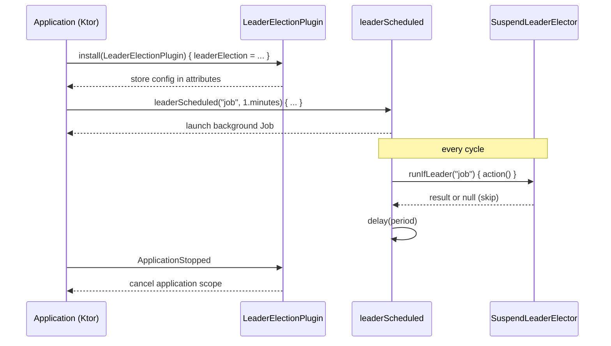

# bluetape4k-leader-ktor

[한국어](./README.ko.md) | English

Ktor 3.x integration module for `bluetape4k-leader`. Provides a Ktor application plugin
DSL and a Spring-`@Scheduled`-style helper that runs leader-only tasks on a fixed period
within the application coroutine scope.

## Architecture

`leader-ktor` adds three pieces of glue on top of `leader-core`:

1. **`LeaderElectionPlugin`** — a `createApplicationPlugin` DSL that captures a
   `SuspendLeaderElector` (and optionally a `SuspendLeaderGroupElector`) and stores it
   in the `Application.attributes` map so it can be reused by extension functions.
2. **`leaderElectionPluginConfig()`** — extension on `Application` to retrieve the
   stored configuration.
3. **`Application.leaderScheduled(...)`** — schedules a leader-only `suspend` action on
   a fixed period, launched in the `Application` coroutine scope so it cancels
   automatically on `ApplicationStopped`.



## Core Features

- Ktor 3.x compatible, coroutine-native (`SuspendLeaderElector` based)
- Automatic cancellation on `ApplicationStopped` via `Application` coroutine scope
- Per-cycle exception isolation — `action` exceptions are logged and the next cycle
  continues (poison-pill prevention)
- `CancellationException` is always re-thrown so structured concurrency works
- Validation: `lockName` must be non-blank; `period` must be positive
- Pluggable backend: any `SuspendLeaderElector` implementation
  (`leader-redis-redisson`, `leader-redis-lettuce`, `leader-mongodb`, etc.)

## Usage Examples

```kotlin
import io.bluetape4k.leader.ktor.LeaderElectionPlugin
import io.bluetape4k.leader.ktor.leaderScheduled
import io.bluetape4k.leader.redisson.RedissonSuspendLeaderElector
import io.ktor.server.application.Application
import io.ktor.server.application.install
import kotlin.time.Duration.Companion.minutes

fun Application.module() {
    val redisson = redissonClient()

    install(LeaderElectionPlugin) {
        leaderElection = RedissonSuspendLeaderElector(redisson)
    }

    leaderScheduled("daily-report", period = 1.minutes) {
        reportService.generate()
    }
}
```

Manual cancellation:

```kotlin
val job = leaderScheduled("inventory-sync", 5.minutes) { syncInventory() }
// ... later
job.cancel()
```

Bypassing the plugin (advanced — pass the elector explicitly):

```kotlin
leaderScheduled(
    lockName = "ad-hoc",
    period = 30.seconds,
    leaderElection = customElector,
) {
    doWork()
}
```

## Configuration Options

| Field                 | Type                          | Required | Description                              |
|-----------------------|-------------------------------|----------|------------------------------------------|
| `leaderElection`      | `SuspendLeaderElector?`       | Yes      | Single-leader elector backend            |
| `leaderGroupElection` | `SuspendLeaderGroupElector?`  | No       | Group/multi-leader elector (optional)    |
| `managementRouteEnabled` | `Boolean`                  | No       | Enables `GET /management/leaderElection` |
| `managementRoutePath` | `String`                      | No       | Management route path                    |

`leaderScheduled` parameters:

| Parameter        | Type                       | Default                              | Notes                                       |
|------------------|----------------------------|--------------------------------------|---------------------------------------------|
| `lockName`       | `String`                   | —                                    | Must be non-blank                           |
| `period`         | `kotlin.time.Duration`     | —                                    | Must be positive                            |
| `leaderElection` | `SuspendLeaderElector`     | from installed plugin                | Falls back to plugin config if omitted      |
| `action`         | `suspend () -> Unit`       | —                                    | Executed only when this node is leader      |

## Management Route

The management route is disabled by default. Enable it explicitly and register static lock names when you want them visible before the first scheduled run:

```kotlin
fun Application.module() {
    install(LeaderElectionPlugin) {
        leaderElection = redissonElector
        managementRouteEnabled = true
        managementLockNames("batch-job", "migration-gate")
    }
}
```

```http
GET /management/leaderElection
```

The route is installed on the main Ktor application port and routing pipeline. Protect it with an authentication plugin, network policy, or a dedicated internal port before exposing it outside a trusted management boundary.

```json
{
  "locks": [
    {
      "name": "batch-job",
      "status": "Empty",
      "leaderId": null,
      "leaseExpiry": null
    }
  ]
}
```

`leaderScheduled()` records its lock name into the management registry when the plugin is installed. The route emits JSON text directly, so applications do not need to install Ktor content negotiation just for this endpoint.

## LockAssert / LockExtender inside `leaderScheduled` (Issue #79)

`LockAssert.assertLockedSuspend()` and `LockExtender.extendActiveLockDetailedSuspend(d)`
work inside the `leaderScheduled { ... }` background action — the underlying
`SuspendLeaderElector`'s capture mechanism propagates `LockHandleElement` through
the action's `CoroutineContext`.

```kotlin
leaderScheduled("daily-report", period = 1.hours) {
    LockAssert.assertLockedSuspend()                              // passes when we are leader
    val outcome = LockExtender.extendActiveLockDetailedSuspend(10.minutes)
    if (outcome is ExtendOutcome.Extended) {
        runLongRunningReport()
    }
}
```

**Unsupported scenarios**: `Application.routing` handlers, `PipelineContext`,
or any non-`leaderScheduled` surface. The plugin only stores configuration in
`Application.attributes`; `LockHandleElement` is not injected into Ktor's
routing pipeline. Use `leaderScheduled` for guaranteed propagation.

## Dependency

Gradle (Kotlin DSL):

```kotlin
dependencies {
    implementation("io.github.bluetape4k.leader:bluetape4k-leader-ktor:$bluetape4kLeaderVersion")
    implementation("io.github.bluetape4k.leader:bluetape4k-leader-redis-redisson:$bluetape4kLeaderVersion") // or another backend
    implementation("io.ktor:ktor-server-core:3.4.3")
}
```

The `ktor-server-core` artifact is `compileOnly` in this module — your application
must declare it explicitly.

## License

MIT License
