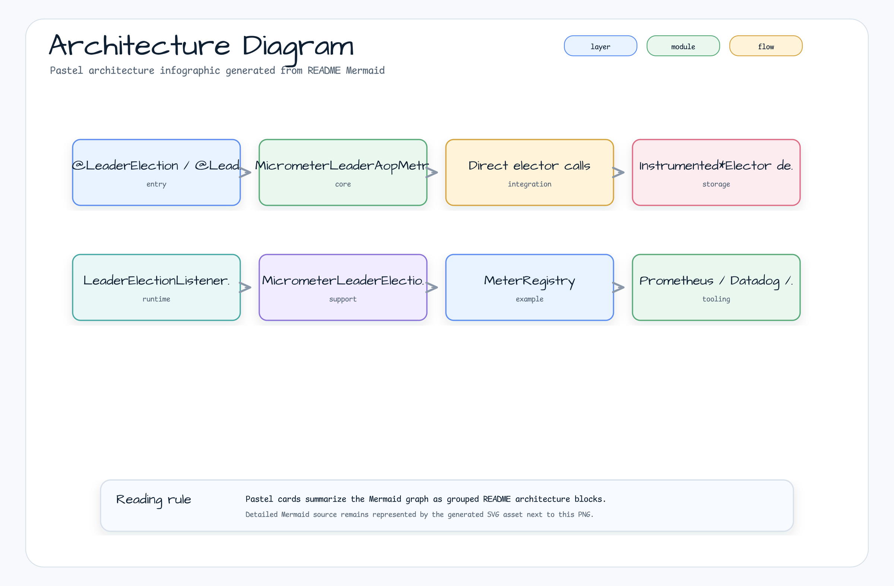

# leader-micrometer

[한국어](README.ko.md)

Micrometer instrumentation for bluetape4k leader election.

---

## Overview

`leader-micrometer` provides two instrumentation paths:

- `MicrometerLeaderAopMetricsRecorder` for Spring AOP annotations from `leader-spring-boot`
- `InstrumentedLeaderElector`, `InstrumentedLeaderGroupElector`, and `InstrumentedSuspendLeaderElector` decorators for direct elector calls
- `MicrometerLeaderElectionListener` for lifecycle callback counters from `LeaderElectionListenerRegistry`

The module depends only on `leader-core` and Micrometer core. Export format is chosen by the application's Micrometer registry, such as Prometheus, Datadog, OTLP, or a composite registry.

## Architecture



## Dependency

```kotlin
implementation("io.github.bluetape4k.leader:bluetape4k-leader-micrometer:0.1.0-SNAPSHOT")

// Choose the registry in the application.
implementation("io.micrometer:micrometer-registry-prometheus")
```

For Spring Boot AOP metrics:

```kotlin
implementation("io.github.bluetape4k.leader:bluetape4k-leader-spring-boot:0.1.0-SNAPSHOT")
implementation("org.springframework.boot:spring-boot-starter-actuator")
```

## Spring AOP Metrics

When `leader-spring-boot`, `leader-micrometer`, and a `MeterRegistry` bean are present, Spring auto-configuration registers `MicrometerLeaderAopMetricsRecorder`.

```yaml
bluetape4k:
  leader:
    aop:
      metrics:
        enabled: true
management:
  endpoints:
    web:
      exposure:
        include: health,prometheus
```

```kotlin
@Service
class ReportJobs {
    @LeaderElection(name = "daily-report")
    fun generate(): Report? =
        reportService.generate()
}
```

## Direct Elector Metrics

Use decorators when calling electors directly.

```kotlin
val delegate = RedissonLeaderElector(redisson)
val election = InstrumentedLeaderElector(delegate, registry)

val result = election.runIfLeader("daily-report") {
    reportService.generate()
}
```

```kotlin
val group = InstrumentedLeaderGroupElector(groupDelegate, registry)
group.runIfLeader("batch-shard") {
    processShard()
}
```

```kotlin
val suspendElection = InstrumentedSuspendLeaderElector(suspendDelegate, registry)
suspendElection.runIfLeader("sync-job") {
    syncService.sync()
}
```

Pass `lockName = "static-job"` to a decorator constructor when every call should use the same `lock.name` tag regardless of the runtime lock name.

## Listener Event Metrics

Use `MicrometerLeaderElectionListener` when you need lifecycle counters without wrapping the elector in an instrumented decorator.

```kotlin
val listener = MicrometerLeaderElectionListener(registry)
val election = LocalLeaderElector().apply {
    addListener(listener)
}

election.runIfLeader("daily-report") {
    reportService.generate()
}
```

## Meter Catalog

### AOP Meters

| Meter | Type | Tags | Description |
|-------|------|------|-------------|
| `leader.aop.attempts` | Counter | `lock.name` | Lock acquisition attempts |
| `leader.aop.acquired` | Counter | `lock.name` | Successful leader executions |
| `leader.aop.lock.not.acquired` | Counter | `lock.name`, `reason` | Skipped execution by contention, backend error, or fail-open path |
| `leader.aop.execution.duration` | Timer | `lock.name` | Successful body duration |
| `leader.aop.task.failed` | Counter | `lock.name`, `exception` | User body failures |
| `leader.aop.active` | Gauge | `lock.name` | Currently running leader bodies in this JVM |

### Direct Elector Meters

| Meter | Type | Tags | Description |
|-------|------|------|-------------|
| `shedlock.leader.acquired` | Counter | `lock.name` | Successful decorator executions |
| `shedlock.leader.not_acquired` | Counter | `lock.name` | Decorator skips |
| `shedlock.leader.duration` | Timer | `lock.name` | Decorator body duration |
| `shedlock.leader.active` | Gauge | `lock.name` | Currently running decorator bodies in this JVM |

### Listener Event Meters

| Meter | Type | Tags | Description |
|-------|------|------|-------------|
| `leader.election.events` | Counter | `lock.name`, `event` | Lifecycle callbacks: `elected`, `revoked`, `skipped` |

Micrometer naming conventions convert names for the export backend. Prometheus exposes examples such as `leader_aop_attempts_total`, `leader_aop_execution_duration_seconds`, and `shedlock_leader_acquired_total`.

## Prometheus Export

In Spring Boot, add the Prometheus registry and expose the endpoint.

```kotlin
implementation("io.micrometer:micrometer-registry-prometheus")
implementation("org.springframework.boot:spring-boot-starter-actuator")
```

```yaml
management:
  endpoints:
    web:
      exposure:
        include: prometheus,health
  endpoint:
    prometheus:
      access: unrestricted
```

Scrape:

```text
GET /actuator/prometheus
```

Useful PromQL:

```promql
sum by (lock_name) (rate(leader_aop_acquired_total[5m]))
sum by (lock_name, reason) (rate(leader_aop_lock_not_acquired_total[5m]))
histogram_quantile(0.95, sum by (lock_name, le) (rate(leader_aop_execution_duration_seconds_bucket[5m])))
max by (lock_name) (leader_aop_active)
```

`leader.aop.active` and `shedlock.leader.active` are JVM-local gauges. Prefer `max by (lock_name)` across instances unless you intentionally need per-instance totals.

`PrometheusExportTest` verifies both Micrometer text exposition and a real Prometheus scrape using `PrometheusServer` from `bluetape4k-testcontainers`.
The coverage checks that AOP and direct elector metrics are exported with Prometheus names such as `leader_aop_acquired_total`,
`shedlock_leader_acquired_total`, and the converted `lock_name` label.

## Pre-Registration

Pre-register static lock names when dashboards should show zero-valued series before the first run.

```kotlin
@Component
class MetricsPreRegistrar(
    private val recorder: MicrometerLeaderAopMetricsRecorder,
) : SmartInitializingSingleton {
    override fun afterSingletonsInstantiated() {
        recorder.registerMetricsFor("daily-report", "nightly-cleanup")
    }
}
```

## Cardinality Guidance

Keep `lock.name` bounded. Do not put request IDs, user IDs, or unbounded tenant IDs directly into lock names unless the metrics backend is sized for that cardinality. If dynamic names are required, aggregate them at the application layer or register only stable job families.

## Cleanup

Use `removeMetricsFor(lockName)` when a static lock name is retired and no longer needs to remain in the registry.

```kotlin
recorder.removeMetricsFor("old-nightly-job")
```
