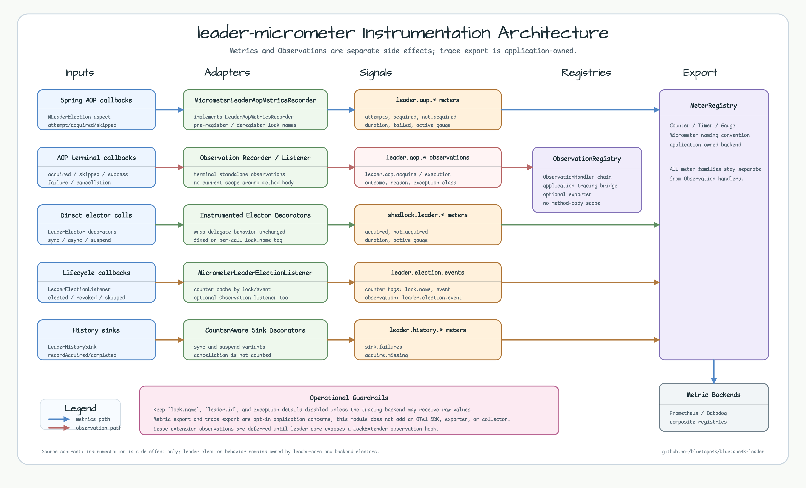

# leader-micrometer

English | [한국어](README.ko.md)

Micrometer instrumentation for bluetape4k leader election.

---

## Overview

`leader-micrometer` provides six instrumentation paths:

- `MicrometerLeaderAopMetricsRecorder` for Spring AOP annotations from `leader-spring-boot`
- `MicrometerObservationLeaderAopMetricsRecorder` and `MicrometerObservationLeaderElectionListener` for Micrometer Observation tracing bridges
- `InstrumentedLeaderElector`, `InstrumentedLeaderGroupElector`, and `InstrumentedSuspendLeaderElector` decorators for direct elector calls
- `MicrometerLeaderElectionListener` for lifecycle callback counters from `LeaderElectionListenerRegistry`
- `MicrometerSafeLeaderHistoryRecorder` and `MicrometerSuspendSafeLeaderHistoryRecorder` for history sink health counters
- `MicrometerLeaderAuditExporter` for bounded audit export counters and gauges

The module depends only on `leader-core`, Micrometer core, and Micrometer Observation. Metric export format is chosen by the application's Micrometer registry, such as Prometheus, Datadog, OTLP, or a composite registry. Observation export is chosen by the application-provided Micrometer tracing bridge and exporter.

## Architecture



## Dependency

```kotlin
implementation("io.github.bluetape4k.leader:bluetape4k-leader-micrometer:0.4.0")

// Choose the registry in the application.
implementation("io.micrometer:micrometer-registry-prometheus")
```

For Spring Boot AOP metrics:

```kotlin
implementation("io.github.bluetape4k.leader:bluetape4k-leader-spring-boot:0.4.0")
implementation("org.springframework.boot:spring-boot-starter-actuator")
```

## Spring AOP Metrics

When `leader-spring-boot`, `leader-micrometer`, and a `MeterRegistry` bean are present, Spring auto-configuration registers `MicrometerLeaderAopMetricsRecorder`. When an `ObservationRegistry` bean is also present, Spring can additionally register the Observation recorder; the two recorders are complementary and can run together.

```yaml
bluetape4k:
  leader:
    aop:
      metrics:
        enabled: true
        tags:
          lock-name:
            mode: REDACT
            redacted-value: redacted-lock
          leader-id:
            mode: REDACT
            redacted-value: redacted-leader
management:
  endpoints:
    web:
      exposure:
        include: health,prometheus
```

```kotlin
@Service
class ReportJobs {
    @LeaderElection(name = "daily-report")
    fun generate(): Report? =
        reportService.generate()
}
```

### Tag Cardinality Controls

Metrics use `LeaderMetricTagOptions` before exporting tag values. The production default redacts dynamic `lock.name` values to `redacted-lock` and opt-in `leader.id` Observation values to `redacted-leader`; bounded `backend.name` values stay raw when a future or custom meter path emits that tag. Current built-in meter paths do not emit `backend.name`. This keeps Prometheus, Datadog, and OTLP backends from receiving one time series per tenant, request, or job id.

Use Spring properties for application-level policy:

```yaml
bluetape4k:
  leader:
    aop:
      metrics:
        tags:
          lock-name:
            mode: HASH
            hash-length: 12
            allow-list:
              - daily-report
              - nightly-cleanup
            deny-list:
              - tenant-debug-job
```

| Mode | Behavior | Typical use |
|---|---|---|
| `REDACT` | Exports the configured sentinel | Default for dynamic names |
| `RAW` | Exports the original value | Small, static job sets only |
| `HASH` | Exports a deterministic SHA-256 hex prefix | Correlation only; not anonymization |
| `TRUNCATE` | Exports a bounded prefix; requires `max-length > 0` | Legacy dashboards with length limits |

Denylist entries always redact. A non-empty allowlist admits exact raw values and redacts every other value; `TRUNCATE` still applies its max length to allowed values. `LeaderMetricTagSanitizer` can be provided as a Spring bean or constructor argument when one process needs a custom rule source.

`HASH` is deterministic, unsalted pseudonymization. It can still be dictionary-attacked for low-entropy tenant, user, or job names and still creates one time series per raw value. Use `REDACT` for PII, secrets, tenant IDs, user IDs, and unbounded names unless the risk model is documented. Use allowlists only for bounded, non-sensitive static names.

## Observation Tracing

Use `MicrometerObservationLeaderAopMetricsRecorder` when you want leader execution to become Micrometer Observations that a tracing bridge can convert to spans.

```kotlin
val recorder = MicrometerObservationLeaderAopMetricsRecorder(
    registry = observationRegistry,
    options = LeaderObservationOptions(
        includeLockName = false,
        includeLeaderId = false,
        includeExceptionDetails = false,
        tagOptions = LeaderMetricTagOptions.Default,
    ),
)

recorder.onLockAcquired("daily-report", LeaderElectionOptions.Default, 12.milliseconds)
```

The recorder emits standalone terminal observations. It does not open a new current `Observation.Scope` around the guarded method body because the current AOP SPI has no per-invocation id that could safely pair same-lock concurrent starts and stops.

Use `MicrometerObservationLeaderElectionListener` for lifecycle events from listener-aware electors:

```kotlin
val listener = MicrometerObservationLeaderElectionListener(observationRegistry)
val election = LocalLeaderElector().apply {
    addListener(listener)
}
```

This module emits Micrometer Observations only. It does not add an OpenTelemetry SDK, tracing bridge, exporter, or collector. Applications that want exported traces must add and configure those dependencies themselves.

Lease-extension observations are tracked separately in issue #559 because `LockExtender` needs a core observation/event hook before Micrometer can record extension outcomes consistently.

## Direct Elector Metrics

Use decorators when calling electors directly.

```kotlin
val delegate = RedissonLeaderElector(redisson)
val election = InstrumentedLeaderElector(delegate, registry)

val result = election.runIfLeader("daily-report") {
    reportService.generate()
}
```

```kotlin
val group = InstrumentedLeaderGroupElector(groupDelegate, registry)
group.runIfLeader("batch-shard") {
    processShard()
}
```

```kotlin
val suspendElection = InstrumentedSuspendLeaderElector(suspendDelegate, registry)
suspendElection.runIfLeader("sync-job") {
    syncService.sync()
}
```

Pass `lockName = "static-job"` to a decorator constructor when every call should use the same `lock.name` tag regardless of the runtime lock name.

Decorator and listener metrics use the same sanitizer defaults as AOP metrics. Pass `LeaderMetricTagOptions.Raw` only when the lock-name set is known and bounded:

```kotlin
val election = InstrumentedLeaderElector(
    delegate = delegate,
    registry = registry,
    tagOptions = LeaderMetricTagOptions.Raw,
)
```

## Listener Event Metrics

Use `MicrometerLeaderElectionListener` when you need lifecycle counters without wrapping the elector in an instrumented decorator.

```kotlin
val listener = MicrometerLeaderElectionListener(registry)
val election = LocalLeaderElector().apply {
    addListener(listener)
}

election.runIfLeader("daily-report") {
    reportService.generate()
}
```

## Meter Catalog

### AOP Meters

| Meter | Type | Tags | Description |
|-------|------|------|-------------|
| `leader.aop.attempts` | Counter | `lock.name` | Lock acquisition attempts |
| `leader.aop.acquired` | Counter | `lock.name` | Successful leader executions |
| `leader.aop.lock.not.acquired` | Counter | `lock.name`, `reason` | Skipped execution by contention, backend error, or fail-open path |
| `leader.aop.execution.duration` | Timer | `lock.name` | Successful body duration |
| `leader.aop.task.failed` | Counter | `lock.name`, `exception` | User body failures |
| `leader.aop.active` | Gauge | `lock.name` | Currently running leader bodies in this JVM |

### Direct Elector Meters

| Meter | Type | Tags | Description |
|-------|------|------|-------------|
| `shedlock.leader.acquired` | Counter | `lock.name` | Successful decorator executions |
| `shedlock.leader.not_acquired` | Counter | `lock.name` | Decorator skips |
| `shedlock.leader.duration` | Timer | `lock.name` | Decorator body duration |
| `shedlock.leader.active` | Gauge | `lock.name` | Currently running decorator bodies in this JVM |

### Listener Event Meters

| Meter | Type | Tags | Description |
|-------|------|------|-------------|
| `leader.election.events` | Counter | `lock.name`, `event` | Lifecycle callbacks: `elected`, `revoked`, `skipped` |

### Observation Names

| Observation | Low-cardinality keys | High-cardinality keys |
|---|---|---|
| `leader.aop.acquire` | `leader.operation`, `outcome`, `reason` | `acquire.elapsed.ms`, plus `lock.name` / `leader.id` only when enabled |
| `leader.aop.execution` | `leader.operation`, `outcome`, `exception` | `execution.elapsed.ms`, plus `lock.name` / `leader.id` only when enabled |
| `leader.election.event` | `event` | `lock.name` only when enabled |

`CancellationException` is recorded as `outcome=cancelled` and is not sent to `Observation.error(...)`. Non-cancellation failures record the exception simple class name by default; raw throwable details are attached only when `LeaderObservationOptions(includeExceptionDetails = true)` is used.

### History Sink Meters

| Meter | Type | Tags | Description |
|-------|------|------|-------------|
| `leader.history.sink.failures` | Counter | `sink` | History sink call failures, excluding cancellation and interruption paths |
| `leader.history.acquire.missing` | Counter | `sink` | `recordAcquired` returned `null` for unavailable or duplicate acquisition records |

## Audit Export Metrics

Wrap a core `LeaderAuditExporter` when bounded audit delivery outcomes should be
exported to Micrometer:

```kotlin
val exporter = MicrometerLeaderAuditExporter(delegate, registry)
exporter.submit(event)
// ACCEPTED means admission only; it does not mean that delivery succeeded.
exporter.close() // owns and closes delegate exactly once
```

The decorator publishes one fixed, aggregate metric catalog. It never copies lock
names, leader IDs, endpoints, error messages, `source`, or `transport` into tags.
The only tag is `outcome`, with the bounded values shown below. A registry keeps
the meter identity across close-and-replacement generations; do not call
`MeterRegistry.remove` or register the fixed IDs from another component. A
duplicate active wrapper or a foreign fixed-ID registration fails fast. For a
non-owning observation, register an observer with `delegate.observe(...)` rather
than wrapping the same delegate twice.

| Meter | Type | Tags / outcome | Snapshot source |
|---|---|---|---|
| `leader.audit.export.accepted` | FunctionCounter | `outcome=accepted` | `accepted` |
| `leader.audit.export.dropped` | FunctionCounter | `outcome=queue_full` or `closed` | `droppedQueueFull`, `droppedClosed` |
| `leader.audit.export.retries` | FunctionCounter | `outcome=retry` | `retries` |
| `leader.audit.export.failures` | FunctionCounter | `outcome=failure` | `terminalFailures` |
| `leader.audit.export.queue.depth` | Gauge | none | `queued` |
| `leader.audit.export.in.flight` | Gauge | none | `inFlight` |
| `leader.audit.export.cancelled` | FunctionCounter | `outcome=cancelled` | `cancellations` |
| `leader.audit.export.rejections` | FunctionCounter | `outcome=rejected` | executor + scheduler rejections |
| `leader.audit.export.observer.dropped` | FunctionCounter | none | `observerDrops` |
| `leader.audit.export.observer.registration.dropped` | FunctionCounter | none | `observerRegistrationDrops` |
| `leader.audit.export.diagnostics.failures` | FunctionCounter | none | `diagnosticsFatalErrors` |
| `leader.audit.export.diagnostics.closed` | Gauge | none | `diagnosticsClosed` |

The dropped meter has two outcome-tagged IDs, so the fixed catalog contains 13
meter IDs. Counter values remain monotonic across replacement by combining the
detached generation offset with the active delegate snapshot. If a delegate
snapshot regresses or fails during close, the decorator keeps the last trusted
offset, marks the source degraded, and detaches the delegate before propagating
the original exception.
During an open generation, if a metric poll cannot read `delegate.snapshot()`, the
decorator keeps the last trusted cumulative and gauge values, leaves
`diagnosticsClosed=0`, and emits the fixed warning at most once for that generation.
Every metric read also rechecks the identity of the 13 meters it owns. If another
component removes or replaces one of those IDs, the manager freezes the last
trusted detached values and emits the fixed `leader.audit.export.meter-ownership-conflict`
warning once; it never reads or removes the foreign meter. A compromised manager
is not reused, so recovery requires a fresh `MeterRegistry` after the conflicting
registration is removed. The same delegate cannot be wrapped by two decorators,
even when the registries differ; the failed wrapper leaves the active owner open.

This slice provides Micrometer metrics only. JSONL output and an OpenTelemetry
SDK/bridge/exporter are separate follow-up scope; applications must add those
dependencies and transports explicitly.

Micrometer naming conventions convert names for the export backend. Prometheus exposes examples such as `leader_aop_attempts_total`, `leader_aop_execution_duration_seconds`, and `shedlock_leader_acquired_total`.

## Prometheus Export

In Spring Boot, add the Prometheus registry and expose the endpoint.

```kotlin
implementation("io.micrometer:micrometer-registry-prometheus")
implementation("org.springframework.boot:spring-boot-starter-actuator")
```

```yaml
management:
  endpoints:
    web:
      exposure:
        include: prometheus,health
  endpoint:
    prometheus:
      access: unrestricted
```

Scrape:

```text
GET /actuator/prometheus
```

Useful PromQL:

```promql
sum by (lock_name) (rate(leader_aop_acquired_total[5m]))
sum by (lock_name, reason) (rate(leader_aop_lock_not_acquired_total[5m]))
histogram_quantile(0.95, sum by (lock_name, le) (rate(leader_aop_execution_duration_seconds_bucket[5m])))
max by (lock_name) (leader_aop_active)
```

`leader.aop.active` and `shedlock.leader.active` are JVM-local gauges. Prefer `max by (lock_name)` across instances unless you intentionally need per-instance totals.

`PrometheusExportTest` verifies both Micrometer text exposition and a real Prometheus scrape using `PrometheusServer` from `bluetape4k-testcontainers`.
The coverage checks that AOP and direct elector metrics are exported with Prometheus names such as `leader_aop_acquired_total`,
`shedlock_leader_acquired_total`, and the converted `lock_name` label.

## Pre-Registration

Pre-register static lock names when dashboards should show zero-valued series before the first run.

```kotlin
@Component
class MetricsPreRegistrar(
    private val recorder: MicrometerLeaderAopMetricsRecorder,
) : SmartInitializingSingleton {
    override fun afterSingletonsInstantiated() {
        recorder.registerMetricsFor("daily-report", "nightly-cleanup")
    }
}
```

## Cardinality Guidance

Keep `lock.name` bounded. Do not put request IDs, user IDs, or unbounded tenant IDs directly into exported metric tags unless the metrics backend is sized for that cardinality. The default sanitizer collapses dynamic names, so dashboards should opt into `RAW` only for static job names. `HASH` can correlate names without raw labels, but it is not cardinality reduction or anonymization.

Observation high-cardinality fields are disabled by default. If `includeLockName=true` or `includeLeaderId=true`, values still pass through `LeaderObservationOptions.tagOptions` before export. Current Spring AOP does not synthesize `leader.id`; `includeLeaderId=true` emits it only when the recorder receives `LeaderAopMetricsContext.Identified` from direct or future identity-aware paths.

Keep `includeExceptionDetails=false` unless the tracing backend is allowed to receive exception messages and stack traces.

## Cleanup

Use `deregisterMetricsFor(lockName)` when a static lock name is retired and no longer needs to remain in the registry.

```kotlin
recorder.deregisterMetricsFor("old-nightly-job")
```
