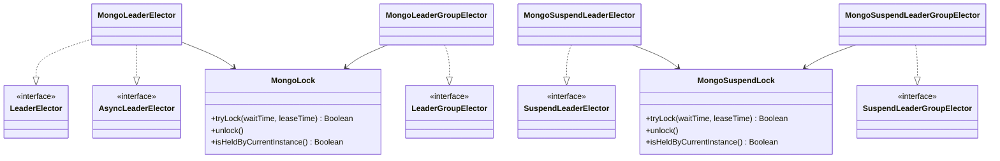

# leader-mongodb

[English](README.md)

`findOneAndUpdate` + TTL 인덱스 기반 MongoDB 분산 리더 선출 — 블로킹, 비동기, 코루틴 API 제공.

---

## 개요

`leader-mongodb`는 `leader-core` 인터페이스를 MongoDB의 `findOneAndUpdate` (`upsert=true`)를 원자적 락 기본 연산으로 구현합니다. `expireAt` 필드의 TTL 인덱스가 자동 만료를 담당합니다. 락 소유권은 인스턴스 별 UUID 토큰으로 추적하여 코루틴 스레드 전환에 무관하게 안전합니다.

`minLeaseTime` 설정 시 unlock은 문서를 즉시 삭제하지 않고 남은 최소 lease만큼 `expireAt`을 갱신합니다. caller를 블로킹하지 않으면서 ShedLock `lockAtLeastFor`와 같은 동작을 제공합니다.

락 전략:
- **획득**: `findOneAndUpdate(filter: {_id, expireAt < 현재}, update: {token, expireAt}, upsert=true, returnDocument=AFTER)` — 반환된 token이 일치하면 성공; `E11000`은 유효한 락이 이미 존재함을 의미 → 재시도.
- **해제**: `deleteOne({_id, token})`, 또는 `minLeaseTime`이 남아 있으면 `updateOne({_id, token}, expireAt = now + remainingMinLeaseTime)`.

## 아키텍처



## 구현 클래스

| 클래스 | 인터페이스 | 설명 |
|--------|-----------|------|
| `MongoLeaderElector` | `LeaderElector` + `AsyncLeaderElector` | `MongoLock` 기반 블로킹/비동기 단일 리더 |
| `MongoLeaderGroupElector` | `LeaderGroupElector` | 슬롯 기반 `MongoLock`을 이용한 블로킹 복수 리더 |
| `MongoSuspendLeaderElector` | `SuspendLeaderElector` | `MongoSuspendLock` 기반 코루틴 단일 리더 |
| `MongoSuspendLeaderGroupElector` | `SuspendLeaderGroupElector` | 슬롯 기반 `MongoSuspendLock`을 이용한 코루틴 복수 리더 |
| `MongoSuspendLeaderElectorFactory` | `SuspendLeaderElectorFactory` | 팩토리: 호출마다 `MongoSuspendLeaderElector` 생성 |
| `MongoSuspendLeaderGroupElectorFactory` | `SuspendLeaderGroupElectorFactory` | 팩토리: 호출마다 `MongoSuspendLeaderGroupElector` 생성 |

## 컬렉션

| 컬렉션 | 용도 |
|--------|------|
| `bluetape4k_leader_locks` | 단일 리더 락 문서 |
| `bluetape4k_leader_group_locks` | 복수 리더 슬롯 문서 (`lockName:slot:N`) |

`expireAt` 필드의 TTL 인덱스 (`expireAfterSeconds=0`)는 최초 사용 시 자동으로 생성됩니다.

## 사용법

### 설정

```kotlin
val mongoClient = MongoClients.create("mongodb://localhost:27017")
val db = mongoClient.getDatabase("mydb")
val lockCollection = db.getCollection("bluetape4k_leader_locks")
```

### 블로킹 단일 리더

```kotlin
val election = MongoLeaderElector(lockCollection)

val result = election.runIfLeader("daily-report") {
    generateReport()
}
// 리더 노드에서는 결과값, waitTime 내 락 획득 실패 시 null 반환
```

### 블로킹 복수 리더 그룹

```kotlin
val options = MongoLeaderGroupElectionOptions(
    leaderGroupOptions = LeaderGroupElectionOptions(maxLeaders = 3)
)
val groupCollection = db.getCollection("bluetape4k_leader_group_locks")
val election = MongoLeaderGroupElector(groupCollection, options)

val result = election.runIfLeader("parallel-batch") {
    processChunk()
}
// 최대 3개 노드가 동시 실행, 나머지는 null 반환
```

### 비동기 단일 리더

```kotlin
val election = MongoLeaderElector(lockCollection)

val future: CompletableFuture<String?> = election.runAsyncIfLeader(
    "async-job",
    VirtualThreadExecutor
) {
    futureOf { doWork() }
}
val result = future.get(5, TimeUnit.SECONDS)
```

### 코루틴 단일 리더

```kotlin
// MongoSuspendLeaderElector은 suspend 팩토리 함수입니다
val coroutineCollection = coroutineMongoClient.getDatabase("mydb")
    .getCollection<Document>("bluetape4k_leader_locks")
val election = MongoSuspendLeaderElector(coroutineCollection)

val result = election.runIfLeader("nightly-sync") {
    syncData()
}
```

### 코루틴 복수 리더 그룹

```kotlin
val syncCollection = db.getCollection("bluetape4k_leader_group_locks")
val coroutineCollection = coroutineDb.getCollection<Document>("bluetape4k_leader_group_locks")
val election = MongoSuspendLeaderGroupElector(syncCollection, coroutineCollection)

val result = election.runIfLeader("task-group") {
    processTask()
}
// 최대 maxLeaders 수의 노드가 동시 실행
```

### 커스텀 옵션

```kotlin
val options = MongoLeaderElectionOptions(
    leaderOptions = LeaderElectionOptions(
        waitTime = 5.seconds,
        leaseTime = 60.seconds,
    ),
    retryDelay = 100.milliseconds,
)
val election = MongoLeaderElector(lockCollection, options)
```

### SPI 팩토리 사용

```kotlin
val coroutineCollection = coroutineDb.getCollection<Document>("bluetape4k_leader_locks")
val factory: SuspendLeaderElectorFactory =
    MongoSuspendLeaderElectorFactory(coroutineCollection)

coroutineScope {
    val elector = factory.create(LeaderElectionOptions.Default)
    val result = elector.runIfLeader("daily-job") { doWork() }
}
```

```kotlin
val syncGroupCollection = db.getCollection("bluetape4k_leader_group_locks")
val coroutineGroupCollection = coroutineDb.getCollection<Document>("bluetape4k_leader_group_locks")
val groupFactory: SuspendLeaderGroupElectorFactory =
    MongoSuspendLeaderGroupElectorFactory(syncGroupCollection, coroutineGroupCollection)

coroutineScope {
    val elector = groupFactory.create(LeaderGroupElectionOptions(maxLeaders = 3))
    val result = elector.runIfLeader("parallel-job") { processChunk() }
}
```

## 락 내부 동작

**`MongoLock`** (블로킹, 동기 드라이버):

```kotlin
collection.findOneAndUpdate(
    Filters.and(eq("_id", lockKey), lt("expireAt", Date())),
    Updates.combine(set("token", token), set("expireAt", expiry)),
    FindOneAndUpdateOptions().upsert(true).returnDocument(AFTER)
)
// E11000 DuplicateKey → 유효한 락 존재 → jitter 포함 재시도
```

**`MongoSuspendLock`** (코루틴 드라이버):
- 동일 전략에서 `Thread.sleep()` 대신 `delay()` 사용
- 매 재시도마다 `currentCoroutineContext().ensureActive()` 호출 → 취소 안전

**취소 안전성 (코루틴)**:

```kotlin
try {
    return action()
} finally {
    withContext(NonCancellable) {
        lock.unlock()  // 코루틴 취소로부터 보호
    }
}
```

## 이중 컬렉션 설계 (`MongoSuspendLeaderGroupElector`)

`activeCount()`, `availableSlots()`, `state()`는 non-suspend 인터페이스 메서드입니다. 코루틴 드라이버의 `countDocuments`는 `suspend` 함수이므로, 상태 조회는 **동기 드라이버**를, 락 작업은 **코루틴 드라이버**를 각각 사용합니다:

```kotlin
MongoSuspendLeaderGroupElector(
    groupCollection = db.getCollection("bluetape4k_leader_group_locks"),        // 동기 — state() 전용
    coroutineGroupCollection = coroutineDb.getCollection("bluetape4k_leader_group_locks"),  // suspend — 락 전용
)
```

## 주의사항

- `leaseTime`은 action의 최대 실행 시간보다 충분히 커야 합니다 (자동 갱신 없음).
- MongoDB TTL 인덱스는 최대 60초 주기로 실행 — 만료 문서가 잠시 잔류할 수 있습니다.
- `activeCount()` / `availableSlots()`는 TTL 만료 주기로 인해 근사치입니다.
- Replica Set 환경: 강한 일관성을 위해 `WriteConcern.MAJORITY` 권장.

## 의존성 추가

```kotlin
// build.gradle.kts
implementation("io.github.bluetape4k.leader:leader-mongodb:0.1.0-SNAPSHOT")

// MongoDB 드라이버를 클래스패스에 추가해야 합니다
implementation("org.mongodb:mongodb-driver-sync:5.x.x")
implementation("org.mongodb:mongodb-driver-kotlin-coroutine:5.x.x")  // suspend API 사용 시
```
