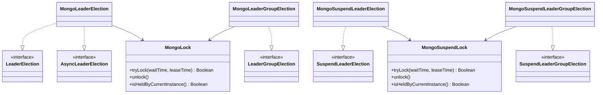

# leader-mongodb

[한국어](README.ko.md)

MongoDB-backed leader election using `findOneAndUpdate` + TTL index — blocking, async, and coroutine APIs.

---

## Overview

`leader-mongodb` implements `leader-core` interfaces using MongoDB's `findOneAndUpdate` with `upsert=true` as the atomic lock primitive. A TTL index on `expireAt` handles automatic expiry. Lock ownership is tracked by a per-instance UUID token, making it safe across coroutine thread switches.

Lock strategy:
- **Acquire**: `findOneAndUpdate(filter: {_id, expireAt < now}, update: {token, expireAt}, upsert=true, returnDocument=AFTER)` — succeeds if the returned token matches; `E11000` means a live lock exists → retry.
- **Release**: `deleteOne({_id, token})` — only the owner can release.

## Architecture



## Implementations

| Class | Interface | Description |
|-------|-----------|-------------|
| `MongoLeaderElection` | `LeaderElection` + `AsyncLeaderElection` | Blocking / async single-leader via `MongoLock` |
| `MongoLeaderGroupElection` | `LeaderGroupElection` | Blocking multi-leader via slot-based `MongoLock` |
| `MongoSuspendLeaderElection` | `SuspendLeaderElection` | Coroutine single-leader via `MongoSuspendLock` |
| `MongoSuspendLeaderGroupElection` | `SuspendLeaderGroupElection` | Coroutine multi-leader via slot-based `MongoSuspendLock` |

## Collections

| Collection | Purpose |
|------------|---------|
| `bluetape4k_leader_locks` | Single-leader lock documents |
| `bluetape4k_leader_group_locks` | Multi-leader slot documents (`lockName:slot:N`) |

TTL index on `expireAt` (expireAfterSeconds=0) is created automatically on first use.

## Usage

### Setup

```kotlin
val mongoClient = MongoClients.create("mongodb://localhost:27017")
val db = mongoClient.getDatabase("mydb")
val lockCollection = db.getCollection("bluetape4k_leader_locks")
```

### Blocking single-leader

```kotlin
val election = MongoLeaderElection(lockCollection)

val result = election.runIfLeader("daily-report") {
    generateReport()
}
// result == report on leader node, null if lock not acquired within waitTime
```

### Blocking multi-leader group

```kotlin
val options = MongoLeaderGroupElectionOptions(
    leaderGroupOptions = LeaderGroupElectionOptions(maxLeaders = 3)
)
val groupCollection = db.getCollection("bluetape4k_leader_group_locks")
val election = MongoLeaderGroupElection(groupCollection, options)

val result = election.runIfLeader("parallel-batch") {
    processChunk()
}
// up to 3 nodes run concurrently, others get null
```

### Async single-leader

```kotlin
val election = MongoLeaderElection(lockCollection)

val future: CompletableFuture<String?> = election.runAsyncIfLeader(
    "async-job",
    VirtualThreadExecutor
) {
    futureOf { doWork() }
}
val result = future.get(5, TimeUnit.SECONDS)
```

### Coroutine single-leader

```kotlin
// MongoSuspendLeaderElection is a suspend factory
val coroutineCollection = coroutineMongoClient.getDatabase("mydb")
    .getCollection<Document>("bluetape4k_leader_locks")
val election = MongoSuspendLeaderElection(coroutineCollection)

val result = election.runIfLeader("nightly-sync") {
    syncData()
}
```

### Coroutine multi-leader group

```kotlin
val syncCollection = db.getCollection("bluetape4k_leader_group_locks")
val coroutineCollection = coroutineDb.getCollection<Document>("bluetape4k_leader_group_locks")
val election = MongoSuspendLeaderGroupElection(syncCollection, coroutineCollection)

val result = election.runIfLeader("task-group") {
    processTask()
}
// up to maxLeaders nodes run concurrently
```

### Custom options

```kotlin
val options = MongoLeaderElectionOptions(
    leaderOptions = LeaderElectionOptions(
        waitTime = Duration.ofSeconds(5),
        leaseTime = Duration.ofSeconds(60),
    ),
    retryDelay = Duration.ofMillis(100),
)
val election = MongoLeaderElection(lockCollection, options)
```

## Lock Internals

**`MongoLock`** (blocking, sync driver):

```kotlin
collection.findOneAndUpdate(
    Filters.and(eq("_id", lockKey), lt("expireAt", Date())),
    Updates.combine(set("token", token), set("expireAt", expiry)),
    FindOneAndUpdateOptions().upsert(true).returnDocument(AFTER)
)
// E11000 DuplicateKey → live lock exists → retry with jitter
```

**`MongoSuspendLock`** (coroutine driver):
- Same strategy with `delay()` instead of `Thread.sleep()`
- `currentCoroutineContext().ensureActive()` on each retry → cancellation-safe

**Cancellation safety (coroutine)**:

```kotlin
try {
    return action()
} finally {
    withContext(NonCancellable) {
        lock.unlock()  // protected from cancellation
    }
}
```

## Dual-collection design (`MongoSuspendLeaderGroupElection`)

`activeCount()`, `availableSlots()`, and `state()` are non-suspend interface methods. The coroutine driver's `countDocuments` is `suspend`, so state queries use the **sync driver** and lock operations use the **coroutine driver**:

```kotlin
MongoSuspendLeaderGroupElection(
    groupCollection = db.getCollection("bluetape4k_leader_group_locks"),        // sync — for state()
    coroutineGroupCollection = coroutineDb.getCollection("bluetape4k_leader_group_locks"),  // suspend — for locks
)
```

## Notes

- `leaseTime` must be longer than the expected action duration (no automatic renewal).
- MongoDB TTL index fires at most every 60 seconds — expired documents may linger briefly.
- `activeCount()` / `availableSlots()` are approximate due to the TTL expiry window.
- Replica Set environments: `WriteConcern.MAJORITY` is recommended for strong consistency.

## Dependency

```kotlin
// build.gradle.kts
implementation("io.github.bluetape4k.leader:leader-mongodb:0.1.0-SNAPSHOT")

// MongoDB drivers must be on the classpath
implementation("org.mongodb:mongodb-driver-sync:5.x.x")
implementation("org.mongodb:mongodb-driver-kotlin-coroutine:5.x.x")  // for suspend APIs
```
