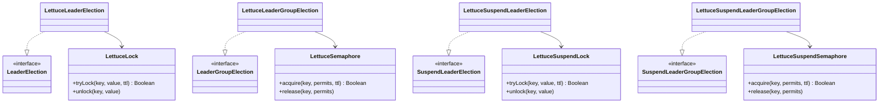

# leader-redis-lettuce

[English](README.md)

[Lettuce](https://lettuce.io/) 기반 Redis 분산 리더 선출 구현체입니다. 블로킹과 코루틴 API를 제공합니다.

---

## 개요

`leader-redis-lettuce`는 Lettuce 리액티브 Redis 클라이언트를 사용하여 `leader-core` 인터페이스를 구현합니다. 락 프리미티브(`LettuceLock`, `LettuceSemaphore`)는 이 모듈에 직접 이식되어 있어 `bluetape4k-lettuce`에 대한 런타임 의존이 없습니다.

락 전략: Redis `SET key value NX PX ttl` (원자적 compare-and-set). 자동 갱신(renewal)은 지원하지 않으므로 `leaseTime`은 예상 작업 시간보다 길게 설정해야 합니다.

## 아키텍처



## 구현체 목록

| 클래스 | 구현 인터페이스 | 설명 |
|-------|--------------|------|
| `LettuceLeaderElection` | `LeaderElection` | `LettuceLock` 기반 블로킹 단일 리더 |
| `LettuceLeaderGroupElection` | `LeaderGroupElection` | `LettuceSemaphore` 기반 블로킹 복수 리더 |
| `LettuceSuspendLeaderElection` | `SuspendLeaderElection` | `LettuceSuspendLock` 기반 코루틴 단일 리더 |
| `LettuceSuspendLeaderGroupElection` | `SuspendLeaderGroupElection` | `LettuceSuspendSemaphore` 기반 코루틴 복수 리더 |

## 사용 예시

### 초기화

```kotlin
val redisClient = RedisClient.create("redis://localhost:6379")
val connection = redisClient.connect()
```

### 블로킹 단일 리더

```kotlin
val election = LettuceLeaderElection(connection)

val result = election.runIfLeader("daily-report") {
    generateReport()
}
// result: 리더 노드에서는 generateReport() 결과, 나머지 노드는 null
```

### 블로킹 복수 리더 그룹

```kotlin
val options = LeaderGroupElectionOptions(maxLeaders = 3)
val election = LettuceLeaderGroupElection(connection, options)

val result = election.runIfLeader("parallel-batch") {
    processChunk()
}
```

### 코루틴 suspend 단일 리더

```kotlin
val election = LettuceSuspendLeaderElection(connection)

coroutineScope {
    val result = election.runIfLeader("nightly-sync") {
        syncData()
    }
}
```

### 코루틴 복수 리더 그룹

```kotlin
val options = LeaderGroupElectionOptions(maxLeaders = 2)
val election = LettuceSuspendLeaderGroupElection(connection, options)

coroutineScope {
    val jobs = (1..5).map {
        async {
            election.runIfLeader("task-group") {
                processTask(it)
            }
        }
    }
    jobs.awaitAll()  // 2개만 동시 실행, 나머지 3개는 null 반환
}
```

### 옵션 커스터마이징

```kotlin
val options = LeaderElectionOptions(
    waitTime = Duration.ofSeconds(3),
    leaseTime = Duration.ofSeconds(30)
)
val election = LettuceLeaderElection(connection, options)
```

## 락 내부 동작

`LettuceLock`은 Lua 스크립트를 사용해 원자적 잠금 해제를 보장합니다 (락 소유자만 해제 가능):

```lua
if redis.call('get', KEYS[1]) == ARGV[1] then
    return redis.call('del', KEYS[1])
else
    return 0
end
```

`LettuceSemaphore`는 Redis 리스트에 permit 토큰을 관리합니다. 획득 시 토큰 추가, 반환 시 토큰 제거.

## 의존성 추가

```kotlin
// build.gradle.kts
implementation("io.github.bluetape4k.leader:leader-redis-lettuce:0.1.0-SNAPSHOT")

// Lettuce가 클래스패스에 있어야 합니다
implementation("io.lettuce:lettuce-core:6.x.x")
```
