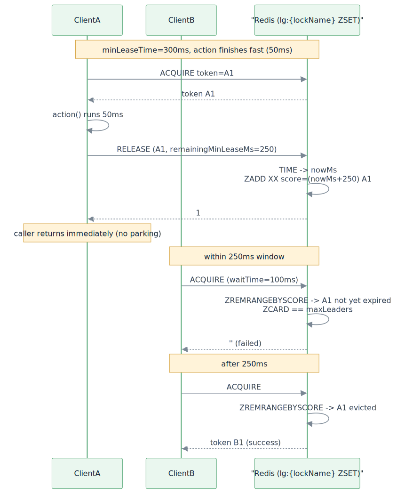

# leader-redis-lettuce

[English](README.md)

[Lettuce](https://lettuce.io/) 기반 Redis 분산 리더 선출 구현체입니다. 블로킹과 코루틴 API를 제공합니다.

---

## 개요

`leader-redis-lettuce`는 Lettuce 리액티브 Redis 클라이언트를 사용하여 `leader-core` 인터페이스를 구현합니다. 락 프리미티브(`LettuceLock`, `LettuceSlotTokenGroup`)는 이 모듈에 직접 이식되어 있어 `bluetape4k-lettuce`에 대한 런타임 의존이 없습니다.

단일 리더 전략: Redis `SET key value NX PX ttl` (원자적 compare-and-set). `LeaderElectionOptions(autoExtend = true)`를 사용하면 단일 리더 elector가 action 실행 중 token 조건부 `PEXPIRE`로 TTL을 갱신합니다.

그룹 전략 (slot-token TTL 모델): 단일 ZSET 키 `lg:{lockName}` 의 member 는 슬롯별 token (`Base58.randomString(8)`) 이고 score 는 `expiryAtMs` 입니다. ACQUIRE / RELEASE / STATUS Lua 스크립트는 모두 `redis.call('TIME')` 으로 Redis 서버 시간을 읽어 사용하므로 클라이언트 clock skew 영향이 없으며, ACQUIRE 시점에 `ZREMRANGEBYSCORE` 로 만료된 entry 를 자동 회수합니다. 클라이언트 crash 시 (release 미호출) 다음 acquire 시 자동 정리되므로 외부 reaper 가 필요 없습니다.

> 기존 `LettuceSemaphore` / `LettuceSuspendSemaphore` 는 `LettuceSlotTokenGroup` 으로 대체되며 `@Deprecated` 처리되었습니다. 새 `lg:{lockName}` 키 prefix 는 롤링 배포 시 구버전 키와의 충돌을 피하기 위해 의도적으로 분리되었습니다.

## 아키텍처



## 그룹 락 흐름

slot-token TTL 모델은 두 시나리오로 가장 잘 이해할 수 있습니다: 정상 acquire/release 와 crash recovery, 그리고 `minLeaseTime` 의 backend ZSET score 위임.

### 시나리오 1 — 정상 acquire/release 와 crash recovery


### 시나리오 2 — `minLeaseTime` 의 backend TTL 위임



## 구현체 목록

| 클래스 | 구현 인터페이스 | 설명 |
|-------|--------------|------|
| `LettuceLeaderElector` | `LeaderElector` | `LettuceLock` 기반 블로킹 단일 리더 |
| `LettuceLeaderGroupElector` | `LeaderGroupElector` | `LettuceSlotTokenGroup` (slot-token TTL) 기반 블로킹 복수 리더 |
| `LettuceSuspendLeaderElector` | `SuspendLeaderElector` | `LettuceSuspendLock` 기반 코루틴 단일 리더 |
| `LettuceSuspendLeaderGroupElector` | `SuspendLeaderGroupElector` | `LettuceSlotTokenGroup` 기반 코루틴 복수 리더 |
| `LettuceSuspendLeaderElectorFactory` | `SuspendLeaderElectorFactory` | 팩토리: 호출마다 `LettuceSuspendLeaderElector` 생성 |
| `LettuceSuspendLeaderGroupElectorFactory` | `SuspendLeaderGroupElectorFactory` | 팩토리: 호출마다 `LettuceSuspendLeaderGroupElector` 생성 |

## 사용 예시

### 초기화

```kotlin
val redisClient = RedisClient.create("redis://localhost:6379")
val connection = redisClient.connect()
```

### 블로킹 단일 리더

```kotlin
val election = LettuceLeaderElector(connection)

val result = election.runIfLeader("daily-report") {
    generateReport()
}
// result: 리더 노드에서는 generateReport() 결과, 나머지 노드는 null
```

### 블로킹 복수 리더 그룹

```kotlin
val options = LeaderGroupElectionOptions(maxLeaders = 3)
val election = LettuceLeaderGroupElector(connection, options)

val result = election.runIfLeader("parallel-batch") {
    processChunk()
}
```

### 코루틴 suspend 단일 리더

```kotlin
val election = LettuceSuspendLeaderElector(connection)

coroutineScope {
    val result = election.runIfLeader("nightly-sync") {
        syncData()
    }
}
```

### 코루틴 복수 리더 그룹

```kotlin
val options = LeaderGroupElectionOptions(maxLeaders = 2)
val election = LettuceSuspendLeaderGroupElector(connection, options)

coroutineScope {
    val jobs = (1..5).map {
        async {
            election.runIfLeader("task-group") {
                processTask(it)
            }
        }
    }
    jobs.awaitAll()  // 2개만 동시 실행, 나머지 3개는 null 반환
}
```

### 옵션 커스터마이징

```kotlin
val options = LeaderElectionOptions(
    waitTime = 3.seconds,
    leaseTime = 30.seconds
)
val election = LettuceLeaderElector(connection, options)
```

### 그룹 옵션 — `minLeaseTime` 은 backend TTL 에 위임

복수 리더 그룹에서 `LeaderGroupElectionOptions(minLeaseTime = ...)` 는 슬롯이 최소 그 시간만큼 점유 상태로 유지되도록 합니다. 구현은 caller 를 park 하지 않고 release 시점에 슬롯 ZSET score (서버 측 TTL) 만 연장하므로, `runIfLeader` 는 `action` 종료 직후 즉시 반환합니다:

```kotlin
val options = LeaderGroupElectionOptions(
    maxLeaders = 3,
    leaseTime = 30.seconds,
    minLeaseTime = 1.seconds, // 빠른 action 종료 시에도 최소 1초 슬롯 유지
)
val election = LettuceLeaderGroupElector(connection, options)
```

### SPI 팩토리 사용

```kotlin
val factory: SuspendLeaderElectorFactory = LettuceSuspendLeaderElectorFactory(connection)

coroutineScope {
    val elector = factory.create(LeaderElectionOptions.Default)
    val result = elector.runIfLeader("daily-job") { doWork() }
}
```

```kotlin
val groupFactory: SuspendLeaderGroupElectorFactory = LettuceSuspendLeaderGroupElectorFactory(connection)

coroutineScope {
    val elector = groupFactory.create(LeaderGroupElectionOptions(maxLeaders = 3))
    val result = elector.runIfLeader("parallel-job") { processChunk() }
}
```

## 락 내부 동작

`LettuceLock`은 Lua 스크립트를 사용해 원자적 잠금 해제를 보장합니다 (락 소유자만 해제 가능):

```lua
if redis.call('get', KEYS[1]) == ARGV[1] then
    return redis.call('del', KEYS[1])
else
    return 0
end
```

### `LettuceSlotTokenGroup` — slot-token TTL 모델

`LettuceLeaderGroupElector` / `LettuceSuspendLeaderGroupElector` 가 사용하는 그룹 프리미티브:

- 단일 ZSET 키 `lg:{lockName}` — `member = Base58 token (8자)`, `score = expiryAtMs`.
- ACQUIRE / RELEASE / STATUS Lua 스크립트는 `redis.call('TIME')` 으로 시간을 읽어 클라이언트 clock skew 영향 없음.
- ACQUIRE 시점에 `ZREMRANGEBYSCORE 0 nowMs` 로 만료된 entry 를 자동 회수 — 외부 reaper 불필요, crash recovery 자동.
- RELEASE 시 `remainingMinLeaseMs > 0` 이면 `ZADD XX` 로 score 를 갱신하여 슬롯을 유지 (`minLeaseTime` 을 backend TTL 에 위임). 그렇지 않으면 member 를 제거.
- 슬롯 미획득 시 `null` 반환 (waitTime 초과) — `IllegalStateException` 미발생.
- `lg:{lockName}` prefix 는 구버전 `LettuceSemaphore` 키와의 충돌을 방지하기 위해 의도적으로 분리되었습니다.

> 기존 `LettuceSemaphore` / `LettuceSuspendSemaphore` (Redis 카운터 + permit 토큰 리스트) 는 소스 트리에 `@Deprecated` 로 남아 있으며, 그룹 elector 와 더 이상 연결되지 않습니다.

## 감사 정체성 (`LeaderSlot`)

`lockName` 대신 `LeaderSlot`을 전달하면 각 선출 라운드마다 사람이 읽을 수 있는 노드 식별자를 전파할 수 있습니다. 식별자는 슬롯이 유지되는 동안 Redis Hash(`lg:{lockName}:meta` — `LettuceSlotTokenGroup.metaKey`)에 저장되고, release 시 원자적으로 삭제됩니다.

```kotlin
val slot = LeaderSlot("batch-job", leaderId = "node-a")

// 블로킹
val result: LeaderRunResult<Unit> = elector.runIfLeaderResult(slot) { doWork() }
if (result is LeaderRunResult.Elected) {
    println("elected as ${result.leaderId}")   // "node-a"
}

// 코루틴
val result2 = suspendElector.runIfLeaderResultSuspend(slot) { doWork() }
```

`leaderId`는 acquire 시 `HSET lg:{lockName}:meta <token> <leaderId>`로 기록되고,
release 시 `HDEL`로 삭제됩니다. `leaderId`가 빈 문자열이면 기록을 생략합니다.

## 의존성 추가

```kotlin
// build.gradle.kts
implementation("io.github.bluetape4k.leader:bluetape4k-leader-redis-lettuce:0.1.0-SNAPSHOT")

// Lettuce가 클래스패스에 있어야 합니다
implementation("io.lettuce:lettuce-core:6.x.x")
```
