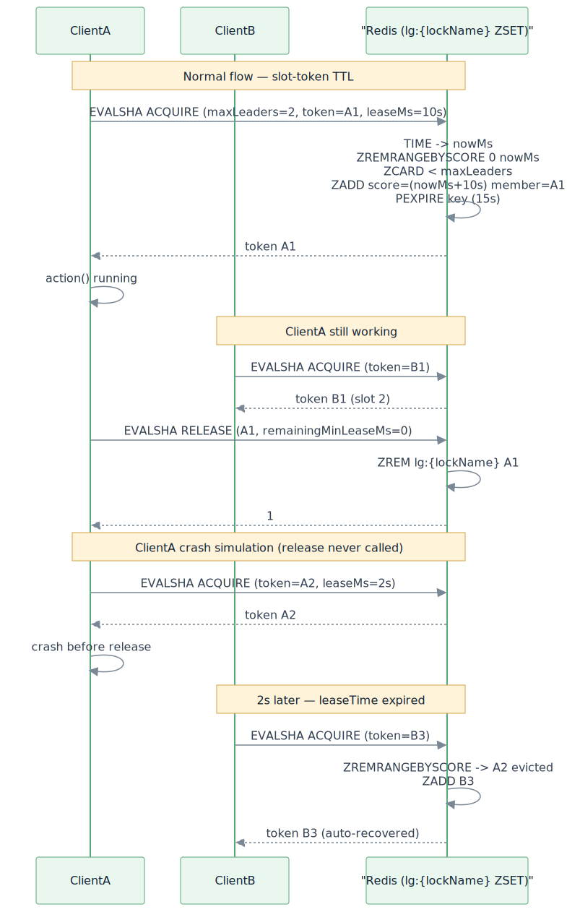

# leader-redis-lettuce

[한국어](README.ko.md)

Redis-backed leader election using [Lettuce](https://lettuce.io/) — blocking and coroutine APIs.

---

## Overview

`leader-redis-lettuce` implements `leader-core` interfaces using Lettuce's reactive Redis client. Lock primitives (`LettuceLock`, `LettuceSlotTokenGroup`) are ported directly into this module — no runtime dependency on `bluetape4k-lettuce`.

Single-leader strategy: Redis `SET key value NX PX ttl` (atomic compare-and-set). With `LeaderElectionOptions(autoExtend = true)`, single-leader electors renew the TTL with a token-conditional `PEXPIRE` while the action is running.

Group strategy (slot-token TTL model): a single ZSET key `lg:{lockName}` whose members are per-slot tokens (`Base58.randomString(8)`) and whose `score = expiryAtMs`. ACQUIRE/RELEASE/STATUS Lua scripts use Redis server-side `TIME` so client clock skew is irrelevant, and ACQUIRE auto-evicts expired members via `ZREMRANGEBYSCORE`. Crash recovery is automatic (no external reaper required) — if a holder dies without releasing, the slot is reclaimed on the next acquire after `leaseTime`.

> The legacy `LettuceSemaphore` / `LettuceSuspendSemaphore` primitives are `@Deprecated` in favor of `LettuceSlotTokenGroup`. The new `lg:{lockName}` key prefix avoids collisions with any pre-existing keys during rolling deployment.

## Architecture



## Group Lock Flow

The slot-token TTL model is best understood through two scenarios: a normal acquire/release cycle with crash recovery, and `minLeaseTime` delegation to the backend ZSET score.

### Scenario 1 — Normal acquire/release plus crash recovery



### Scenario 2 — `minLeaseTime` delegated to backend TTL


## Implementations

| Class | Interface | Description |
|-------|-----------|-------------|
| `LettuceLeaderElector` | `LeaderElector` | Blocking single-leader via `LettuceLock` |
| `LettuceLeaderGroupElector` | `LeaderGroupElector` | Blocking multi-leader via `LettuceSlotTokenGroup` (slot-token TTL) |
| `LettuceSuspendLeaderElector` | `SuspendLeaderElector` | Coroutine single-leader via `LettuceSuspendLock` |
| `LettuceSuspendLeaderGroupElector` | `SuspendLeaderGroupElector` | Coroutine multi-leader via `LettuceSlotTokenGroup` |
| `LettuceSuspendLeaderElectorFactory` | `SuspendLeaderElectorFactory` | Factory: creates `LettuceSuspendLeaderElector` per call |
| `LettuceSuspendLeaderGroupElectorFactory` | `SuspendLeaderGroupElectorFactory` | Factory: creates `LettuceSuspendLeaderGroupElector` per call |

## Usage

### Setup

```kotlin
val redisClient = RedisClient.create("redis://localhost:6379")
val connection = redisClient.connect()
```

### Blocking single-leader

```kotlin
val election = LettuceLeaderElector(connection)

val result = election.runIfLeader("daily-report") {
    generateReport()
}
// result == report on leader node, null on others
```

### Blocking multi-leader group

```kotlin
val options = LeaderGroupElectionOptions(maxLeaders = 3)
val election = LettuceLeaderGroupElector(connection, options)

val result = election.runIfLeader("parallel-batch") {
    processChunk()
}
```

### Coroutine suspend single-leader

```kotlin
val election = LettuceSuspendLeaderElector(connection)

coroutineScope {
    val result = election.runIfLeader("nightly-sync") {
        syncData()
    }
}
```

### Coroutine multi-leader group

```kotlin
val options = LeaderGroupElectionOptions(maxLeaders = 2)
val election = LettuceSuspendLeaderGroupElector(connection, options)

coroutineScope {
    val jobs = (1..5).map {
        async {
            election.runIfLeader("task-group") {
                processTask(it)
            }
        }
    }
    jobs.awaitAll()  // 2 run concurrently, 3 get null
}
```

### Custom options

```kotlin
val options = LeaderElectionOptions(
    waitTime = 3.seconds,
    leaseTime = 30.seconds
)
val election = LettuceLeaderElector(connection, options)
```

### Group options — `minLeaseTime` is delegated to the backend TTL

For multi-leader groups, `LeaderGroupElectionOptions(minLeaseTime = ...)` keeps a slot occupied for at least that duration. Implementation extends the slot's ZSET score (server-side TTL) on release rather than parking the caller, so `runIfLeader` returns as soon as `action` finishes:

```kotlin
val options = LeaderGroupElectionOptions(
    maxLeaders = 3,
    leaseTime = 30.seconds,
    minLeaseTime = 1.seconds, // slot stays at least 1s after a fast action
)
val election = LettuceLeaderGroupElector(connection, options)
```

### Using factories

```kotlin
val factory: SuspendLeaderElectorFactory = LettuceSuspendLeaderElectorFactory(connection)

coroutineScope {
    val elector = factory.create(LeaderElectionOptions.Default)
    val result = elector.runIfLeader("daily-job") { doWork() }
}
```

```kotlin
val groupFactory: SuspendLeaderGroupElectorFactory = LettuceSuspendLeaderGroupElectorFactory(connection)

coroutineScope {
    val elector = groupFactory.create(LeaderGroupElectionOptions(maxLeaders = 3))
    val result = elector.runIfLeader("parallel-job") { processChunk() }
}
```

## Lock Internals

`LettuceLock` uses a Lua script to ensure atomic unlock (only the lock owner can release):

```lua
if redis.call('get', KEYS[1]) == ARGV[1] then
    return redis.call('del', KEYS[1])
else
    return 0
end
```

### `LettuceSlotTokenGroup` — slot-token TTL model

The group primitive backing `LettuceLeaderGroupElector` and `LettuceSuspendLeaderGroupElector`:

- Single ZSET key `lg:{lockName}` — `member = Base58 token (8 chars)`, `score = expiryAtMs`.
- ACQUIRE / RELEASE / STATUS Lua scripts read the timestamp via `redis.call('TIME')` so client clock skew has no effect.
- ACQUIRE first runs `ZREMRANGEBYSCORE 0 nowMs` to evict expired members — crash recovery is automatic, no external reaper required.
- RELEASE with `remainingMinLeaseMs > 0` does `ZADD XX` to extend the slot's score (delegating `minLeaseTime` to backend TTL); otherwise it removes the member.
- Failed acquire returns `null` (waitTime exhausted) — no `IllegalStateException`.
- The `lg:{lockName}` prefix is intentionally distinct from the legacy `LettuceSemaphore` keys to avoid collisions during rolling upgrades.

> The legacy `LettuceSemaphore` / `LettuceSuspendSemaphore` (Redis counter + permit tokens) remain in the source tree marked `@Deprecated` and are no longer wired into the group electors.

## Audit Identity (`LeaderSlot`)

Pass a `LeaderSlot` instead of a plain `lockName` to propagate a human-readable node identity
through each election round. The identity is stored in a Redis Hash
(`lg:{lockName}:meta` — accessible as `LettuceSlotTokenGroup.metaKey`) while the slot is held,
and removed atomically on release.

```kotlin
val slot = LeaderSlot("batch-job", leaderId = "node-a")

// blocking
val result: LeaderRunResult<Unit> = elector.runIfLeaderResult(slot) { doWork() }
if (result is LeaderRunResult.Elected) {
    println("elected as ${result.leaderId}")   // "node-a"
}

// suspend
val result2 = suspendElector.runIfLeaderResultSuspend(slot) { doWork() }
```

The `leaderId` is stored as `HSET lg:{lockName}:meta <token> <leaderId>` on acquire and
removed with `HDEL` on release. An empty `leaderId` skips the write entirely.

## Dependency

```kotlin
// build.gradle.kts
implementation("io.github.bluetape4k.leader:bluetape4k-leader-redis-lettuce:0.1.0-SNAPSHOT")

// Lettuce must be on the classpath
implementation("io.lettuce:lettuce-core:6.x.x")
```
