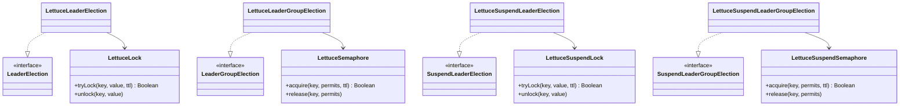

# leader-redis-lettuce

[한국어](README.ko.md)

Redis-backed leader election using [Lettuce](https://lettuce.io/) — blocking and coroutine APIs.

---

## Overview

`leader-redis-lettuce` implements `leader-core` interfaces using Lettuce's reactive Redis client. Lock primitives (`LettuceLock`, `LettuceSemaphore`) are ported directly into this module — no runtime dependency on `bluetape4k-lettuce`.

Lock strategy: Redis `SET key value NX PX ttl` (atomic compare-and-set). Renewal is not automatic; the caller must ensure `leaseTime` is longer than the expected action duration.

## Architecture



## Implementations

| Class | Interface | Description |
|-------|-----------|-------------|
| `LettuceLeaderElection` | `LeaderElection` | Blocking single-leader via `LettuceLock` |
| `LettuceLeaderGroupElection` | `LeaderGroupElection` | Blocking multi-leader via `LettuceSemaphore` |
| `LettuceSuspendLeaderElection` | `SuspendLeaderElection` | Coroutine single-leader via `LettuceSuspendLock` |
| `LettuceSuspendLeaderGroupElection` | `SuspendLeaderGroupElection` | Coroutine multi-leader via `LettuceSuspendSemaphore` |

## Usage

### Setup

```kotlin
val redisClient = RedisClient.create("redis://localhost:6379")
val connection = redisClient.connect()
```

### Blocking single-leader

```kotlin
val election = LettuceLeaderElection(connection)

val result = election.runIfLeader("daily-report") {
    generateReport()
}
// result == report on leader node, null on others
```

### Blocking multi-leader group

```kotlin
val options = LeaderGroupElectionOptions(maxLeaders = 3)
val election = LettuceLeaderGroupElection(connection, options)

val result = election.runIfLeader("parallel-batch") {
    processChunk()
}
```

### Coroutine suspend single-leader

```kotlin
val election = LettuceSuspendLeaderElection(connection)

coroutineScope {
    val result = election.runIfLeader("nightly-sync") {
        syncData()
    }
}
```

### Coroutine multi-leader group

```kotlin
val options = LeaderGroupElectionOptions(maxLeaders = 2)
val election = LettuceSuspendLeaderGroupElection(connection, options)

coroutineScope {
    val jobs = (1..5).map {
        async {
            election.runIfLeader("task-group") {
                processTask(it)
            }
        }
    }
    jobs.awaitAll()  // 2 run concurrently, 3 get null
}
```

### Custom options

```kotlin
val options = LeaderElectionOptions(
    waitTime = Duration.ofSeconds(3),
    leaseTime = Duration.ofSeconds(30)
)
val election = LettuceLeaderElection(connection, options)
```

## Lock Internals

`LettuceLock` uses a Lua script to ensure atomic unlock (only the lock owner can release):

```lua
if redis.call('get', KEYS[1]) == ARGV[1] then
    return redis.call('del', KEYS[1])
else
    return 0
end
```

`LettuceSemaphore` maintains a Redis list of permit tokens. Acquire appends a token; release removes one.

## Dependency

```kotlin
// build.gradle.kts
implementation("io.github.bluetape4k.leader:leader-redis-lettuce:0.1.0-SNAPSHOT")

// Lettuce must be on the classpath
implementation("io.lettuce:lettuce-core:6.x.x")
```
