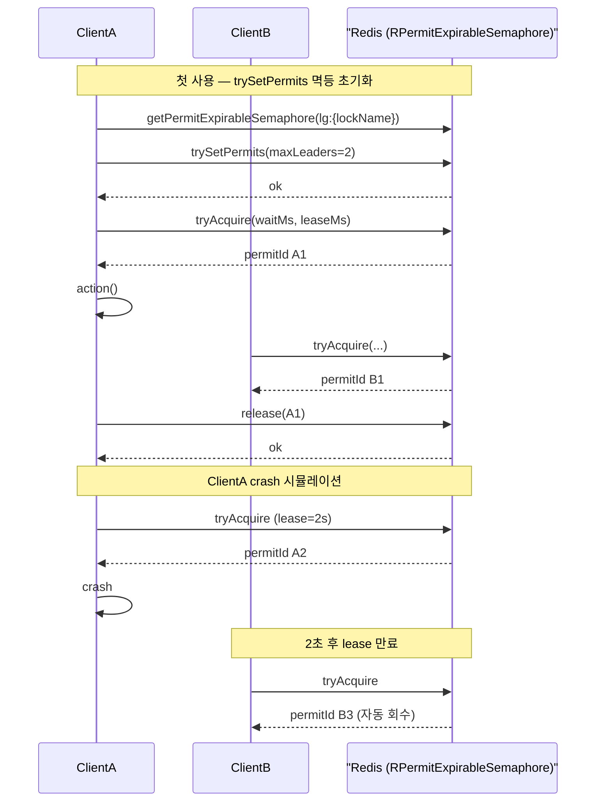
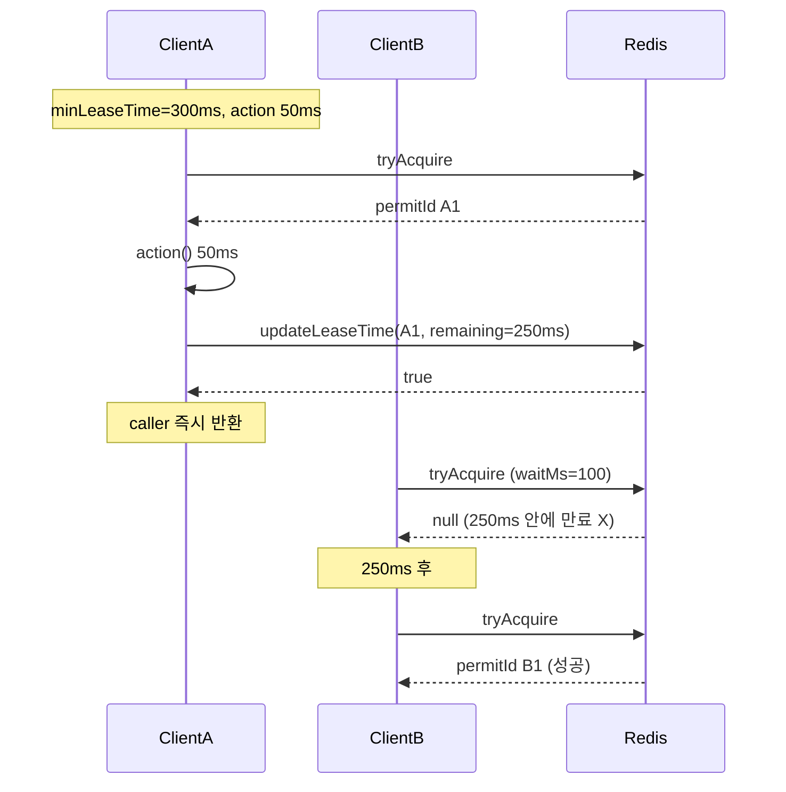

# leader-redis-redisson

[English](README.md)

[Redisson](https://redisson.org/) 기반 Redis 분산 리더 선출 구현체입니다. 블로킹과 코루틴 API를 제공합니다.

---

## 개요

`leader-redis-redisson`은 Redisson의 `RLock`과 `RPermitExpirableSemaphore` 를 사용하여 `leader-core` 인터페이스를 구현합니다. 블로킹, 비동기, 코루틴, 가상 스레드 실행 모델을 모두 지원합니다.

단일 리더 선출에서 `LeaderElectionOptions(autoExtend = true)`를 사용하면 명시적 lease timeout 없이 `RLock`을 획득해 Redisson 자체 watchdog에 위임합니다. watchdog release semantics가 모호하므로 `autoExtend=true`와 `minLeaseTime > 0` 조합은 거부합니다.

복수 리더 그룹 elector 는 `lg:{lockName}` 키의 `RPermitExpirableSemaphore` 를 사용하며, 첫 접근 시 `trySetPermits(maxLeaders)` 를 멱등적으로 호출합니다 (호출하지 않으면 0 permits 로 시작하여 acquire 가 영구 실패). 각 acquire 는 Redisson 이 발급한 고유한 `permitId` 를 반환하며, release / 연장 시 정확히 그 슬롯을 식별합니다. `minLeaseTime` 은 `updateLeaseTime` (sync) / `updateLeaseTimeAsync` (async) 로 backend TTL 에 위임되어 — caller 를 park 하지 않고 `runIfLeader` 가 `action` 종료 직후 즉시 반환합니다. 클라이언트 crash 시 (release 미호출) `leaseTime` 만료 후 Redisson 이 자동으로 슬롯을 회수합니다. `lg:{lockName}` key prefix 는 롤링 배포 시 구버전 semaphore 키와의 충돌을 피하기 위해 의도적으로 분리되었습니다.

코루틴 단일 리더 구현체는 PID 시드 기반의 미니 Snowflake ID 생성기를 사용하여 Redis 라운드트립 없이 코루틴별 고유 락 ID를 생성합니다. HA(다중 JVM) 환경에서 안전하게 동작합니다.

## 아키텍처



## 그룹 락 흐름

`RPermitExpirableSemaphore` 기반 그룹 elector 는 Lettuce slot-token TTL 모델과 동등하게 동작합니다. 두 시나리오로 계약을 설명합니다: 정상 acquire/release 와 crash recovery, 그리고 `updateLeaseTime` 을 통한 `minLeaseTime` 연장.

### 시나리오 1 — 정상 acquire/release 와 crash recovery



### 시나리오 2 — `updateLeaseTime` 을 통한 `minLeaseTime`



## 구현체 목록

| 클래스 | 구현 인터페이스 | 설명 |
|-------|--------------|------|
| `RedissonLeaderElector` | `LeaderElector` | `RLock.tryLock()` 기반 블로킹 |
| `RedissonLeaderGroupElector` | `LeaderGroupElector` | `RPermitExpirableSemaphore` (`lg:{lockName}`) 기반 블로킹 복수 리더 |
| `RedissonSuspendLeaderElector` | `SuspendLeaderElector` | 코루틴, PID 시드 Snowflake 락 ID |
| `RedissonSuspendLeaderGroupElector` | `SuspendLeaderGroupElector` | `RPermitExpirableSemaphoreAsync` 기반 코루틴 복수 리더 |
| `RedissonSuspendLeaderElectorFactory` | `SuspendLeaderElectorFactory` | 팩토리: 호출마다 `RedissonSuspendLeaderElector` 생성 |
| `RedissonSuspendLeaderGroupElectorFactory` | `SuspendLeaderGroupElectorFactory` | 팩토리: 호출마다 `RedissonSuspendLeaderGroupElector` 생성 |

## 코루틴 락 ID 설계

Redisson은 락 ID(스레드 ID)를 "소유자" 식별자로 사용합니다. 동일한 ID는 "내가 이 락을 보유 중"을 의미하며, 재진입성(reentrancy)을 활성화합니다. 코루틴 환경에서는 여러 코루틴이 같은 스레드에서 실행될 수 있으므로, 스레드 기반 ID를 사용하면 잘못된 재진입이 발생합니다.

`RedissonSuspendLeaderElector`은 `runIfLeader` 호출마다 미니 Snowflake로 고유한 락 ID를 생성합니다:

```
timestamp(42비트) | pid%(2^10)(10비트) | seq(12비트)
```

- `pid % 1024`를 머신 ID로 사용 — HA 환경에서 JVM 프로세스 간 충돌 최소화
- 인스턴스 내 `AtomicLong` 시퀀스 카운터 (12비트, 4096 이후 순환)
- Redis I/O 없음 — 순수 인메모리 연산

## 그룹 내부 동작 — `RPermitExpirableSemaphore`

`RedissonLeaderGroupElector` 와 `RedissonSuspendLeaderGroupElector` 는 `lg:{lockName}` 키의 `RPermitExpirableSemaphore` 를 사용합니다:

- 각 `lockName` 의 첫 접근에서 `trySetPermits(maxLeaders)` 를 멱등적으로 호출. 호출하지 않으면 0 permits 로 시작해 `tryAcquire` 가 항상 `null` 을 반환합니다.
- 각 `tryAcquire(waitTime, leaseTime, ms)` 는 고유한 `permitId: String?` 를 반환 (경합 시 `null`). 이 `permitId` 로 정확한 슬롯을 release / 연장하므로 동일 elector 인스턴스가 동시에 여러 슬롯을 보유해도 안전합니다.
- `runIfLeader` finally 블록에서:
  - `remainingMinLeaseTime > 0` → `updateLeaseTime(permitId, remainingMs, MILLISECONDS)` 로 backend TTL 연장 (async 경로는 `updateLeaseTimeAsync`).
  - 그 외 → `release(permitId)` 로 즉시 슬롯 반납.
- 클라이언트 crash 시 (release 미호출) `leaseTime` 만료 후 Redisson 이 자동으로 permit 을 회수합니다.
- `minLeaseTime` 을 backend TTL 에 위임 (caller-park 없음) — `runIfLeader` 는 `action` 종료 직후 즉시 반환.

> 이전 버전은 익명 permit 의 `RSemaphore` 를 사용했습니다. `RPermitExpirableSemaphore` 로의 전환과 새 `lg:{lockName}` key prefix 는 롤링 업그레이드 시 구버전 키와의 충돌을 방지합니다.

## 사용 예시

### 초기화

```kotlin
val config = Config().apply {
    useSingleServer()
        .setAddress("redis://localhost:6379")
        .setConnectionPoolSize(8)
        .setConnectionMinimumIdleSize(2)
}
val client = Redisson.create(config)
```

### 블로킹 단일 리더

```kotlin
val election = RedissonLeaderElector(client)

val result = election.runIfLeader("daily-report") {
    generateReport()
}
// result: 리더 노드에서는 generateReport() 결과, 나머지 노드는 null
```

### 블로킹 복수 리더 그룹

```kotlin
val options = LeaderGroupElectionOptions(maxLeaders = 3)
val election = RedissonLeaderGroupElector(client, options)

val result = election.runIfLeader("parallel-batch") {
    processChunk()
}

println(election.activeCount("parallel-batch"))    // 현재 활성 리더 수 (0~3)
println(election.availableSlots("parallel-batch")) // 잔여 슬롯 수
```

### 코루틴 suspend 단일 리더

```kotlin
val election = RedissonSuspendLeaderElector(client)

val result = election.runIfLeader("nightly-sync") {
    syncData()
}
```

### 코루틴 복수 리더 그룹

```kotlin
val options = LeaderGroupElectionOptions(maxLeaders = 2)
val election = RedissonSuspendLeaderGroupElector(client, options)

coroutineScope {
    val jobs = (1..5).map {
        async {
            election.runIfLeader("worker-pool") {
                processTask(it)
            }
        }
    }
    jobs.awaitAll()  // 2개만 동시 실행, 나머지 3개는 null 반환
}
```

### 옵션 커스터마이징

```kotlin
val options = LeaderElectionOptions(
    waitTime = 3.seconds,
    leaseTime = 30.seconds
)
val election = RedissonLeaderElector(client, options)
```

### 그룹 `minLeaseTime` — backend TTL 연장

```kotlin
val options = LeaderGroupElectionOptions(
    maxLeaders = 3,
    leaseTime = 30.seconds,
    minLeaseTime = 1.seconds, // updateLeaseTime 으로 permit TTL 연장
)
val election = RedissonLeaderGroupElector(client, options)
```

### SPI 팩토리 사용

```kotlin
val factory: SuspendLeaderElectorFactory = RedissonSuspendLeaderElectorFactory(client)

coroutineScope {
    val elector = factory.create(LeaderElectionOptions.Default)
    val result = elector.runIfLeader("daily-job") { doWork() }
}
```

```kotlin
val groupFactory: SuspendLeaderGroupElectorFactory = RedissonSuspendLeaderGroupElectorFactory(client)

coroutineScope {
    val elector = groupFactory.create(LeaderGroupElectionOptions(maxLeaders = 3))
    val result = elector.runIfLeader("parallel-job") { processChunk() }
}
```

## 테스트 인프라

테스트는 `bluetape4k-testcontainers` 의 `RedisServer.Launcher.redis` (JVM 전역 싱글톤 Redis 컨테이너) 를 사용합니다:

```kotlin
@TestInstance(TestInstance.Lifecycle.PER_CLASS)
abstract class AbstractRedissonLeaderTest {
    companion object : KLogging() {
        val redis = RedisServer.Launcher.redis
        val redisUrl: String get() = redis.url
    }
}
```

## 감사 정체성 (`LeaderSlot`)

`lockName` 대신 `LeaderSlot`을 전달하면 각 선출 라운드마다 사람이 읽을 수 있는 노드 식별자를 전파할 수 있습니다. 식별자는 슬롯이 유지되는 동안 Redis Hash(`lg:{lockName}:audit`)에 저장되고, release 시 삭제됩니다.

```kotlin
val slot = LeaderSlot("batch-job", leaderId = "node-a")

// 블로킹
val result: LeaderRunResult<Unit> = elector.runIfLeaderResult(slot) { doWork() }
if (result is LeaderRunResult.Elected) {
    println("elected as ${result.leaderId}")   // "node-a"
}

// 코루틴
val result2 = suspendElector.runIfLeaderResultSuspend(slot) { doWork() }
```

`leaderId`는 acquire 시 `HSET lg:{lockName}:audit <permitId> <leaderId>`로 기록되고,
release 시 `HDEL`로 삭제됩니다. `null` 또는 생략된 `leaderId`는 기록을 생략합니다.

## 의존성 추가

```kotlin
// build.gradle.kts
implementation("io.github.bluetape4k.leader:bluetape4k-leader-redis-redisson:0.1.0-SNAPSHOT")

// Redisson이 클래스패스에 있어야 합니다
implementation("org.redisson:redisson:3.x.x")
```
