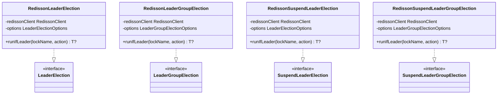

# leader-redis-redisson

[English](README.md)

[Redisson](https://redisson.org/) 기반 Redis 분산 리더 선출 구현체입니다. 블로킹과 코루틴 API를 제공합니다.

---

## 개요

`leader-redis-redisson`은 Redisson의 `RLock`과 `RSemaphore`를 사용하여 `leader-core` 인터페이스를 구현합니다. 블로킹, 비동기, 코루틴, 가상 스레드 실행 모델을 모두 지원합니다.

코루틴 구현체는 PID 시드 기반의 미니 Snowflake ID 생성기를 사용하여 Redis 라운드트립 없이 코루틴별 고유 락 ID를 생성합니다. HA(다중 JVM) 환경에서 안전하게 동작합니다.

## 아키텍처



## 구현체 목록

| 클래스 | 구현 인터페이스 | 설명 |
|-------|--------------|------|
| `RedissonLeaderElection` | `LeaderElection` | `RLock.tryLock()` 기반 블로킹 |
| `RedissonLeaderGroupElection` | `LeaderGroupElection` | `RSemaphore` 기반 블로킹 복수 리더 |
| `RedissonSuspendLeaderElection` | `SuspendLeaderElection` | 코루틴, PID 시드 Snowflake 락 ID |
| `RedissonSuspendLeaderGroupElection` | `SuspendLeaderGroupElection` | `RSemaphoreAsync` 기반 코루틴 복수 리더 |

## 코루틴 락 ID 설계

Redisson은 락 ID(스레드 ID)를 "소유자" 식별자로 사용합니다. 동일한 ID는 "내가 이 락을 보유 중"을 의미하며, 재진입성(reentrancy)을 활성화합니다. 코루틴 환경에서는 여러 코루틴이 같은 스레드에서 실행될 수 있으므로, 스레드 기반 ID를 사용하면 잘못된 재진입이 발생합니다.

`RedissonSuspendLeaderElection`은 `runIfLeader` 호출마다 미니 Snowflake로 고유한 락 ID를 생성합니다:

```
timestamp(42비트) | pid%(2^10)(10비트) | seq(12비트)
```

- `pid % 1024`를 머신 ID로 사용 — HA 환경에서 JVM 프로세스 간 충돌 최소화
- 인스턴스 내 `AtomicLong` 시퀀스 카운터 (12비트, 4096 이후 순환)
- Redis I/O 없음 — 순수 인메모리 연산

## 사용 예시

### 초기화

```kotlin
val config = Config().apply {
    useSingleServer()
        .setAddress("redis://localhost:6379")
        .setConnectionPoolSize(8)
        .setConnectionMinimumIdleSize(2)
}
val client = Redisson.create(config)
```

### 블로킹 단일 리더

```kotlin
val election = RedissonLeaderElection(client)

val result = election.runIfLeader("daily-report") {
    generateReport()
}
// result: 리더 노드에서는 generateReport() 결과, 나머지 노드는 null
```

### 블로킹 복수 리더 그룹

```kotlin
val options = LeaderGroupElectionOptions(maxLeaders = 3)
val election = RedissonLeaderGroupElection(client, options)

val result = election.runIfLeader("parallel-batch") {
    processChunk()
}

println(election.activeCount("parallel-batch"))    // 현재 활성 리더 수 (0~3)
println(election.availableSlots("parallel-batch")) // 잔여 슬롯 수
```

### 코루틴 suspend 단일 리더

```kotlin
val election = RedissonSuspendLeaderElection(client)

val result = election.runIfLeader("nightly-sync") {
    syncData()
}
```

### 코루틴 복수 리더 그룹

```kotlin
val options = LeaderGroupElectionOptions(maxLeaders = 2)
val election = RedissonSuspendLeaderGroupElection(client, options)

coroutineScope {
    val jobs = (1..5).map {
        async {
            election.runIfLeader("worker-pool") {
                processTask(it)
            }
        }
    }
    jobs.awaitAll()  // 2개만 동시 실행, 나머지 3개는 null 반환
}
```

### 옵션 커스터마이징

```kotlin
val options = LeaderElectionOptions(
    waitTime = Duration.ofSeconds(3),
    leaseTime = Duration.ofSeconds(30)
)
val election = RedissonLeaderElection(client, options)
```

## 테스트 인프라

테스트는 `bluetape4k-testcontainers` 의 `RedisServer.Launcher.redis` (JVM 전역 싱글톤 Redis 컨테이너) 를 사용합니다:

```kotlin
@TestInstance(TestInstance.Lifecycle.PER_CLASS)
abstract class AbstractRedissonLeaderTest {
    companion object : KLogging() {
        val redis = RedisServer.Launcher.redis
        val redisUrl: String get() = redis.url
    }
}
```

## 의존성 추가

```kotlin
// build.gradle.kts
implementation("io.github.bluetape4k.leader:leader-redis-redisson:0.1.0-SNAPSHOT")

// Redisson이 클래스패스에 있어야 합니다
implementation("org.redisson:redisson:3.x.x")
```
