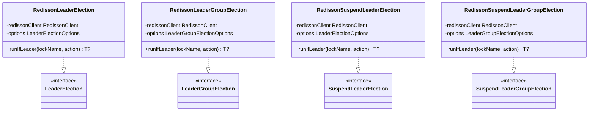

# leader-redis-redisson

[한국어](README.ko.md)

Redis-backed leader election using [Redisson](https://redisson.org/) — blocking and coroutine APIs.

---

## Overview

`leader-redis-redisson` implements `leader-core` interfaces using Redisson's `RLock` and `RSemaphore`. It supports blocking, async, coroutine, and virtual-thread execution models.

The coroutine implementation uses a PID-seeded mini-Snowflake ID generator to produce unique per-coroutine lock IDs without Redis round-trips, ensuring safety in HA (multi-JVM) deployments.

## Architecture



## Implementations

| Class | Interface | Description |
|-------|-----------|-------------|
| `RedissonLeaderElection` | `LeaderElection` | Blocking via `RLock.tryLock()` |
| `RedissonLeaderGroupElection` | `LeaderGroupElection` | Blocking multi-leader via `RSemaphore` |
| `RedissonSuspendLeaderElection` | `SuspendLeaderElection` | Coroutine, PID-seeded Snowflake lock ID |
| `RedissonSuspendLeaderGroupElection` | `SuspendLeaderGroupElection` | Coroutine multi-leader via `RSemaphoreAsync` |

## Coroutine Lock ID Design

Redisson treats the lock ID (thread ID) as the "owner" identifier — the same ID means "I own this lock" and enables reentrancy. In coroutine environments, multiple coroutines run on the same thread, so a thread-based ID would cause false reentrancy.

`RedissonSuspendLeaderElection` generates a unique lock ID per `runIfLeader` call using a mini-Snowflake:

```
timestamp(42 bits) | pid%(2^10)(10 bits) | seq(12 bits)
```

- `pid % 1024` as machine ID — reasonably collision-resistant across JVM processes in HA
- Per-instance `AtomicLong` sequence counter (12 bits, wraps after 4096)
- Zero Redis I/O — pure in-memory computation

## Usage

### Setup

```kotlin
val config = Config().apply {
    useSingleServer()
        .setAddress("redis://localhost:6379")
        .setConnectionPoolSize(8)
        .setConnectionMinimumIdleSize(2)
}
val client = Redisson.create(config)
```

### Blocking single-leader

```kotlin
val election = RedissonLeaderElection(client)

val result = election.runIfLeader("daily-report") {
    generateReport()
}
// result == report on leader, null on others
```

### Blocking multi-leader group

```kotlin
val options = LeaderGroupElectionOptions(maxLeaders = 3)
val election = RedissonLeaderGroupElection(client, options)

val result = election.runIfLeader("parallel-batch") {
    processChunk()
}

println(election.activeCount("parallel-batch"))    // 0–3
println(election.availableSlots("parallel-batch")) // remaining slots
```

### Coroutine suspend single-leader

```kotlin
val election = RedissonSuspendLeaderElection(client)

val result = election.runIfLeader("nightly-sync") {
    syncData()
}
```

### Coroutine multi-leader group

```kotlin
val options = LeaderGroupElectionOptions(maxLeaders = 2)
val election = RedissonSuspendLeaderGroupElection(client, options)

coroutineScope {
    val jobs = (1..5).map {
        async {
            election.runIfLeader("worker-pool") {
                processTask(it)
            }
        }
    }
    jobs.awaitAll()  // 2 run concurrently, 3 return null
}
```

### Custom options

```kotlin
val options = LeaderElectionOptions(
    waitTime = Duration.ofSeconds(3),
    leaseTime = Duration.ofSeconds(30)
)
val election = RedissonLeaderElection(client, options)
```

### Using `invoke` factory

```kotlin
val election = RedissonSuspendLeaderElection(client, LeaderElectionOptions.Default)
```

## Test Infrastructure

Tests use Testcontainers `GenericContainer("redis:7-alpine")` — self-contained, no dependency on external test utilities:

```kotlin
abstract class AbstractRedissonLeaderTest {
    companion object : KLogging() {
        private val redisContainer =
            GenericContainer("redis:7-alpine").withExposedPorts(6379)

        init { redisContainer.start() }

        val redisUrl: String
            get() = "redis://${redisContainer.host}:${redisContainer.getMappedPort(6379)}"

        val redissonClient: RedissonClient by lazy {
            val config = Config().apply {
                useSingleServer().setAddress(redisUrl)
            }
            Redisson.create(config)
        }
    }
}
```

## Dependency

```kotlin
// build.gradle.kts
implementation("io.github.bluetape4k.leader:leader-redis-redisson:0.1.0-SNAPSHOT")

// Redisson must be on the classpath
implementation("org.redisson:redisson:3.x.x")
```
