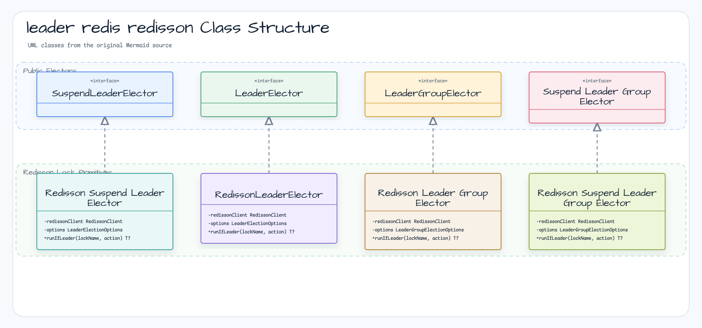
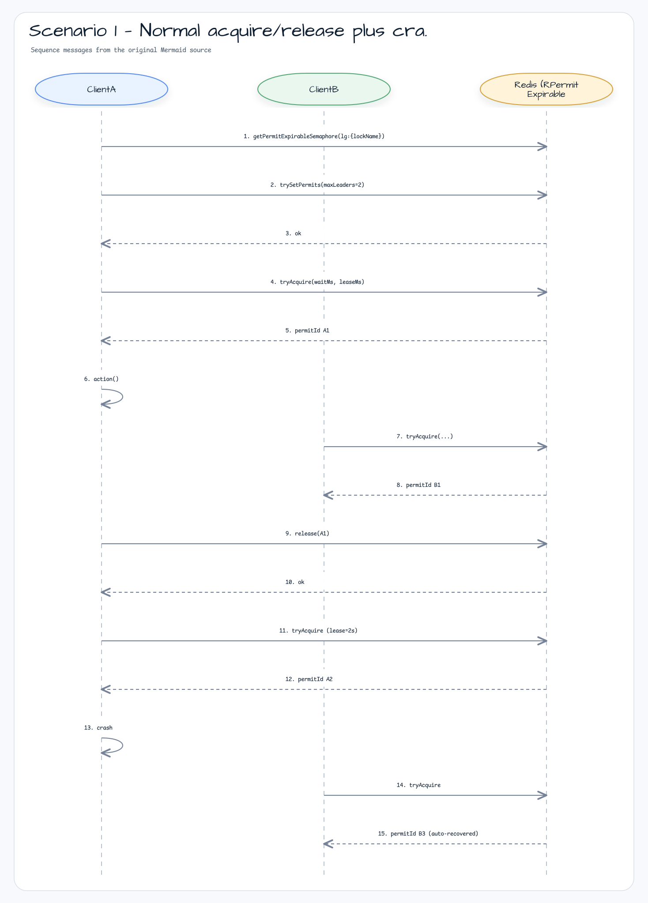
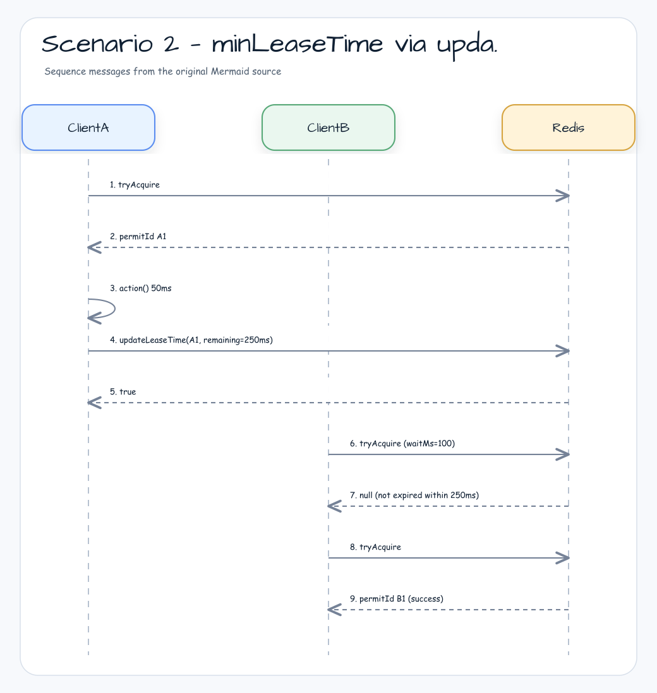

# leader-redis-redisson

[한국어](README.ko.md)

Redis-backed leader election using [Redisson](https://redisson.org/) — blocking and coroutine APIs.

---

## Overview

`leader-redis-redisson` implements `leader-core` interfaces using Redisson's `RLock` and `RPermitExpirableSemaphore`. It supports blocking, async, coroutine, and virtual-thread execution models.

For single-leader elections, `LeaderElectionOptions(autoExtend = true)` enables the shared `LeaderLeaseAutoExtender` watchdog (T8 PR 3 / Issue #79). The Redisson built-in lock watchdog is disabled — `tryLock` is always called with an explicit `leaseTime` so that `LeaderLeaseAutoExtender` is the single source of truth for lease extension. This activates R2 watchdog-skip semantics: when the user calls `LockExtender.extendActiveLock(d)`, the watchdog observes the updated `lastExtendDeadline` on the shared `ExtendDelegate` and skips the next tick if it would shorten the user-extended lease. `minLeaseTime > 0` combined with `autoExtend = true` is now supported (the earlier restriction tied to Redisson's built-in watchdog has been removed).

For multi-leader groups, the elector binds to a `RPermitExpirableSemaphore` keyed `lg:{lockName}` and calls `trySetPermits(maxLeaders)` idempotently on first access (without it the semaphore would default to 0 permits and `tryAcquire` would deadlock). Each acquire returns a Redisson-issued `permitId` used to release or extend the slot. `minLeaseTime` is delegated to the backend TTL via `updateLeaseTime` (sync) / `updateLeaseTimeAsync` (async) — `runIfLeader` returns immediately when `action` finishes, with no caller-side parking. Crash recovery is automatic: a permit's TTL expires and the slot is reclaimed by Redisson on the next acquire. The `lg:{lockName}` key prefix is intentionally distinct from any pre-existing semaphore keys to avoid collisions during rolling deployment.

The coroutine single-leader implementation uses a PID-seeded mini-Snowflake ID generator to produce unique per-coroutine lock IDs without Redis round-trips, ensuring safety in HA (multi-JVM) deployments.

## Architecture



## Group Lock Flow

The `RPermitExpirableSemaphore`-backed group elector behaves equivalently to the Lettuce slot-token TTL model. Two scenarios illustrate the contract: a normal acquire/release with crash recovery, and `minLeaseTime` extension via `updateLeaseTime`.

### Scenario 1 — Normal acquire/release plus crash recovery



### Scenario 2 — `minLeaseTime` via `updateLeaseTime`



## Implementations

| Class | Interface | Description |
|-------|-----------|-------------|
| `RedissonLeaderElector` | `LeaderElector` | Blocking via `RLock.tryLock()` |
| `RedissonLeaderGroupElector` | `LeaderGroupElector` | Blocking multi-leader via `RPermitExpirableSemaphore` (`lg:{lockName}`) |
| `RedissonSuspendLeaderElector` | `SuspendLeaderElector` | Coroutine, PID-seeded Snowflake lock ID |
| `RedissonSuspendLeaderGroupElector` | `SuspendLeaderGroupElector` | Coroutine multi-leader via `RPermitExpirableSemaphoreAsync` |
| `RedissonSuspendLeaderElectorFactory` | `SuspendLeaderElectorFactory` | Factory: creates `RedissonSuspendLeaderElector` per call |
| `RedissonSuspendLeaderGroupElectorFactory` | `SuspendLeaderGroupElectorFactory` | Factory: creates `RedissonSuspendLeaderGroupElector` per call |

## Coroutine Lock ID Design

Redisson treats the lock ID (thread ID) as the "owner" identifier — the same ID means "I own this lock" and enables reentrancy. In coroutine environments, multiple coroutines run on the same thread, so a thread-based ID would cause false reentrancy.

`RedissonSuspendLeaderElector` generates a unique lock ID per `runIfLeader` call using a mini-Snowflake:

```
timestamp(42 bits) | pid%(2^10)(10 bits) | seq(12 bits)
```

- `pid % 1024` as machine ID — reasonably collision-resistant across JVM processes in HA
- Per-instance `AtomicLong` sequence counter (12 bits, wraps after 4096)
- Zero Redis I/O — pure in-memory computation

## Group Internals — `RPermitExpirableSemaphore`

`RedissonLeaderGroupElector` and `RedissonSuspendLeaderGroupElector` use `RPermitExpirableSemaphore` keyed `lg:{lockName}`:

- `trySetPermits(maxLeaders)` is invoked idempotently on the first access for each `lockName`. Without this, the semaphore would default to 0 permits and `tryAcquire` would always return `null`.
- Each `tryAcquire(waitTime, leaseTime, ms)` returns a unique `permitId: String?` (or `null` on contention). The `permitId` is used to release or extend the exact slot — no positional ambiguity even when one elector instance holds multiple slots concurrently.
- On `runIfLeader` finally:
  - if `remainingMinLeaseTime > 0` → `updateLeaseTime(permitId, remainingMs, MILLISECONDS)` extends the backend TTL (the async path uses `updateLeaseTimeAsync`).
  - otherwise → `release(permitId)` returns the slot immediately.
- Crash recovery is automatic: when a holder dies without releasing, Redisson reclaims the permit after `leaseTime` expires.
- `minLeaseTime` is delegated to the backend TTL (no caller-side park) — `runIfLeader` returns as soon as `action` finishes.

> Earlier versions used `RSemaphore` with anonymous permits. The shift to `RPermitExpirableSemaphore` plus the new `lg:{lockName}` key prefix avoids collisions with any legacy keys during rolling upgrades.

## Usage

### Setup

```kotlin
val config = Config().apply {
    useSingleServer()
        .setAddress("redis://localhost:6379")
        .setConnectionPoolSize(8)
        .setConnectionMinimumIdleSize(2)
}
val client = Redisson.create(config)
```

### Blocking single-leader

```kotlin
val election = RedissonLeaderElector(client)

val result = election.runIfLeader("daily-report") {
    generateReport()
}
// result == report on leader, null on others
```

### Blocking multi-leader group

```kotlin
val options = LeaderGroupElectionOptions(maxLeaders = 3)
val election = RedissonLeaderGroupElector(client, options)

val result = election.runIfLeader("parallel-batch") {
    processChunk()
}

println(election.activeCount("parallel-batch"))    // 0–3
println(election.availableSlots("parallel-batch")) // remaining slots
```

### Coroutine suspend single-leader

```kotlin
val election = RedissonSuspendLeaderElector(client)

val result = election.runIfLeader("nightly-sync") {
    syncData()
}
```

### Coroutine multi-leader group

```kotlin
val options = LeaderGroupElectionOptions(maxLeaders = 2)
val election = RedissonSuspendLeaderGroupElector(client, options)

coroutineScope {
    val jobs = (1..5).map {
        async {
            election.runIfLeader("worker-pool") {
                processTask(it)
            }
        }
    }
    jobs.awaitAll()  // 2 run concurrently, 3 return null
}
```

### Custom options

```kotlin
val options = LeaderElectionOptions(
    waitTime = 3.seconds,
    leaseTime = 30.seconds
)
val election = RedissonLeaderElector(client, options)
```

### Group `minLeaseTime` — backend TTL extension

```kotlin
val options = LeaderGroupElectionOptions(
    maxLeaders = 3,
    leaseTime = 30.seconds,
    minLeaseTime = 1.seconds, // extends the permit TTL via updateLeaseTime
)
val election = RedissonLeaderGroupElector(client, options)
```

### Using `invoke` factory

```kotlin
val election = RedissonSuspendLeaderElector(client, LeaderElectionOptions.Default)
```

### Using SPI factories

```kotlin
val factory: SuspendLeaderElectorFactory = RedissonSuspendLeaderElectorFactory(client)

coroutineScope {
    val elector = factory.create(LeaderElectionOptions.Default)
    val result = elector.runIfLeader("daily-job") { doWork() }
}
```

```kotlin
val groupFactory: SuspendLeaderGroupElectorFactory = RedissonSuspendLeaderGroupElectorFactory(client)

coroutineScope {
    val elector = groupFactory.create(LeaderGroupElectionOptions(maxLeaders = 3))
    val result = elector.runIfLeader("parallel-job") { processChunk() }
}
```

## Test Infrastructure

Tests use `bluetape4k-testcontainers` `RedisServer.Launcher.redis`, a JVM-wide singleton Redis container:

```kotlin
@TestInstance(TestInstance.Lifecycle.PER_CLASS)
abstract class AbstractRedissonLeaderTest {
    companion object : KLogging() {
        val redis = RedisServer.Launcher.redis
        val redisUrl: String get() = redis.url
    }
}
```

## Audit Identity (`LeaderSlot`)

Pass a `LeaderSlot` instead of a plain `lockName` to propagate a human-readable node identity
through each election round. The identity is stored in a Redis Hash
(`lg:{lockName}:audit`) while the slot is held, and removed on release.

```kotlin
val slot = LeaderSlot("batch-job", leaderId = "node-a")

// blocking
val result: LeaderRunResult<Unit> = elector.runIfLeaderResult(slot) { doWork() }
if (result is LeaderRunResult.Elected) {
    println("elected as ${result.leaderId}")   // "node-a"
}

// suspend
val result2 = suspendElector.runIfLeaderResultSuspend(slot) { doWork() }
```

The `leaderId` is stored as `HSET lg:{lockName}:audit <permitId> <leaderId>` on acquire and
removed with `HDEL` on release. A `null` or absent `leaderId` skips the write entirely.

## Dependency

```kotlin
// build.gradle.kts
implementation("io.github.bluetape4k.leader:bluetape4k-leader-redis-redisson:0.2.0")

// Redisson must be on the classpath
implementation("org.redisson:redisson:3.x.x")
```
