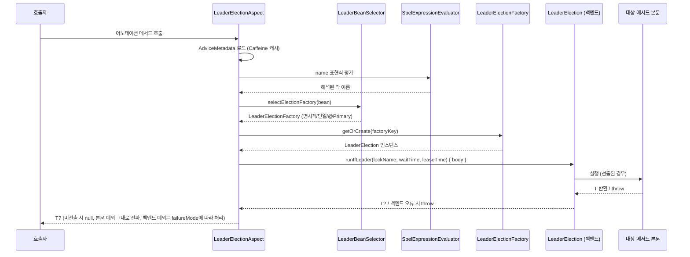
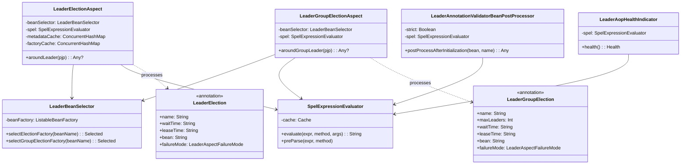

# leader-spring-boot-common

Spring Boot 3/4 통합 모듈이 공유하는 Boot 버전 독립 공통 모듈입니다.

## 역할

- `leader-spring-boot3`, `leader-spring-boot4` 양쪽에서 재사용
- Spring Boot 버전에 의존하지 않는 순수 Kotlin 코드만 포함
- `@ConfigurationProperties` 등 Boot 특화 어노테이션은 각 Boot 버전 모듈에서 선언

## AOP 어노테이션

### `@LeaderElection`

분산 단일 리더 선출로 메서드를 보호합니다. 락 획득 실패 시 동작은 `failureMode`로 제어합니다.

```kotlin
@Scheduled(cron = "0 0 2 * * *")
@LeaderElection(name = "daily-settlement", leaseTime = "PT1H")
fun dailySettlement() { ... }

// SpEL을 이용한 동적 락 이름
@LeaderElection(name = "'process-' + #region", failureMode = LeaderAspectFailureMode.SKIP)
fun process(region: String): Result? = service.process(region)

// 멀티 백엔드 환경에서 팩토리 빈 명시
@LeaderElection(name = "audit", bean = "redissonLeaderElectionFactory")
fun audit() { ... }
```

**`name`에 대한 SpEL 규칙**:
- ✅ `"daily-job"` — 정적 문자열 (따옴표 불필요)
- ✅ `"'process-' + #region"` — 리터럴 접두사는 반드시 따옴표 처리
- ✅ `"#user.tenantId"` — 파라미터 프로퍼티 접근
- ✅ `"\${spring.application.name}-warmup"` — Spring 플레이스홀더 + SpEL 조합
- ❌ `"process-#region"` — `process-`가 식별자로 처리됨 → 시작 시 파싱 실패

### `@LeaderGroupElection`

세마포어 기반 복수 리더 선출(`maxLeaders ≥ 2`)로 메서드를 보호합니다.

```kotlin
@LeaderGroupElection(name = "batch-shard", maxLeaders = 3, leaseTime = "PT5M")
fun batch() { ... }
```

**제약**: `maxLeaders ≤ 1`이면 시작 시 실패합니다. 단일 리더는 `@LeaderElection`을 사용하세요.

## 아키텍처 개요

### 시퀀스 다이어그램 — `@LeaderElection` 어드바이스 흐름



### 클래스 다이어그램 — 컴포넌트 관계



## AOP 인프라

| 클래스 | 설명 |
|--------|------|
| `LeaderElectionAspect` | `@LeaderElection`에 대한 `@Around` 어드바이스 |
| `LeaderGroupElectionAspect` | `@LeaderGroupElection`에 대한 `@Around` 어드바이스 |
| `LeaderBeanSelector` | `LeaderElectionFactory` 빈 해결 (명시적 / 단일 / `@Primary`) |
| `SpelExpressionEvaluator` | Caffeine 캐시 + 보안 샌드박스(기본적으로 메서드 호출 차단) SpEL 평가기 |
| `LockNameValidator` | 해결된 락 이름 검증 (빈 값, 너무 긴 이름) |
| `LeaderAnnotationValidatorBeanPostProcessor` | 시작 시 풋건 탐지: final/private 메서드, `maxLeaders ≤ 1`, SpEL 파싱 실패 |
| `LeaderAopHealthIndicator` | Actuator health 엔드포인트에 SpEL 캐시 크기 노출 |
| `LeaderAopMetricsRecorder` | 메트릭 통합(Micrometer 등)을 위한 인터페이스 |

## AOP 설정 프로퍼티

YAML 접두사: `bluetape4k.leader.aop`

```yaml
bluetape4k:
  leader:
    aop:
      enabled: true               # 기본값 true
      strict: false               # 기본값 false — 풋건: WARN만; true = 시작 시 실패
      failure-mode: RETHROW       # 기본값 RETHROW; SKIP은 백엔드 예외 흡수
      default-wait-time: PT5S     # 어노테이션별로 재정의 가능
      default-lease-time: PT1M    # 어노테이션별로 재정의 가능
      lock-name-prefix: "myapp:"  # 기본값 "${spring.application.name}:"
      spel:
        allow-method-invocation: false  # 기본값 false (CVE-2022-22947 완화)
```

## 시작 시 검증

`LeaderAnnotationValidatorBeanPostProcessor`는 애플리케이션 시작 시 어노테이션이 붙은 빈을 검사하며, `strict` 모드에서는 다음 경우 즉시 실패합니다:
- `final` 또는 `private` 메서드에 어노테이션 적용 (프록시가 가로챌 수 없음)
- `@LeaderGroupElection.maxLeaders ≤ 1` (`strict` 여부와 관계없이 항상 실패)
- `name` 표현식의 SpEL 파싱 실패 (`strict` 여부와 관계없이 항상 실패)
- `suspend` 또는 리액티브(`Mono`/`Flux`/`Flow`) 반환 타입 (현재 릴리스에서는 동기만 지원)

## 보안 주의사항

- SpEL 메서드 호출은 **기본적으로 비활성화**됩니다. `spel.allow-method-invocation=true`로 활성화할 수 있습니다.
- 락 이름 접두사로 애플리케이션 간 충돌을 방지합니다.

## 실패 모드

| 모드 | 백엔드 예외 발생 시 동작 |
|------|------------------------|
| `RETHROW` (기본값) | `LeaderElectionException`으로 래핑하여 재전파 |
| `SKIP` | 백엔드 예외를 흡수하고 `null` 반환 (ShedLock 동등 스킵) |

메서드 본문 예외는 `failureMode`와 관계없이 항상 그대로 전파됩니다.

## 제공 클래스

### Properties

| 클래스 | 설명 |
|--------|------|
| `LeaderElectionProperties` | 리더 선출 설정 (`wait-time`, `lease-time`, `group.*`) |
| `LeaderGroupProperties` | 복수 리더 그룹 설정 (`max-leaders`, `wait-time`, `lease-time`) |

```kotlin
// Boot 3/4 AutoConfiguration에서 사용 예
@ConfigurationProperties(prefix = "bluetape4k.leader")
class BootLeaderElectionProperties : LeaderElectionProperties()

// options 변환
val options: LeaderElectionOptions = properties.toOptions()
val groupOptions: LeaderGroupElectionOptions = properties.group.toOptions()
```

### Config Support

| 클래스 | 설명 |
|--------|------|
| `LeaderElectionConfigSupport` | AutoConfiguration 공통 추상 기반 클래스 |

## 의존 관계

```
leader-spring-boot-common
  └── leader-core
```

## 관련 문서

- [leader-spring-boot3](../leader-spring-boot3/README.ko.md) — Spring Boot 3 자동 구성 + AOP
- [leader-spring-boot4](../leader-spring-boot4/README.ko.md) — Spring Boot 4 자동 구성 + AOP
