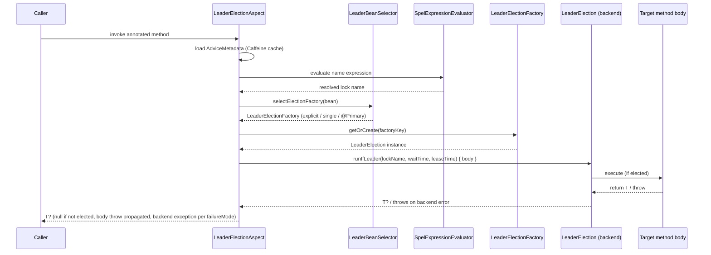
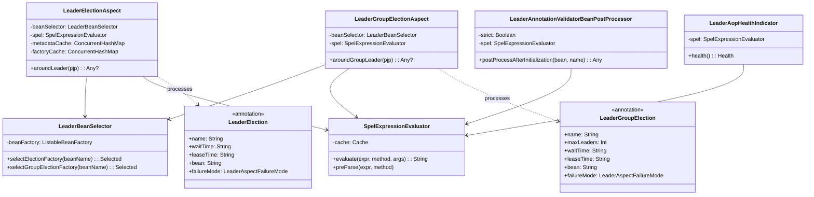

# leader-spring-boot-common

Boot-version-independent common module shared by `leader-spring-boot3` and `leader-spring-boot4`.

## Role

- Reused by both `leader-spring-boot3` and `leader-spring-boot4`
- Contains pure Kotlin code with no Spring Boot version dependency
- Boot-specific annotations like `@ConfigurationProperties` are declared in each versioned module

## AOP Annotations

### `@LeaderElection`

Protects a method with distributed single-leader election. On lock acquisition failure, behaviour is controlled by `failureMode`.

```kotlin
@Scheduled(cron = "0 0 2 * * *")
@LeaderElection(name = "daily-settlement", leaseTime = "PT1H")
fun dailySettlement() { ... }

// Dynamic lock name via SpEL
@LeaderElection(name = "'process-' + #region", failureMode = LeaderAspectFailureMode.SKIP)
fun process(region: String): Result? = service.process(region)

// Explicit factory bean in multi-backend setups
@LeaderElection(name = "audit", bean = "redissonLeaderElectionFactory")
fun audit() { ... }
```

**SpEL rules for `name`**:
- ✅ `"daily-job"` — static string (no quotes needed)
- ✅ `"'process-' + #region"` — literal prefix must be quoted
- ✅ `"#user.tenantId"` — parameter property access
- ✅ `"\${spring.application.name}-warmup"` — Spring placeholder + SpEL
- ❌ `"process-#region"` — `process-` treated as identifier → startup parse failure

### `@LeaderGroupElection`

Protects a method with semaphore-based multi-leader election (`maxLeaders ≥ 2`).

```kotlin
@LeaderGroupElection(name = "batch-shard", maxLeaders = 3, leaseTime = "PT5M")
fun batch() { ... }
```

**Constraint**: `maxLeaders ≤ 1` causes startup failure. Use `@LeaderElection` for single-leader.

## Architecture Overview

### Sequence Diagram — `@LeaderElection` advice flow



### Class Diagram — Component relationships



## AOP Infrastructure

| Class | Description |
|-------|-------------|
| `LeaderElectionAspect` | `@Around` advice for `@LeaderElection` |
| `LeaderGroupElectionAspect` | `@Around` advice for `@LeaderGroupElection` |
| `LeaderBeanSelector` | Resolves `LeaderElectionFactory` bean (explicit / single / `@Primary`) |
| `SpelExpressionEvaluator` | SpEL evaluator with Caffeine cache, security sandbox (method-call blocked by default) |
| `LockNameValidator` | Validates resolved lock names (empty, too long) |
| `LeaderAnnotationValidatorBeanPostProcessor` | Startup footgun detection: final/private methods, `maxLeaders ≤ 1`, SpEL parse failures |
| `LeaderAopHealthIndicator` | Exposes SpEL cache size via Actuator health endpoint |
| `LeaderAopMetricsRecorder` | Interface for metrics integration (Micrometer, etc.) |

## AOP Configuration Properties

YAML prefix: `bluetape4k.leader.aop`

```yaml
bluetape4k:
  leader:
    aop:
      enabled: true               # default true
      strict: false               # default false — footgun: WARN only; true = startup fail
      failure-mode: RETHROW       # default RETHROW; SKIP absorbs backend exceptions
      default-wait-time: PT5S     # overridable per-annotation
      default-lease-time: PT1M    # overridable per-annotation
      lock-name-prefix: "myapp:"  # default "${spring.application.name}:" 
      spel:
        allow-method-invocation: false  # default false (CVE-2022-22947 mitigation)
```

## Startup Validation

`LeaderAnnotationValidatorBeanPostProcessor` inspects annotated beans at startup and fails fast (in `strict` mode) for:
- `final` or `private` annotated methods (proxy cannot intercept)
- `@LeaderGroupElection.maxLeaders ≤ 1` (always fail regardless of `strict`)
- SpEL parse failures in `name` expressions (always fail regardless of `strict`)
- `suspend` or reactive (`Mono`/`Flux`/`Flow`) return types (sync-only in current release)

## Security Notes

- SpEL method invocation is **disabled by default**. Set `spel.allow-method-invocation=true` to opt in.
- Lock name prefix prevents cross-application collision.

## Failure Modes

| Mode | On backend exception |
|------|---------------------|
| `RETHROW` (default) | Wraps in `LeaderElectionException` and rethrows |
| `SKIP` | Absorbs backend exception, returns `null` (ShedLock-equivalent skip) |

Body exceptions always propagate unchanged regardless of `failureMode`.

## Provided Classes

### Properties

| Class | Description |
|-------|-------------|
| `LeaderElectionProperties` | Election settings (`wait-time`, `lease-time`, `group.*`) |
| `LeaderGroupProperties` | Multi-leader group settings (`max-leaders`, `wait-time`, `lease-time`) |

```kotlin
// Example usage in Boot 3/4 AutoConfiguration
@ConfigurationProperties(prefix = "bluetape4k.leader")
class BootLeaderElectionProperties : LeaderElectionProperties()

// Convert to options
val options: LeaderElectionOptions = properties.toOptions()
val groupOptions: LeaderGroupElectionOptions = properties.group.toOptions()
```

### Config Support

| Class | Description |
|-------|-------------|
| `LeaderElectionConfigSupport` | Abstract base class for AutoConfiguration |

## Dependency Graph

```
leader-spring-boot-common
  └── leader-core
```

## See Also

- [leader-spring-boot3](../leader-spring-boot3/README.md) — Spring Boot 3 auto-configuration + AOP
- [leader-spring-boot4](../leader-spring-boot4/README.md) — Spring Boot 4 auto-configuration + AOP
