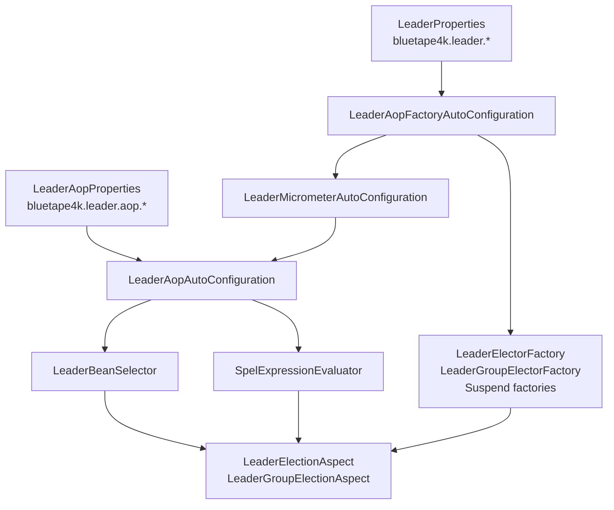

# leader-spring-boot

[English](README.md)

bluetape4k 리더 선출을 위한 Spring Boot 4 자동 구성과 AspectJ CTW 기반 어노테이션 지원 모듈입니다.

---

## 개요

`leader-spring-boot`는 Spring 애플리케이션에 bluetape4k leader backend를 연결하고 어노테이션 기반 실행 가드를 제공합니다.

- `@LeaderElection`: 단일 분산 리더 실행
- `@LeaderGroupElection`: 슬롯 기반 복수 리더 실행
- `@LeaderElectionBackend`: 메서드, 클래스, 패키지 단위 backend 선택
- Local, Lettuce, Redisson, Exposed JDBC/R2DBC, MongoDB, Hazelcast, Micrometer 자동 구성

AOP 계층은 Freefair post-compile weaving을 통한 AspectJ compile-time weaving을 전제로 합니다. Spring runtime proxy AOP에 의존하지 않습니다.

## 아키텍처



## 의존성

```kotlin
implementation("io.github.bluetape4k.leader:leader-spring-boot:0.1.0-SNAPSHOT")

// backend 모듈을 하나 이상 추가합니다.
implementation("io.github.bluetape4k.leader:leader-redis-redisson:0.1.0-SNAPSHOT")

// 선택: Micrometer/Actuator 연동.
implementation("io.github.bluetape4k.leader:leader-micrometer:0.1.0-SNAPSHOT")
implementation("org.springframework.boot:spring-boot-starter-actuator")
```

어노테이션이 붙은 애플리케이션 메서드를 weaving하려면 소비 애플리케이션에 AspectJ compile-time weaving을 활성화합니다.

```kotlin
plugins {
    id("io.freefair.aspectj.post-compile-weaving") version "9.5.0"
}
```

## 설정

```yaml
bluetape4k:
  leader:
    wait-time: 5s
    lease-time: 60s
    group:
      max-leaders: 3
      wait-time: 5s
      lease-time: 60s
    aop:
      enabled: true
      strict: false
      failure-mode: RETHROW
      default-wait-time: 5s
      default-lease-time: 60s
      lock-name-prefix: "${spring.application.name:}:"
      metrics:
        enabled: true
      spel:
        allow-method-invocation: false
```

Spring 설정 속성은 Spring Boot duration binding을 사용하므로 `5s`, `60s`, `PT1M`을 그대로 쓸 수 있습니다. Kotlin 코드의 core `LeaderElectionOptions`, `LeaderGroupElectionOptions`는 `kotlin.time.Duration`을 사용합니다.

## Backend Factory

`LeaderAopFactoryAutoConfiguration`은 backend client bean이 있을 때 해당 factory bean을 등록합니다.

| Backend | 필요한 bean | Factory bean 예 |
|---------|-------------|-----------------|
| Local | 없음 | `localLeaderElectionFactory`, `localSuspendLeaderElectorFactory` |
| Lettuce | `StatefulRedisConnection<String, String>` | `lettuceLeaderElectionFactory`, `lettuceSuspendLeaderElectorFactory` |
| Redisson | `RedissonClient` | `redissonLeaderElectionFactory`, `redissonSuspendLeaderElectorFactory` |
| Exposed JDBC | `Database` | `exposedJdbcLeaderElectionFactory` |
| Exposed R2DBC | `R2dbcDatabase` | `exposedR2dbcSuspendLeaderElectorFactory` |
| MongoDB | `MongoClient` | `mongoLeaderElectionFactory`, `mongoSuspendLeaderElectorFactory` |
| Hazelcast | `HazelcastInstance` | `hazelcastLeaderElectionFactory` |

여러 backend가 동시에 있으면 어노테이션의 `bean = "..."`으로 사용할 factory를 명시합니다.

## 어노테이션 사용

```kotlin
@Service
class SettlementJobs {
    @Scheduled(cron = "0 0 2 * * *")
    @LeaderElection(name = "daily-settlement", leaseTime = "30m")
    fun settleDaily(): SettlementReport? =
        settlementService.settle()

    @LeaderGroupElection(name = "'region-sync-' + #region", maxLeaders = 3)
    fun syncRegion(region: String) {
        syncService.sync(region)
    }
}
```

지원 반환 형태:

| 형태 | 동작 |
|------|------|
| `T?` / `Unit` | 리더에서 본문 실행 후 결과 반환, 미선출 시 `null` / no-op |
| `suspend fun` | `SuspendLeaderElectorFactory` 사용, `LeaderElectionInfo`를 `CoroutineContext`로 전파 |
| `Mono<T>` | Reactor context로 `LeaderElectionInfo` 전파 |
| `Flux<T>` / `Flow<T>` | 장기 stream은 lease renewal이 필요하므로 issue #74에서 별도 추적 |

## SpEL Lock Name

`name`은 정적 이름, Spring placeholder, plain SpEL, template SpEL을 지원합니다.

```kotlin
@LeaderElection(name = "daily-report")
fun dailyReport() = report()

@LeaderElection(name = "'tenant-' + #tenantId + '-invoice'")
fun invoice(tenantId: String) = invoiceService.run(tenantId)

@LeaderElection(name = "job-#{#region}-${spring.application.name}")
fun regionalJob(region: String) = jobService.run(region)
```

SpEL 메서드 호출은 기본 비활성화입니다. 신뢰 가능한 표현식에만 명시적으로 켭니다.

```yaml
bluetape4k.leader.aop.spel.allow-method-invocation: true
```

## 메타 어노테이션

`@LeaderElection`, `@LeaderGroupElection`은 Spring `@AliasFor` 기반 합성 어노테이션으로 사용할 수 있습니다.

```kotlin
@Target(AnnotationTarget.FUNCTION)
@Retention(AnnotationRetention.RUNTIME)
@LeaderElection(name = "", leaseTime = "5m")
annotation class DailyLeaderJob(
    @get:AliasFor(annotation = LeaderElection::class, attribute = "name")
    val name: String,
)
```

Backend 선택도 메서드, 클래스, 패키지 레벨로 올릴 수 있습니다.

```kotlin
@LeaderElectionBackend("redissonLeaderElectionFactory")
class RedisBackedJobs {
    @LeaderElection(name = "daily-report")
    fun report() = reportService.run()
}
```

## Failure Mode

| Mode | 동작 |
|------|------|
| `RETHROW` | backend 실패를 `LeaderElectionException` / `LeaderGroupElectionException`으로 감싸 전파 |
| `SKIP` | backend 실패 또는 경쟁 상황을 skip으로 처리 |
| `FAIL_OPEN_RUN` | backend 장애 또는 락 미획득 시 락 없이 본문 실행 |
| `INHERIT` | 어노테이션 sentinel. `bluetape4k.leader.aop.failure-mode` 사용 |

`FAIL_OPEN_RUN`은 여러 노드가 동시에 본문을 실행할 수 있으므로 멱등 작업에만 사용해야 합니다.

## 자동 구성 순서

1. `LeaderElectionAutoConfiguration`: 공통 backend 속성 바인딩
2. `LeaderAopFactoryAutoConfiguration`: backend factory 등록
3. `LeaderMicrometerAutoConfiguration`: `MeterRegistry`가 있으면 `MicrometerLeaderAopMetricsRecorder` 등록
4. `LeaderAopAutoConfiguration`: Aspect, SpEL evaluator, lock-name validator, annotation validator 등록
5. `LeaderMicrometerHealthAutoConfiguration`: Actuator가 있으면 health indicator 등록

## 마이그레이션 노트

- Core option 생성자는 `kotlin.time.Duration`을 사용합니다: `LeaderElectionOptions(waitTime = 5.seconds, leaseTime = 60.seconds)`.
- Spring property class는 Spring Boot duration binding을 유지하므로 YAML의 `5s`, `60s`, `PT1M`은 계속 유효합니다.
- Bean 이름은 `LeaderElector` 용어를 사용합니다. `redissonLeaderElectionFactory`, `localSuspendLeaderElectorFactory` 같은 이름을 사용하고, 과거 `LeaderElection` 기반 bean 이름은 피하세요.

## 테스트

자동 구성 테스트는 `ApplicationContextRunner`를 사용하고, 인프라 backend 테스트는 `bluetape4k-testcontainers`의 singleton server를 사용합니다. 이 모듈은 AspectJ CTW와 Spring Boot 통합 특성 때문에 targeted integration test 중심으로 검증합니다.
