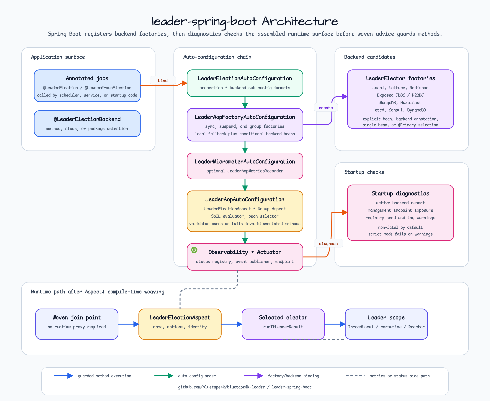
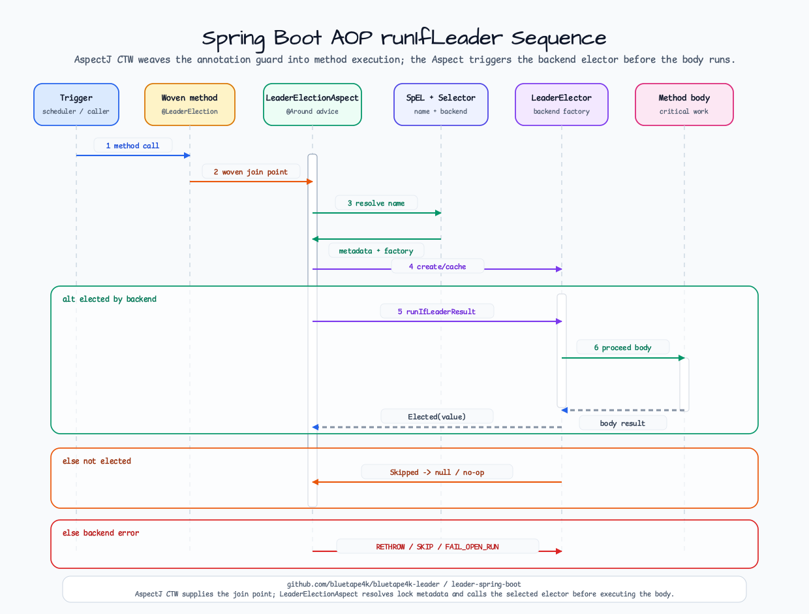
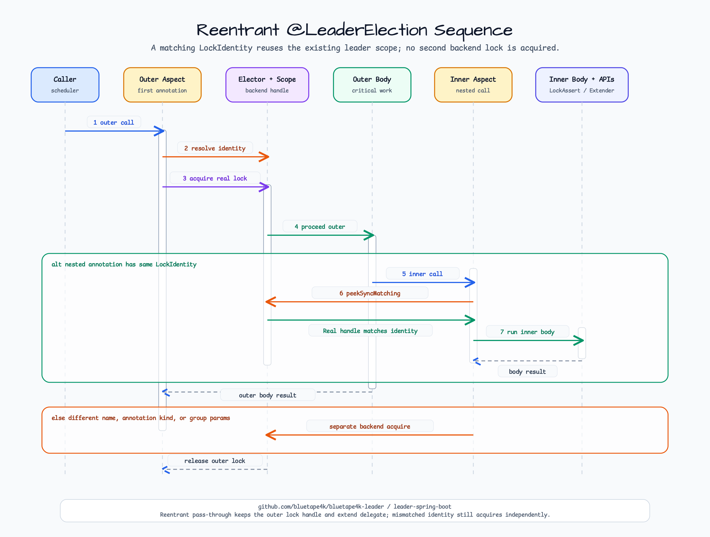

# leader-spring-boot

[English](README.md) | 한국어

bluetape4k 리더 선출을 위한 Spring Boot 4 자동 구성과 AspectJ CTW 기반 어노테이션 지원 모듈입니다.

---

## 개요

`leader-spring-boot`는 Spring 애플리케이션에 bluetape4k leader backend를 연결하고 어노테이션 기반 실행 가드를 제공합니다.

- `@LeaderElection`: 단일 분산 리더 실행
- `@LeaderGroupElection`: 슬롯 기반 복수 리더 실행
- `@LeaderElectionBackend`: 메서드, 클래스, 패키지 단위 backend 선택
- Local, Lettuce, Redisson, Exposed JDBC/R2DBC, MongoDB, Hazelcast, Micrometer 자동 구성

AOP 계층은 Freefair post-compile weaving을 통한 AspectJ compile-time weaving을 전제로 합니다. Spring runtime proxy AOP에 의존하지 않습니다.

## 아키텍처



## 의존성

```kotlin
implementation("io.github.bluetape4k.leader:bluetape4k-leader-spring-boot:0.4.0")

// backend 모듈을 하나 이상 추가합니다.
implementation("io.github.bluetape4k.leader:bluetape4k-leader-redis-redisson:0.4.0")

// 선택: Micrometer/Actuator 연동.
implementation("io.github.bluetape4k.leader:bluetape4k-leader-micrometer:0.4.0")
implementation("org.springframework.boot:spring-boot-starter-actuator")

// 선택: trace export는 애플리케이션이 선택합니다.
// implementation("io.micrometer:micrometer-tracing-bridge-otel")
// implementation("io.opentelemetry:opentelemetry-exporter-otlp")
```

어노테이션이 붙은 애플리케이션 메서드를 weaving하려면 소비 애플리케이션에 AspectJ compile-time weaving을 활성화합니다.

```kotlin
plugins {
    id("io.freefair.aspectj.post-compile-weaving") version "9.5.0"
}
```

## 설정

```yaml
bluetape4k:
  leader:
    wait-time: 5s
    lease-time: 60s
    group:
      max-leaders: 3
      wait-time: 5s
      lease-time: 60s
    aop:
      enabled: true
      strict: false
      failure-mode: RETHROW
      default-wait-time: 5s
      default-lease-time: 60s
      lock-name-prefix: "${spring.application.name:}:"
      metrics:
        enabled: true
        tags:
          lock-name:
            mode: REDACT
            redacted-value: redacted-lock
          leader-id:
            mode: REDACT
            redacted-value: redacted-leader
          backend-name:
            mode: RAW
      spel:
        allow-method-invocation: false
    diagnostics:
      enabled: true
      strict: false
      include-bean-names: true
    route-guard:
      enabled: false
      authority-mode: STATE
      elector-bean: ""
      rejection-status: SERVICE_UNAVAILABLE
    observability:
      enabled: true
      lock-names:
        - daily-settlement
      health:
        enabled: true
        lease-warning-threshold: 10s
      tracing:
        enabled: true
        include-lock-name: false
        include-leader-id: false
        include-exception-details: false
```

Spring 설정 속성은 Spring Boot duration binding을 사용하므로 `5s`, `60s`, `PT1M`을 그대로 쓸 수 있습니다. Kotlin 코드의 core `LeaderElectionOptions`, `LeaderGroupElectionOptions`는 `kotlin.time.Duration`을 사용합니다.

## 리더 전용 Route (0.5.0)

Route guard는 opt-in read-only 기능입니다. 선택한 Spring MVC 또는 WebFlux route를 현재 애플리케이션이 처리해도 되는지 판단할 뿐, request path에서 lease를 획득·연장·해제하지 않습니다. `bluetape4k.leader.route-guard.enabled=true`를 명시하지 않으면 어떤 guard bean도 활성화되지 않습니다.

기본 `STATE` authority는 `LeaderElector.state(slot.lockName)`을 한 번 조회하고, 점유 중인 기준 상태의 audit leader ID가 `slot.leaderId`와 같을 때만 request를 허용합니다. Leader ID는 실행 중인 프로세스 incarnation마다 한 번 생성하고, 해당 프로세스의 선출과 route guard에서 동일한 `LeaderSlot`을 재사용하세요. 재시작을 거쳐 고정 node ID를 재사용하면 새 프로세스가 이전 프로세스의 stale lease와 일치할 수 있습니다.

```kotlin
@Bean
fun ordersSlot(): LeaderSlot =
    LeaderSlot("orders-route", "orders-node-${UUID.randomUUID()}")

fun runOrdersLeader(elector: LeaderElector, slot: LeaderSlot) =
    elector.runIfLeader(slot) {
        runLeaderWork()
    }
```

애플리케이션에 `LeaderElector` bean이 여러 개라면 built-in authority를 켜면서 사용할 elector를 명시합니다.

```yaml
bluetape4k:
  leader:
    route-guard:
      enabled: true
      authority-mode: STATE
      elector-bean: ordersLeaderElector
      rejection-status: SERVICE_UNAVAILABLE
```

생성된 MVC interceptor는 보호할 path에만 등록합니다.

```kotlin
@Configuration
class OrdersMvcRoutes(
    private val guards: LeaderMvcRouteGuardFactory,
    private val ordersSlot: LeaderSlot,
) : WebMvcConfigurer {
    override fun addInterceptors(registry: InterceptorRegistry) {
        registry.addInterceptor(guards.interceptor(ordersSlot))
            .addPathPatterns("/internal/orders/**")
    }
}
```

선택한 elector가 `supportsAuditLeaderState=true`를 선언해야 `STATE` mode가 시작됩니다. Built-in Local, Consul, DynamoDB, Kubernetes Lease elector는 audit identity 기준 데이터를 지원하며 listening, tenant-scoped, Micrometer decorator도 이 capability를 보존합니다. Lettuce와 Redisson처럼 빈 `state()` fallback을 상속하는 elector는 `LEADER_ROUTE_ELECTOR_STATE_UNSUPPORTED`로 startup이 실패합니다. 그런 backend에서는 애플리케이션이 신뢰할 수 있는 다른 ownership source를 제공하는 명시적 `CUSTOM` mode를 사용하세요.

WebFlux에서는 애플리케이션의 route/path 선택 안에서만 생성된 filter를 적용합니다. `WebFilter` bean은 전역으로 동작하므로 일부 route만 보호하려면 반환된 filter를 제한 없이 bean으로 등록하면 안 됩니다.

```kotlin
@Bean
fun ordersRouteGuard(
    guards: LeaderWebFluxRouteGuardFactory,
    ordersSlot: LeaderSlot,
): WebFilter {
    val guarded = guards.filter(ordersSlot)
    val path = PathPatternParser().parse("/internal/orders/**")
    return WebFilter { exchange, chain ->
        if (path.matches(exchange.request.path.pathWithinApplication())) {
            guarded.filter(exchange, chain)
        } else {
            chain.filter(exchange)
        }
    }
}
```

다른 authority source가 필요하면 `CUSTOM`을 선택하고 `LeaderRouteAuthority` bean을 정확히 하나 제공합니다.

```yaml
bluetape4k:
  leader:
    route-guard:
      enabled: true
      authority-mode: CUSTOM
      rejection-status: LOCKED
```

```kotlin
@Bean
fun controlPlaneAuthority(controlPlane: ControlPlane): LeaderRouteAuthority =
    LeaderRouteAuthority { slot ->
        if (controlPlane.isLocalLeader(slot)) {
            LeaderRouteDecision.Allowed
        } else {
            LeaderRouteDecision.NotLeader
        }
    }
```

`STATE`와 `CUSTOM`은 완전히 분리된 mode입니다. `STATE`는 애플리케이션이 제공한 모든 `LeaderRouteAuthority`를 거부합니다. `CUSTOM`은 해당 bean을 정확히 하나 요구하며 `elector-bean` 설정을 허용하지 않습니다. Elector가 없거나 여러 개이거나 타입/capability가 맞지 않는 경우와 authority 조합이 잘못된 경우에는 `LEADER_ROUTE_AUTHORITY_MIXED`, `LEADER_ROUTE_AUTHORITY_MISSING`, `LEADER_ROUTE_AUTHORITY_AMBIGUOUS`, `LEADER_ROUTE_ELECTOR_MISSING`, `LEADER_ROUTE_ELECTOR_AMBIGUOUS`, `LEADER_ROUTE_ELECTOR_STATE_UNSUPPORTED` 중 해당하는 안정적 error code로 startup이 실패합니다.

Custom authority는 실행 시간이 제한적이고 side effect가 없어야 하며 lease를 획득·연장·해제해서는 안 됩니다. 일반 authority/state 오류는 fail-closed로 처리합니다. 허용하는 rejection status는 `NOT_FOUND`(404), `CONFLICT`(409), `LOCKED`(423), `SERVICE_UNAVAILABLE`(503, 기본값)입니다. 거부 응답의 body는 비어 있으며 leader identity, lock name, backend 오류, host, `Location` header를 노출하지 않습니다.

Built-in state 판단은 best-effort 기준 상태이며 HTTP request 전체에서 leadership이 유지된다는 원자적 보장이 아닙니다. 짧은 stale-state window를 허용할 수 있는 route에만 사용하세요. 작업 자체를 lease로 보호해야 한다면 `@LeaderElection` 또는 명시적인 lease-owned 실행 경로를 사용해야 합니다.

## Leader Readiness (0.5.0)

opt-in `leaderElectionReadiness` contributor는 설정했거나 현재 JVM에서 관찰한 lock name만 검사합니다. 알려진 이름마다 read-only `LeaderElector.state(...)`를 한 번 호출하며 backend lock을 열거하거나 선출 상태를 변경하지 않습니다.

```yaml
bluetape4k:
  leader:
    observability:
      lock-names: [daily-settlement]
      health:
        enabled: true
        lease-warning-threshold: 10s

management:
  endpoint:
    health:
      group:
        readiness:
          include: readinessState,leaderElectionReadiness
```

상태 조회가 모두 성공하고 만료 임박 lease가 없으면 `UP`, 점유 중인 lease가 threshold 안에 만료되면 `OUT_OF_SERVICE`, 알려진 lock 상태 조회가 실패하면 `DOWN`입니다. 만료 시각을 알 수 없는 lease는 detail에 표시하지만 애플리케이션을 unready로 만들지는 않습니다. 이 결과는 JVM-local best-effort 진단 정보이며 소유권 판단에 사용하면 안 됩니다.

health 평가마다 JVM-local registry의 lock 이름별로 backend 상태를 한 번씩 조회하므로 비용은 등록된 lock 수와 backend 지연 시간에 비례합니다. 작고 고정된 lock 집합에서만 활성화하고, 동적 이름이 무제한으로 늘어나는 애플리케이션에서는 비활성 상태를 유지하세요. health detail에는 원본 lock 이름이 포함될 수 있으므로 Actuator 접근을 보호하고 공개 정책에 맞게 `management.endpoint.health.show-details`를 설정해야 합니다.

### 최근 획득 실패 관찰

readiness contributor는 최근 AOP 획득 실패의 best-effort aggregate도 제공합니다. 관찰 window는 양의 유한 duration이어야 하며 기본값은 `5m`입니다. window에는 timestamp를 최대 `1024`개까지 보관합니다.

```yaml
bluetape4k:
  leader:
    observability:
      health:
        acquisition-failure-window: 5m
```

`LeaderAopMetricsRecorder.onLockNotAcquired(..., SkipReason.BACKEND_ERROR)`만 이 aggregate에 기록됩니다. 정상적인 `CONTENTION` skip과 `FAIL_OPEN_FORCED` skip은 제외합니다. `recentAcquisitionFailures`는 현재 window에 남아 있는 횟수이며, 고정 capacity를 넘으면 `acquisitionFailureWindowOverflowed=true`가 되어 count가 하한값임을 나타냅니다. window가 지나면 `lastAcquisitionFailureAt`은 `null`이 됩니다. detail에는 lock name이나 exception message를 보관하지 않습니다.

최근 실패만으로 readiness는 `UP`, `OUT_OF_SERVICE`, `DOWN`, `UNKNOWN` 사이에서 바뀌지 않습니다. 이 window는 readiness 판단이 아니라 관찰을 위한 보조 신호입니다. Actuator endpoint를 보호하고, readiness contributor가 등록된 이름마다 backend를 한 번씩 조회한다는 점을 고려해 동적 lock-name registry도 작고 bounded하게 유지하세요.

## Startup Diagnostics

`LeaderStartupDiagnosticsAutoConfiguration`은 backend, observability, Actuator 자동 구성이 끝난 뒤 실행됩니다. 시작 시점에 선택된 backend 후보, `LeaderElector` bean 개수, `leaderElection` endpoint 활성화 여부, web exposure 상태, 위험 조합 warning을 report로 남깁니다.

Diagnostics는 기본적으로 startup을 실패시키지 않습니다. warning이 있을 때 애플리케이션을 실패시키려면 `bluetape4k.leader.diagnostics.strict=true`를 설정하세요. 이 값은 `bluetape4k.leader.aop.strict`와 별개입니다. AOP strict mode는 어노테이션이 붙은 메서드를 검증하고, diagnostics strict mode는 조립된 Spring context와 management/cardinality 설정을 검증합니다.

| Warning | 의미 | 일반적인 조치 |
|---|---|---|
| `MULTIPLE_NON_LOCAL_BACKENDS` | non-local `LeaderElector`가 둘 이상 활성화됨 | `@LeaderElection(bean = "...")`, `@LeaderElectionBackend`, `@Primary`로 사용할 bean 지정 |
| `MANAGEMENT_ENDPOINT_NOT_EXPOSED` | `management.endpoint.leaderElection.enabled=true`지만 web exposure에 `leaderElection` 또는 `*`가 없음 | `management.endpoints.web.exposure.include`에 `leaderElection` 추가 |
| `MANAGEMENT_REGISTRY_NOT_SEEDED` | endpoint는 켜졌지만 `bluetape4k.leader.observability.lock-names`가 비어 있어 runtime event 전 초기 report가 비어 보일 수 있음 | scheduled job의 정적 lock name을 seed하거나 runtime discovery를 의도적으로 허용 |
| `RAW_LOCK_NAME_TAGS` | raw `lock.name` metric tag가 allow-list 없이 활성화됨 | 기본 `REDACT` 유지, 또는 작은 allow-list, `HASH`, `TRUNCATE` 사용 |
| `RAW_LEADER_ID_TAGS` | opt-in raw `leader.id` Observation tag가 allow-list 없이 emit될 수 있음 | leader ID tag 비활성화 또는 tag policy로 bounded 처리 |

현재 `leaderElection` Actuator endpoint는 read-only 상태 조회만 제공합니다. 따라서 diagnostics는 파괴적인 management action이 아니라 endpoint 노출 여부와 tag cardinality 위험을 확인합니다.

## Metrics와 Observation Tracing

`leader-micrometer`와 `MeterRegistry` bean이 있으면 `LeaderMicrometerAutoConfiguration`이 `MicrometerLeaderAopMetricsRecorder`를 등록합니다. `leader-micrometer`와 `ObservationRegistry` bean이 있으면 `LeaderObservationAutoConfiguration`이 `MicrometerObservationLeaderAopMetricsRecorder`, `MicrometerObservationLeaderElectionListener`를 등록합니다.


Metrics와 Observation은 별도 스위치를 가집니다.

- `bluetape4k.leader.aop.metrics.enabled=false`: 기존 meter recorder만 끕니다.
- `bluetape4k.leader.observability.tracing.enabled=false`: Observation bridge만 끕니다.
- `bluetape4k.leader.observability.enabled=false`: leader observability 지원 bean과 tracing bridge를 함께 끕니다.

| Property | 기본값 | 제어 대상 |
|---|---:|---|
| `bluetape4k.leader.aop.metrics.enabled` | `true` | 기존 Micrometer meter recorder |
| `bluetape4k.leader.aop.metrics.tags.lock-name.mode` | `REDACT` | meter `lock.name` tag export 정책 |
| `bluetape4k.leader.aop.metrics.tags.lock-name.redacted-value` | `redacted-lock` | redaction된 lock name sentinel |
| `bluetape4k.leader.aop.metrics.tags.leader-id.mode` | `REDACT` | opt-in Observation `leader.id` 값 export 정책 |
| `bluetape4k.leader.aop.metrics.tags.backend-name.mode` | `RAW` | custom 또는 future meter path가 `backend.name`을 emit할 때 cardinality가 제한된 backend label export 정책; 현재 built-in meter는 emit하지 않음 |
| `bluetape4k.leader.observability.enabled` | `true` | leader observability와 tracing의 parent switch |
| `bluetape4k.leader.observability.health.acquisition-failure-window` | `5m` | AOP backend 획득 실패 aggregate의 bounded window |
| `bluetape4k.leader.observability.tracing.enabled` | `true` | Observation recorder/listener |
| `bluetape4k.leader.observability.tracing.include-lock-name` | `false` | tag 정책을 거친 opt-in `lock.name` high-cardinality Observation data |
| `bluetape4k.leader.observability.tracing.include-leader-id` | `false` | identified context가 있을 때 tag 정책을 거친 opt-in `leader.id` high-cardinality Observation data |
| `bluetape4k.leader.observability.tracing.include-exception-details` | `false` | `Observation.error(...)`를 통한 raw throwable detail |

Observation bridge는 `leader.aop.acquire`, `leader.aop.execution`, `leader.election.event` 같은 짧은 terminal observation을 남깁니다. 보호된 메서드 본문 전체를 새 current `Observation.Scope`으로 감싸지는 않습니다.

#529는 Micrometer Observation만 발생시킵니다. exported trace가 필요하면 애플리케이션이 Micrometer tracing bridge, exporter, collector, OpenTelemetry SDK를 직접 추가하고 설정해야 합니다.

동적 lock name, leader ID, exception detail은 운영 환경에서 민감할 수 있습니다. tenant, user, job, URL, credential과 비슷한 값이 들어갈 수 있습니다. 메트릭은 기본적으로 `lock.name`을 redaction합니다. 작고 정적인 job set에만 `RAW`를 사용하고, dashboard에서 제한된 상관관계가 필요하면 `bluetape4k.leader.aop.metrics.tags.*` 아래에서 `HASH` 또는 `TRUNCATE`를 사용하세요. 현재 Spring AOP는 node ID나 lock name으로 `leader.id`를 합성하지 않습니다. `include-leader-id=true`는 direct 호출 또는 future identity-aware 경로에서 `LeaderAopMetricsContext.Identified`가 전달될 때만 값을 내보냅니다.

Lease-extension observation은 issue #559로 미뤘습니다. Spring이나 Micrometer가 extension outcome을 관찰하려면 `LockExtender`에 core hook이 먼저 필요합니다.

## Backend Factory

`LeaderAopFactoryAutoConfiguration`은 backend client bean이 있을 때 해당 factory bean을 등록합니다.

| Backend | 필요한 bean | Factory bean 예 |
|---------|-------------|-----------------|
| Local | 없음 | `localLeaderElectionFactory`, `localSuspendLeaderElectorFactory` |
| Lettuce | `StatefulRedisConnection<String, String>` | `lettuceLeaderElectionFactory`, `lettuceSuspendLeaderElectorFactory` |
| Redisson | `RedissonClient` | `redissonLeaderElectionFactory`, `redissonSuspendLeaderElectorFactory` |
| Exposed JDBC | `Database` | `exposedJdbcLeaderElectionFactory` |
| Exposed R2DBC | `R2dbcDatabase` | `exposedR2dbcSuspendLeaderElectorFactory` |
| MongoDB | `MongoClient` | `mongoLeaderElectionFactory`, `mongoSuspendLeaderElectorFactory` |
| Hazelcast | `HazelcastInstance` | `hazelcastLeaderElectionFactory` |

여러 backend가 동시에 있으면 어노테이션의 `bean = "..."`으로 사용할 factory를 명시합니다.

## 어노테이션 사용

```kotlin
@Service
class SettlementJobs {
    @LeaderScheduled(
        name = "daily-settlement",
        cron = "\${jobs.settlement.cron:0 0 2 * * *}",
        leaseTime = "30m",
        minLeaseTime = "10s",
    )
    fun settleDaily(): SettlementReport? =
        settlementService.settle()

    @LeaderGroupElection(name = "'region-sync-' + #region", maxLeaders = 3)
    fun syncRegion(region: String) {
        syncService.sync(region)
    }
}
```

`@LeaderScheduled`는 Spring `@Scheduled`와 `@LeaderElection`을 합성합니다. Spring이 scheduling과 scheduled-task observation을 계속 담당하고, 기존 leader aspect가 lock 획득과 경합 시 skip을 담당합니다. Spring scheduling을 활성화해야 하며, 일반 `@Scheduled`의 메서드 시그니처와 trigger 하나만 지정하는 규칙도 그대로 적용됩니다. 사용자 정의 합성 어노테이션이 필요하거나 두 관심사를 코드에서 분명히 나누고 싶다면 `@Scheduled`와 `@LeaderElection`을 따로 사용해도 됩니다.

### 기존 scheduled method를 위한 YAML-only policy

기존 scheduled method를 수정하기 어렵다면 opt-in property policy를 켜고,
정확한 Spring bean name과 method name으로 대상을 선택합니다.

```yaml
bluetape4k:
  leader:
    scheduling:
      enabled: true
      policies:
        - selector: "orderJob#reconcile"
          name: "orders:reconcile"
          wait-time: 0s
          lease-time: 30s
          min-lease-time: 5s
          bean: "redisLeaderElectionFactory"
          auto-extend: false
          stream-bounded: false
          failure-mode: SKIP
```

기본값은 `enabled: false`입니다. selector는 정확한
`beanName#methodName`만 허용하며 wildcard, 정규식, 공백, overloaded method
이름은 startup에서 거부합니다. 안정적인 Spring bean name을 명시하고,
backend가 여러 개라면 `bean` factory name도 지정하세요. blank 또는 매칭되지
않는 selector, 잘못된 duration이나 SpEL 표현식, 해석할 수 없는 backend,
잘못된 stream policy는 scheduled task 실행 전에 startup을 실패시킵니다.

우선순위는 명시적 annotation(`@LeaderElection` 또는 `@LeaderScheduled`),
matching property policy, leader metadata 없음 순서입니다. metadata가 없으면
기존 `@Scheduled` method가 변경 없이 실행됩니다. `failure-mode: SKIP`은 기존
경합 동작을 유지하므로 scheduled body를 호출하지 않고 contention exception도
던지지 않습니다. `Flux`와 Kotlin `Flow` method는 계속해서
`auto-extend: true` 또는 `stream-bounded: true`가 필요합니다.

scheduled task, trigger, subscription, context close, task `Observation`
lifecycle은 계속 Spring이 소유하며 policy registry는 metadata만 보관합니다.
policy는 startup 시점에만 읽습니다. dynamic reload와 wildcard matching은
지원하지 않습니다. 롤백하려면 `bluetape4k.leader.scheduling.enabled=false`로
설정하세요. 일반 Spring scheduler 경로는 그대로 유지됩니다.

### 시퀀스 — AOP가 트리거하는 `runIfLeader`



지원 반환 형태:

| 형태 | 동작 |
|------|------|
| `T?` / `Unit` | 리더에서 본문 실행 후 결과 반환, 미선출 시 `null` / no-op |
| `suspend fun` | `SuspendLeaderElectorFactory` 사용, `LeaderElectionInfo`를 `CoroutineContext`로 전파 |
| `Mono<T>` | Reactor context로 `LeaderElectionInfo` 전파 |
| `Flux<T>` / `Flow<T>` | 장기 stream은 lease renewal이 필요하므로 issue #74에서 별도 추적 |

## SpEL Lock Name

`name`은 정적 이름, Spring placeholder, plain SpEL, template SpEL을 지원합니다.

```kotlin
@LeaderElection(name = "daily-report")
fun dailyReport() = report()

@LeaderElection(name = "'tenant-' + #tenantId + '-invoice'")
fun invoice(tenantId: String) = invoiceService.run(tenantId)

@LeaderElection(name = "job-#{#region}-${spring.application.name}")
fun regionalJob(region: String) = jobService.run(region)
```

SpEL 메서드 호출은 기본 비활성화입니다. 신뢰 가능한 표현식에만 명시적으로 켭니다.

```yaml
bluetape4k.leader.aop.spel.allow-method-invocation: true
```

## 메타 어노테이션

`@LeaderElection`, `@LeaderGroupElection`은 Spring `@AliasFor` 기반 합성 어노테이션으로 사용할 수 있습니다.

```kotlin
@Target(AnnotationTarget.FUNCTION)
@Retention(AnnotationRetention.RUNTIME)
@LeaderElection(name = "", leaseTime = "5m")
annotation class DailyLeaderJob(
    @get:AliasFor(annotation = LeaderElection::class, attribute = "name")
    val name: String,
)
```

Backend 선택도 메서드, 클래스, 패키지 레벨로 올릴 수 있습니다.

```kotlin
@LeaderElectionBackend("redissonLeaderElectionFactory")
class RedisBackedJobs {
    @LeaderElection(name = "daily-report")
    fun report() = reportService.run()
}
```

## Failure Mode

| Mode | 동작 |
|------|------|
| `RETHROW` | backend 실패를 `LeaderElectionException` / `LeaderGroupElectionException`으로 감싸 전파 |
| `SKIP` | backend 실패 또는 경쟁 상황을 skip으로 처리 |
| `FAIL_OPEN_RUN` | backend 장애 또는 락 미획득 시 락 없이 본문 실행 |
| `INHERIT` | 어노테이션 sentinel. `bluetape4k.leader.aop.failure-mode` 사용 |

`FAIL_OPEN_RUN`은 여러 노드가 동시에 본문을 실행할 수 있으므로 멱등 작업에만 사용해야 합니다.

## LockAssert & LockExtender (ShedLock-등가 — issue #79)

`leader-core` 가 ShedLock 스타일의 ergonomic API 를 제공합니다. `@LeaderElection` / `@LeaderGroupElection` 본문 안에서 호출 가능:

```kotlin
@Service
class ReportJobs {
    @LeaderElection(name = "daily-report", leaseTime = "30m", minLeaseTime = "10s")
    fun runReport(): Report? {
        LockAssert.assertLocked()    // 활성 leader scope 가 아니면 IllegalStateException
        // ... 작업 ...
        if (needsExtraTime) {
            LockExtender.extendActiveLock(60.seconds)    // 성공 시 true
        }
        return reportService.generate()
    }
}
```

### Lock identity

동일 thread/coroutine 안에서 동일 `name` 으로 nested 호출하면 **`LockIdentity` (lockName + 어노테이션 종류 + group params)** 로 reentrant 판정 — backend acquire 정확히 1회. `factoryBeanName` 은 equality 에서 제외 — sync ↔ suspend 중첩 호출도 정확히 reentrant 처리 (Step 3-P R3).

### Suspend / Mono

`suspend` / `Mono` 본문에서는 lock handle 이 `CoroutineContext` 로 전파됩니다 (`ThreadLocal` fallback 없음). suspend 변형 사용:

```kotlin
@LeaderElection(name = "stream-job")
suspend fun stream(): Result? {
    LockAssert.assertLockedSuspend()
    LockExtender.extendActiveLockSuspend(2.minutes)
    return streamService.process()
}
```

⚠️ **Reactor non-suspend operator (`.map`, `.filter`) 는 미지원.** `.flatMap { mono { ... } }` 안에서 `LockAssert.assertLockedSuspend()` 호출 권장:

```kotlin
@LeaderElection(name = "mono-job")
fun process(): Mono<String> =
    sourceMono
        .flatMap { value ->
            mono {
                LockAssert.assertLockedSuspend()    // ✅
                transform(value)
            }
        }
```

### 시퀀스 — reentrant `@LeaderElection`



### Watchdog × LockExtender

둘 다 **동일 `ExtendDelegate` reference** 공유 (token-guarded backend operation 으로 atomicity 보장). `LockExtender.extendActiveLock(d)` 호출 시 delegate 가 `lastExtendDeadline = now + d` 갱신 — 다음 watchdog tick 이 user 가 지정한 deadline 이 더 크면 backend 재extend 를 skip. 엄격한 deadline (ShedLock 동등) 이 필요하면 watchdog OFF.

### 반환값

| API | scope 밖 | `Real` 안 | `FailOpen` sentinel |
|---|---|---|---|
| `LockAssert.assertLocked()` | `IllegalStateException` | passes | throws |
| `LockAssert.isLocked()` | `false` | `true` | `false` |
| `LockExtender.extendActiveLock(d)` | `false` + WARN | backend 결과 | `false` + WARN |
| `LockExtender.extendActiveLockDetailed(d)` | `NotHeld` | `Extended` / `NotHeld` / `WrongThread` / `BackendError` | `NotHeld` |

Java caller 는 `@JvmStatic` overload — `kotlin.time.Duration` 과 `java.time.Duration` 모두 지원.

## 자동 구성 순서

1. `LeaderElectionAutoConfiguration`: 공통 backend 속성 바인딩
2. `LeaderAopFactoryAutoConfiguration`: backend factory 등록
3. `LeaderMicrometerAutoConfiguration`: `MeterRegistry`가 있으면 `MicrometerLeaderAopMetricsRecorder` 등록
4. `LeaderObservationAutoConfiguration`: `ObservationRegistry`가 있으면 Observation recorder/listener 등록
5. `LeaderAcquisitionFailureWindowAutoConfiguration`: AOP 실행 전에 bounded backend-failure recorder 등록
6. `LeaderAopAutoConfiguration`: Aspect, SpEL evaluator, lock-name validator, annotation validator 등록
7. `LeaderMicrometerHealthAutoConfiguration`: Actuator가 있으면 health indicator 등록
8. `LeaderElectionObservabilityAutoConfiguration`: lock-name 상태 registry와 fallback event-publisher adapter 등록
9. `LeaderElectionActuatorAutoConfiguration`: opt-in `/actuator/leaderElection` endpoint 등록
10. `LeaderBackendDiagnosticsActuatorAutoConfiguration`: opt-in 정적 `/actuator/leaderBackendDiagnostics` endpoint 등록
11. `LeaderBackendHealthAutoConfiguration`: opt-in backend 연결 상태 health indicator 등록
12. `LeaderStartupDiagnosticsAutoConfiguration`: runtime surface가 준비된 뒤 backend, management, cardinality diagnostics 기록

## Leader Election Actuator Endpoint

`leaderElection` endpoint는 기본 비활성입니다. endpoint 활성화와 HTTP 노출을 명시적으로 설정하세요:

```yaml
bluetape4k:
  leader:
    observability:
      lock-names:
        - batch-job
        - migration-gate

management:
  endpoint:
    leaderElection:
      enabled: true
  endpoints:
    web:
      exposure:
        include: health,leaderElection
```

```http
GET /actuator/leaderElection
```

```json
{
  "locks": [
    {
      "name": "batch-job",
      "status": "Occupied",
      "leaderId": "node-1",
      "leaseExpiry": "2026-05-16T00:00:00Z"
    }
  ],
  "acquisitionFailures": {
    "count": 0,
    "lastFailureAt": null,
    "window": "PT5M",
    "capacity": 1024,
    "overflowed": false
  }
}
```

`lock-names`는 첫 runtime event 전에 JVM-local status registry를 seed합니다. Listener-aware elector는 lifecycle event를 관찰하면서 lock 이름을 추가할 수도 있습니다. Fallback `LeaderElectionEventPublisher`는 publisher-only adapter라 `LeaderElector` 후보가 되지 않으므로 기존 elector 주입 경로가 유지됩니다.

`acquisitionFailures`는 readiness와 동일한 bounded aggregate입니다. timestamp와 count만 포함하므로 lock name이나 backend exception message를 노출하지 않습니다. read-only endpoint이지만 운영 실패량을 보여 줄 수 있으므로 신뢰할 수 있는 Actuator client에만 노출하세요.

## Backend 진단과 연결 상태 Health

정적 backend diagnostics endpoint는 기본 비활성입니다. 네트워크나 데이터베이스 I/O 없이 선택된 backend descriptor를 반환하므로 연결 상태는 `NOT_CHECKED`입니다.

```yaml
management:
  endpoint:
    leaderBackendDiagnostics:
      enabled: true
  endpoints:
    web:
      exposure:
        include: health,leaderElection,leaderBackendDiagnostics
```

```http
GET /actuator/leaderBackendDiagnostics
```

배포 환경에서 실제 backend probe가 필요한 경우에만 별도의 연결 상태 health indicator를 활성화하세요:

```yaml
bluetape4k:
  leader:
    observability:
      backend-health:
        enabled: true
        timeout: 500ms
```

`UP`과 `DOWN`은 같은 이름의 Spring health status로 매핑됩니다. `UNKNOWN`과 `NOT_CHECKED`는 Spring `UNKNOWN`으로 매핑됩니다. 두 surface는 `bluetape4k.leader.observability.state-provider-bean`과 같은 elector 선택 규칙을 사용합니다. 선택된 elector가 `LeaderBackendDiagnosticsProvider`를 노출하지 않으면 typed endpoint와 health indicator를 등록하지 않습니다.

다른 management endpoint와 동일하게 인증과 network policy로 보호하세요. Backend가 정상이라는 결과는 probe 시점의 연결 가능성만 의미하며, 현재 프로세스가 leader lease를 보유한다는 증거가 아닙니다.

## 마이그레이션 노트

- Core option 생성자는 `kotlin.time.Duration`을 사용합니다: `LeaderElectionOptions(waitTime = 5.seconds, leaseTime = 60.seconds)`.
- Spring property class는 Spring Boot duration binding을 유지하므로 YAML의 `5s`, `60s`, `PT1M`은 계속 유효합니다.
- Bean 이름은 `LeaderElector` 용어를 사용합니다. `redissonLeaderElectionFactory`, `localSuspendLeaderElectorFactory` 같은 이름을 사용하고, 과거 `LeaderElection` 기반 bean 이름은 피하세요.

## 테스트

자동 구성 테스트는 `ApplicationContextRunner`를 사용하고, 인프라 backend 테스트는 `bluetape4k-testcontainers`의 singleton server를 사용합니다. 이 모듈은 AspectJ CTW와 Spring Boot 통합 특성 때문에 targeted integration test 중심으로 검증합니다.
