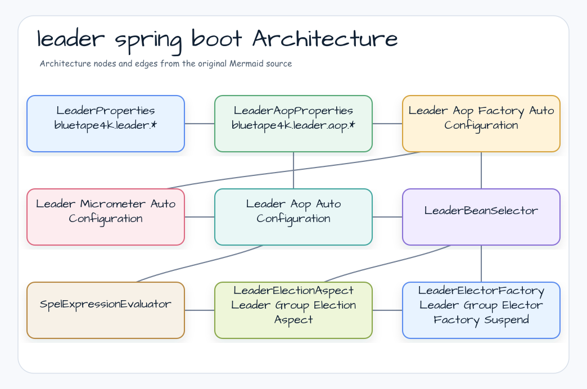
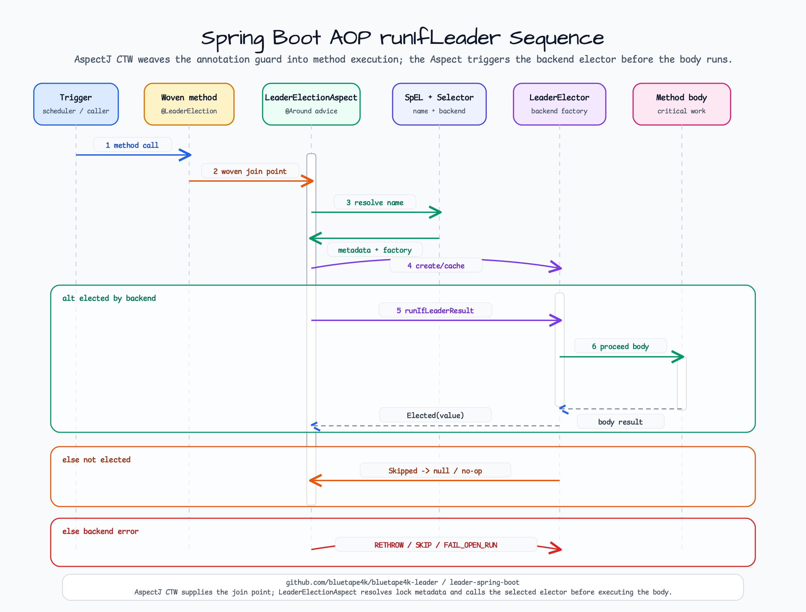
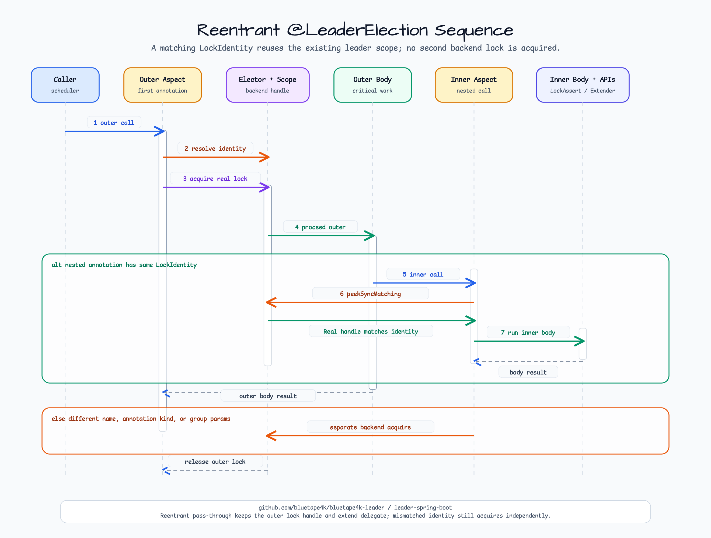

# leader-spring-boot

English | [한국어](README.ko.md)

Spring Boot 4 auto-configuration and AspectJ CTW support for bluetape4k leader election.

---

## Overview

`leader-spring-boot` wires bluetape4k leader backends into Spring applications and provides annotation-based execution guards:

- `@LeaderElection` for a single distributed leader
- `@LeaderGroupElection` for slot-based multi-leader execution
- `@LeaderElectionBackend` for backend selection at method, class, or package level
- Spring Boot auto-configuration for local, Lettuce, Redisson, Exposed JDBC/R2DBC, MongoDB, Hazelcast, and Micrometer integration

The AOP layer is built for AspectJ compile-time weaving via Freefair post-compile weaving. It does not rely on Spring runtime proxy AOP.

## Architecture



## Dependency

```kotlin
implementation("io.github.bluetape4k.leader:bluetape4k-leader-spring-boot:0.3.0")

// Add at least one backend module.
implementation("io.github.bluetape4k.leader:bluetape4k-leader-redis-redisson:0.3.0")

// Optional metrics.
implementation("io.github.bluetape4k.leader:bluetape4k-leader-micrometer:0.3.0")
implementation("org.springframework.boot:spring-boot-starter-actuator")
```

For annotated application methods, enable AspectJ compile-time weaving in the consuming application:

```kotlin
plugins {
    id("io.freefair.aspectj.post-compile-weaving") version "9.5.0"
}
```

## Configuration

```yaml
bluetape4k:
  leader:
    wait-time: 5s
    lease-time: 60s
    group:
      max-leaders: 3
      wait-time: 5s
      lease-time: 60s
    aop:
      enabled: true
      strict: false
      failure-mode: RETHROW
      default-wait-time: 5s
      default-lease-time: 60s
      lock-name-prefix: "${spring.application.name:}:"
      metrics:
        enabled: true
      spel:
        allow-method-invocation: false
```

Spring configuration properties use Spring Boot duration binding (`5s`, `60s`, `PT1M`). Core `LeaderElectionOptions` and `LeaderGroupElectionOptions` use `kotlin.time.Duration` in Kotlin code.

## Backend Factories

`LeaderAopFactoryAutoConfiguration` registers factory beans when the matching backend client is present.

| Backend | Required bean | Factory bean examples |
|---------|---------------|-----------------------|
| Local | none | `localLeaderElectionFactory`, `localSuspendLeaderElectorFactory` |
| Lettuce | `StatefulRedisConnection<String, String>` | `lettuceLeaderElectionFactory`, `lettuceSuspendLeaderElectorFactory` |
| Redisson | `RedissonClient` | `redissonLeaderElectionFactory`, `redissonSuspendLeaderElectorFactory` |
| Exposed JDBC | `Database` | `exposedJdbcLeaderElectionFactory` |
| Exposed R2DBC | `R2dbcDatabase` | `exposedR2dbcSuspendLeaderElectorFactory` |
| MongoDB | `MongoClient` | `mongoLeaderElectionFactory`, `mongoSuspendLeaderElectorFactory` |
| Hazelcast | `HazelcastInstance` | `hazelcastLeaderElectionFactory` |

Use `bean = "..."` on the annotation when more than one backend is available.

## Annotation Usage

```kotlin
@Service
class SettlementJobs {
    @Scheduled(cron = "0 0 2 * * *")
    @LeaderElection(name = "daily-settlement", leaseTime = "30m", minLeaseTime = "10s")
    fun settleDaily(): SettlementReport? =
        settlementService.settle()

    @LeaderGroupElection(name = "'region-sync-' + #region", maxLeaders = 3)
    fun syncRegion(region: String) {
        syncService.sync(region)
    }
}
```

### Sequence: AOP-triggered `runIfLeader`



Supported return shapes:

| Shape | Behavior |
|-------|----------|
| `T?` / `Unit` | Runs on the leader and returns the body result, or skips with `null` / no-op |
| `suspend fun` | Uses `SuspendLeaderElectorFactory` and propagates `LeaderElectionInfo` in `CoroutineContext` |
| `Mono<T>` | Uses Reactor context propagation for `LeaderElectionInfo` |
| `Flux<T>` / `Flow<T>` | Tracked separately in issue #74 because long-lived streams require lease renewal |

## SpEL Lock Names

`name` supports static names, Spring placeholders, plain SpEL, and template SpEL.

```kotlin
@LeaderElection(name = "daily-report")
fun dailyReport() = report()

@LeaderElection(name = "'tenant-' + #tenantId + '-invoice'")
fun invoice(tenantId: String) = invoiceService.run(tenantId)

@LeaderElection(name = "job-#{#region}-${spring.application.name}")
fun regionalJob(region: String) = jobService.run(region)
```

Method invocation in SpEL is disabled by default. Enable it only for trusted expressions:

```yaml
bluetape4k.leader.aop.spel.allow-method-invocation: true
```

## Meta-Annotations

`@LeaderElection` and `@LeaderGroupElection` can be composed with Spring `@AliasFor`.

```kotlin
@Target(AnnotationTarget.FUNCTION)
@Retention(AnnotationRetention.RUNTIME)
@LeaderElection(name = "", leaseTime = "5m")
annotation class DailyLeaderJob(
    @get:AliasFor(annotation = LeaderElection::class, attribute = "name")
    val name: String,
)
```

Backend selection can also be lifted to method, class, or package level:

```kotlin
@LeaderElectionBackend("redissonLeaderElectionFactory")
class RedisBackedJobs {
    @LeaderElection(name = "daily-report")
    fun report() = reportService.run()
}
```

## Failure Modes

| Mode | Behavior |
|------|----------|
| `RETHROW` | Wrap backend failures in `LeaderElectionException` / `LeaderGroupElectionException` |
| `SKIP` | Treat backend failure or contention as skipped execution |
| `FAIL_OPEN_RUN` | Run the method body without a lock when the backend is unavailable or the lock is not acquired |
| `INHERIT` | Annotation sentinel; uses `bluetape4k.leader.aop.failure-mode` |

`FAIL_OPEN_RUN` is only appropriate for idempotent work because multiple nodes may execute the body concurrently.

## LockAssert & LockExtender (ShedLock-equivalent — issue #79)

`leader-core` ships ShedLock-style ergonomic APIs that you can call from within `@LeaderElection` / `@LeaderGroupElection` bodies:

```kotlin
@Service
class ReportJobs {
    @LeaderElection(name = "daily-report", leaseTime = "30m", minLeaseTime = "10s")
    fun runReport(): Report? {
        LockAssert.assertLocked()    // throws IllegalStateException if not inside an active leader scope
        // ... critical work ...
        if (needsExtraTime) {
            LockExtender.extendActiveLock(60.seconds)    // returns true on success
        }
        return reportService.generate()
    }
}
```

### Lock identity

Reentrant `@LeaderElection` calls (same `name`, same JVM, same thread/coroutine) are detected by **`LockIdentity` (lockName + annotation kind + group params)** — the backend is acquired exactly once. `factoryBeanName` is intentionally excluded from equality so that sync ↔ suspend nested calls work correctly (Step 3-P R3).

### Suspend / Mono

Inside `suspend` and `Mono`-returning bodies, the lock handle propagates via `CoroutineContext` (no `ThreadLocal` fallback). Use the suspend variants:

```kotlin
@LeaderElection(name = "stream-job")
suspend fun stream(): Result? {
    LockAssert.assertLockedSuspend()
    LockExtender.extendActiveLockSuspend(2.minutes)
    return streamService.process()
}
```

⚠️ **Reactor non-suspend operators (`.map`, `.filter`) are unsupported.** Call `LockAssert.assertLockedSuspend()` inside `.flatMap { mono { ... } }`:

```kotlin
@LeaderElection(name = "mono-job")
fun process(): Mono<String> =
    sourceMono
        .flatMap { value ->
            mono {
                LockAssert.assertLockedSuspend()    // ✅
                transform(value)
            }
        }
```

### Sequence: reentrant `@LeaderElection`



### Watchdog × LockExtender

Both share the **same `ExtendDelegate` reference** (atomicity guaranteed by token-guarded backend operations). When you call `LockExtender.extendActiveLock(d)`, the delegate records `now + d` in `lastExtendDeadline` so the next watchdog tick will skip backend re-extend if the user-provided deadline is larger. For strict deadline semantics (ShedLock parity), turn off watchdog.

### Return values

| API | Outside scope | Inside `Real` | Inside `FailOpen` sentinel |
|---|---|---|---|
| `LockAssert.assertLocked()` | throws `IllegalStateException` | passes | throws |
| `LockAssert.isLocked()` | `false` | `true` | `false` |
| `LockExtender.extendActiveLock(d)` | `false` + WARN | backend result | `false` + WARN |
| `LockExtender.extendActiveLockDetailed(d)` | `NotHeld` | `Extended` / `NotHeld` / `WrongThread` / `BackendError` | `NotHeld` |

For Java callers, `@JvmStatic` overloads accept both `kotlin.time.Duration` and `java.time.Duration`.

## Auto-Configuration Order

1. `LeaderElectionAutoConfiguration` binds shared backend properties.
2. `LeaderAopFactoryAutoConfiguration` registers backend factories.
3. `LeaderMicrometerAutoConfiguration` registers `MicrometerLeaderAopMetricsRecorder` when `MeterRegistry` exists.
4. `LeaderAopAutoConfiguration` registers the Aspect, SpEL evaluator, lock-name validator, and annotation validator.
5. `LeaderMicrometerHealthAutoConfiguration` registers the Actuator health indicator when Actuator is present.
6. `LeaderElectionObservabilityAutoConfiguration` registers the lock-name status registry and fallback event-publisher adapter.
7. `LeaderElectionActuatorAutoConfiguration` registers the opt-in `/actuator/leaderElection` endpoint.

## Leader Election Actuator Endpoint

The `leaderElection` endpoint is disabled by default. Enable the endpoint and expose it over HTTP explicitly:

```yaml
bluetape4k:
  leader:
    observability:
      lock-names:
        - batch-job
        - migration-gate

management:
  endpoint:
    leaderElection:
      enabled: true
  endpoints:
    web:
      exposure:
        include: health,leaderElection
```

```http
GET /actuator/leaderElection
```

```json
{
  "locks": [
    {
      "name": "batch-job",
      "status": "Occupied",
      "leaderId": "node-1",
      "leaseExpiry": "2026-05-16T00:00:00Z"
    }
  ]
}
```

`lock-names` seeds the JVM-local status registry before the first runtime event. Listener-aware electors can also add names as they observe lifecycle events. The fallback `LeaderElectionEventPublisher` is publisher-only and never becomes a `LeaderElector` candidate, so existing elector injection remains stable.

## Migration Notes

- Core option constructors use `kotlin.time.Duration`: `LeaderElectionOptions(waitTime = 5.seconds, leaseTime = 60.seconds)`.
- Spring property classes still use Spring Boot duration binding, so YAML values such as `5s`, `60s`, and `PT1M` remain valid.
- Bean names use `LeaderElector` terminology. Prefer names such as `redissonLeaderElectionFactory` and `localSuspendLeaderElectorFactory`; avoid older `LeaderElection` bean names.

## Testing

Use `ApplicationContextRunner` for auto-configuration tests and keep infrastructure-backed tests on the singleton servers from `bluetape4k-testcontainers`. The module keeps a lower Kover threshold because AspectJ CTW and Spring Boot integration are verified by targeted integration tests.
