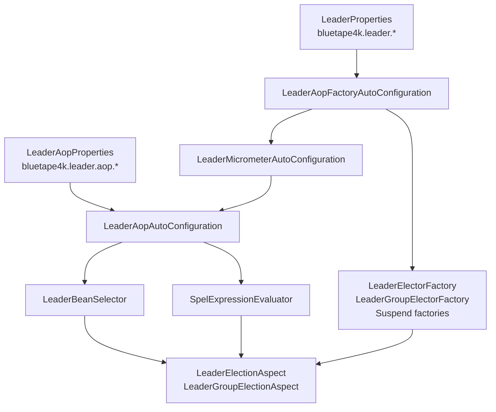

# leader-spring-boot

[한국어](README.ko.md)

Spring Boot 4 auto-configuration and AspectJ CTW support for bluetape4k leader election.

---

## Overview

`leader-spring-boot` wires bluetape4k leader backends into Spring applications and provides annotation-based execution guards:

- `@LeaderElection` for a single distributed leader
- `@LeaderGroupElection` for slot-based multi-leader execution
- `@LeaderElectionBackend` for backend selection at method, class, or package level
- Spring Boot auto-configuration for local, Lettuce, Redisson, Exposed JDBC/R2DBC, MongoDB, Hazelcast, and Micrometer integration

The AOP layer is built for AspectJ compile-time weaving via Freefair post-compile weaving. It does not rely on Spring runtime proxy AOP.

## Architecture



## Dependency

```kotlin
implementation("io.github.bluetape4k.leader:leader-spring-boot:0.1.0-SNAPSHOT")

// Add at least one backend module.
implementation("io.github.bluetape4k.leader:leader-redis-redisson:0.1.0-SNAPSHOT")

// Optional metrics.
implementation("io.github.bluetape4k.leader:leader-micrometer:0.1.0-SNAPSHOT")
implementation("org.springframework.boot:spring-boot-starter-actuator")
```

For annotated application methods, enable AspectJ compile-time weaving in the consuming application:

```kotlin
plugins {
    id("io.freefair.aspectj.post-compile-weaving") version "9.5.0"
}
```

## Configuration

```yaml
bluetape4k:
  leader:
    wait-time: 5s
    lease-time: 60s
    group:
      max-leaders: 3
      wait-time: 5s
      lease-time: 60s
    aop:
      enabled: true
      strict: false
      failure-mode: RETHROW
      default-wait-time: 5s
      default-lease-time: 60s
      lock-name-prefix: "${spring.application.name:}:"
      metrics:
        enabled: true
      spel:
        allow-method-invocation: false
```

Spring configuration properties use Spring Boot duration binding (`5s`, `60s`, `PT1M`). Core `LeaderElectionOptions` and `LeaderGroupElectionOptions` use `kotlin.time.Duration` in Kotlin code.

## Backend Factories

`LeaderAopFactoryAutoConfiguration` registers factory beans when the matching backend client is present.

| Backend | Required bean | Factory bean examples |
|---------|---------------|-----------------------|
| Local | none | `localLeaderElectionFactory`, `localSuspendLeaderElectorFactory` |
| Lettuce | `StatefulRedisConnection<String, String>` | `lettuceLeaderElectionFactory`, `lettuceSuspendLeaderElectorFactory` |
| Redisson | `RedissonClient` | `redissonLeaderElectionFactory`, `redissonSuspendLeaderElectorFactory` |
| Exposed JDBC | `Database` | `exposedJdbcLeaderElectionFactory` |
| Exposed R2DBC | `R2dbcDatabase` | `exposedR2dbcSuspendLeaderElectorFactory` |
| MongoDB | `MongoClient` | `mongoLeaderElectionFactory`, `mongoSuspendLeaderElectorFactory` |
| Hazelcast | `HazelcastInstance` | `hazelcastLeaderElectionFactory` |

Use `bean = "..."` on the annotation when more than one backend is available.

## Annotation Usage

```kotlin
@Service
class SettlementJobs {
    @Scheduled(cron = "0 0 2 * * *")
    @LeaderElection(name = "daily-settlement", leaseTime = "30m")
    fun settleDaily(): SettlementReport? =
        settlementService.settle()

    @LeaderGroupElection(name = "'region-sync-' + #region", maxLeaders = 3)
    fun syncRegion(region: String) {
        syncService.sync(region)
    }
}
```

Supported return shapes:

| Shape | Behavior |
|-------|----------|
| `T?` / `Unit` | Runs on the leader and returns the body result, or skips with `null` / no-op |
| `suspend fun` | Uses `SuspendLeaderElectorFactory` and propagates `LeaderElectionInfo` in `CoroutineContext` |
| `Mono<T>` | Uses Reactor context propagation for `LeaderElectionInfo` |
| `Flux<T>` / `Flow<T>` | Tracked separately in issue #74 because long-lived streams require lease renewal |

## SpEL Lock Names

`name` supports static names, Spring placeholders, plain SpEL, and template SpEL.

```kotlin
@LeaderElection(name = "daily-report")
fun dailyReport() = report()

@LeaderElection(name = "'tenant-' + #tenantId + '-invoice'")
fun invoice(tenantId: String) = invoiceService.run(tenantId)

@LeaderElection(name = "job-#{#region}-${spring.application.name}")
fun regionalJob(region: String) = jobService.run(region)
```

Method invocation in SpEL is disabled by default. Enable it only for trusted expressions:

```yaml
bluetape4k.leader.aop.spel.allow-method-invocation: true
```

## Meta-Annotations

`@LeaderElection` and `@LeaderGroupElection` can be composed with Spring `@AliasFor`.

```kotlin
@Target(AnnotationTarget.FUNCTION)
@Retention(AnnotationRetention.RUNTIME)
@LeaderElection(name = "", leaseTime = "5m")
annotation class DailyLeaderJob(
    @get:AliasFor(annotation = LeaderElection::class, attribute = "name")
    val name: String,
)
```

Backend selection can also be lifted to method, class, or package level:

```kotlin
@LeaderElectionBackend("redissonLeaderElectionFactory")
class RedisBackedJobs {
    @LeaderElection(name = "daily-report")
    fun report() = reportService.run()
}
```

## Failure Modes

| Mode | Behavior |
|------|----------|
| `RETHROW` | Wrap backend failures in `LeaderElectionException` / `LeaderGroupElectionException` |
| `SKIP` | Treat backend failure or contention as skipped execution |
| `FAIL_OPEN_RUN` | Run the method body without a lock when the backend is unavailable or the lock is not acquired |
| `INHERIT` | Annotation sentinel; uses `bluetape4k.leader.aop.failure-mode` |

`FAIL_OPEN_RUN` is only appropriate for idempotent work because multiple nodes may execute the body concurrently.

## Auto-Configuration Order

1. `LeaderElectionAutoConfiguration` binds shared backend properties.
2. `LeaderAopFactoryAutoConfiguration` registers backend factories.
3. `LeaderMicrometerAutoConfiguration` registers `MicrometerLeaderAopMetricsRecorder` when `MeterRegistry` exists.
4. `LeaderAopAutoConfiguration` registers the Aspect, SpEL evaluator, lock-name validator, and annotation validator.
5. `LeaderMicrometerHealthAutoConfiguration` registers the Actuator health indicator when Actuator is present.

## Migration Notes

- Core option constructors use `kotlin.time.Duration`: `LeaderElectionOptions(waitTime = 5.seconds, leaseTime = 60.seconds)`.
- Spring property classes still use Spring Boot duration binding, so YAML values such as `5s`, `60s`, and `PT1M` remain valid.
- Bean names use `LeaderElector` terminology. Prefer names such as `redissonLeaderElectionFactory` and `localSuspendLeaderElectorFactory`; avoid older `LeaderElection` bean names.

## Testing

Use `ApplicationContextRunner` for auto-configuration tests and keep infrastructure-backed tests on the singleton servers from `bluetape4k-testcontainers`. The module keeps a lower Kover threshold because AspectJ CTW and Spring Boot integration are verified by targeted integration tests.
