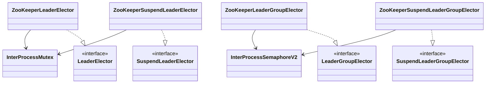

# leader-zookeeper

[English](README.md)

ZooKeeper/Apache Curator 기반 리더 선출 모듈입니다. 블로킹, 비동기, 코루틴 API를 제공합니다.

---

## 개요

`leader-zookeeper`는 Apache Curator lock recipe로 `leader-core` 인터페이스를 구현합니다.

- 단일 리더: `InterProcessMutex`
- 복수 리더 그룹: `InterProcessSemaphoreV2`
- 코루틴 그룹: `InterProcessSemaphoreV2`
- 코루틴 단일 리더: `InterProcessMutex`를 호출별 단일 thread dispatcher에서 실행해 Curator의 acquire/release owner thread 제약을 지킵니다.

ZooKeeper 세션이 만료되면 ephemeral recipe node가 제거되어 lock이 해제됩니다. `leaseTime`은 API 일관성을 위해 받지만 ZooKeeper TTL로 사용하지 않습니다.

## 아키텍처



## 구현체

| 클래스 | 인터페이스 | 설명 |
|--------|------------|------|
| `ZooKeeperLeaderElector` | `LeaderElector` | 블로킹 + 비동기 단일 리더 |
| `ZooKeeperLeaderGroupElector` | `LeaderGroupElector` | 블로킹 + 비동기 복수 리더 |
| `ZooKeeperSuspendLeaderElector` | `SuspendLeaderElector` | 코루틴 단일 리더 |
| `ZooKeeperSuspendLeaderGroupElector` | `SuspendLeaderGroupElector` | 코루틴 복수 리더 |

## 사용법

### Gradle

```kotlin
implementation("io.github.bluetape4k.leader:leader-zookeeper:0.1.0-SNAPSHOT")
```

### 설정

```kotlin
val curator = CuratorFrameworkFactory.newClient(
    "localhost:2181",
    ExponentialBackoffRetry(1_000, 3)
).apply {
    start()
    blockUntilConnected()
}
```

### 블로킹 단일 리더

```kotlin
val election = ZooKeeperLeaderElector(curator)

val result = election.runIfLeader("daily-report") {
    generateReport()
}
// 리더이면 generateReport() 결과, 아니면 null
```

### 블로킹 복수 리더 그룹

```kotlin
val options = LeaderGroupElectionOptions(maxLeaders = 3)
val election = ZooKeeperLeaderGroupElector(curator, options)

val result = election.runIfLeader("parallel-batch") {
    processChunk()
}
```

### 비동기 단일 리더

```kotlin
val election = ZooKeeperLeaderElector(curator)

val future: CompletableFuture<Report?> = election.runAsyncIfLeader("daily-report") {
    CompletableFuture.supplyAsync { generateReport() }
}
```

### 코루틴 단일 리더

```kotlin
val election = ZooKeeperSuspendLeaderElector(curator)

val result = election.runIfLeader("nightly-sync") {
    syncData()
}
```

### 확장 함수

```kotlin
curator.runIfLeader("job") { doWork() }
curator.runIfLeaderGroup("job", LeaderGroupElectionOptions(maxLeaders = 2)) { doWork() }

curator.suspendRunIfLeader("job") { doWork() }
curator.suspendRunIfLeaderGroup("job", LeaderGroupElectionOptions(maxLeaders = 2)) { doWork() }
```

## 설정 옵션

| 옵션 | 적용 대상 | 설명 |
|------|-----------|------|
| `basePath` | 모든 elector | 리더 선출 데이터를 저장할 root znode 경로 |
| `waitTime` | 모든 elector | lock/lease 획득 최대 대기 시간 |
| `leaseTime` | 단일 리더 옵션 | API 호환용. 실제 해제 경계는 ZooKeeper 세션 만료 |
| `maxLeaders` | 그룹 elector | 동시에 허용할 semaphore lease 수 |

## 테스트

테스트는 `bluetape4k-testcontainers`의 `ZooKeeperServer`를 사용하며 블로킹, 비동기, 코루틴, factory, extension, group state API를 검증합니다. 이 모듈은 Kover 80% 이상 coverage를 강제합니다.
