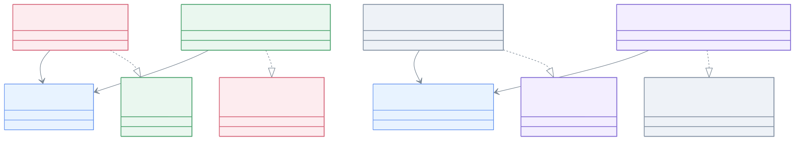

# leader-zookeeper

[한국어](README.ko.md)

ZooKeeper/Apache Curator-backed leader election for blocking, async, and coroutine APIs.

---

## Overview

`leader-zookeeper` implements `leader-core` interfaces with Apache Curator lock recipes.

- Single leader: `InterProcessMutex`
- Multi-leader group: `InterProcessSemaphoreV2`
- Coroutine group: `InterProcessSemaphoreV2`
- Coroutine single leader: `InterProcessMutex` on a call-scoped single-thread dispatcher, so acquire/release stay on the same Curator owner thread

ZooKeeper session expiry removes ephemeral recipe nodes, so locks are released when the Curator session ends. `leaseTime` is accepted for API consistency but is not a ZooKeeper TTL.

## Architecture



## Implementations

| Class | Interface | Description |
|-------|-----------|-------------|
| `ZooKeeperLeaderElector` | `LeaderElector` | Blocking + async single-leader |
| `ZooKeeperLeaderGroupElector` | `LeaderGroupElector` | Blocking + async multi-leader |
| `ZooKeeperSuspendLeaderElector` | `SuspendLeaderElector` | Coroutine single-leader |
| `ZooKeeperSuspendLeaderGroupElector` | `SuspendLeaderGroupElector` | Coroutine multi-leader |
| `ZooKeeperLeaderElectorFactory` | `LeaderElectorFactory` | Factory: creates `ZooKeeperLeaderElector` per call |
| `ZooKeeperLeaderGroupElectorFactory` | `LeaderGroupElectorFactory` | Factory: creates `ZooKeeperLeaderGroupElector` per call |
| `ZooKeeperSuspendLeaderElectorFactory` | `SuspendLeaderElectorFactory` | Factory: creates `ZooKeeperSuspendLeaderElector` per call |
| `ZooKeeperSuspendLeaderGroupElectorFactory` | `SuspendLeaderGroupElectorFactory` | Factory: creates `ZooKeeperSuspendLeaderGroupElector` per call |

## Usage

### Gradle

```kotlin
implementation("io.github.bluetape4k.leader:bluetape4k-leader-zookeeper:0.1.0-SNAPSHOT")
```

### Setup

```kotlin
val curator = CuratorFrameworkFactory.newClient(
    "localhost:2181",
    ExponentialBackoffRetry(1_000, 3)
).apply {
    start()
    blockUntilConnected()
}
```

### Blocking single-leader

```kotlin
val election = ZooKeeperLeaderElector(curator)

val result = election.runIfLeader("daily-report") {
    generateReport()
}
// result == generateReport() return value on leader, null on others
```

### Blocking multi-leader group

```kotlin
val options = LeaderGroupElectionOptions(maxLeaders = 3)
val election = ZooKeeperLeaderGroupElector(curator, options)

val result = election.runIfLeader("parallel-batch") {
    processChunk()
}
```

### Async single-leader

```kotlin
val election = ZooKeeperLeaderElector(curator)

val future: CompletableFuture<Report?> = election.runAsyncIfLeader("daily-report") {
    CompletableFuture.supplyAsync { generateReport() }
}
```

### Coroutine single-leader

```kotlin
val election = ZooKeeperSuspendLeaderElector(curator)

val result = election.runIfLeader("nightly-sync") {
    syncData()
}
```

### Extension functions

```kotlin
curator.runIfLeader("job") { doWork() }
curator.runIfLeaderGroup("job", LeaderGroupElectionOptions(maxLeaders = 2)) { doWork() }

curator.suspendRunIfLeader("job") { doWork() }
curator.suspendRunIfLeaderGroup("job", LeaderGroupElectionOptions(maxLeaders = 2)) { doWork() }
```

### Using factories

```kotlin
val factory: LeaderElectorFactory = ZooKeeperLeaderElectorFactory(curator)
val election = factory.create(LeaderElectionOptions.Default)

val suspendFactory: SuspendLeaderElectorFactory = ZooKeeperSuspendLeaderElectorFactory(curator)
val suspendElection = suspendFactory.create(LeaderElectionOptions.Default)
```

## Configuration

| Option | Applies to | Notes |
|--------|------------|-------|
| `basePath` | all electors | Root znode path for election data |
| `waitTime` | all electors | Max time to wait for lock/lease acquisition |
| `leaseTime` | single-leader options | API compatibility only; ZooKeeper session expiry owns release semantics |
| `maxLeaders` | group electors | Max concurrent semaphore leases |

## Testing

Tests use `ZooKeeperServer` from `bluetape4k-testcontainers` and cover blocking, async, coroutine, factory, extension, and group-state APIs. The module enforces 80%+ Kover coverage.
